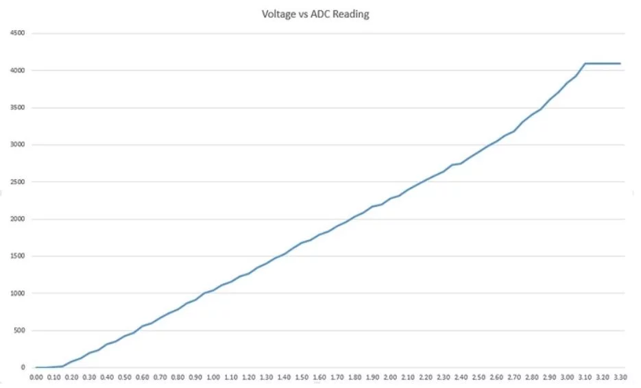
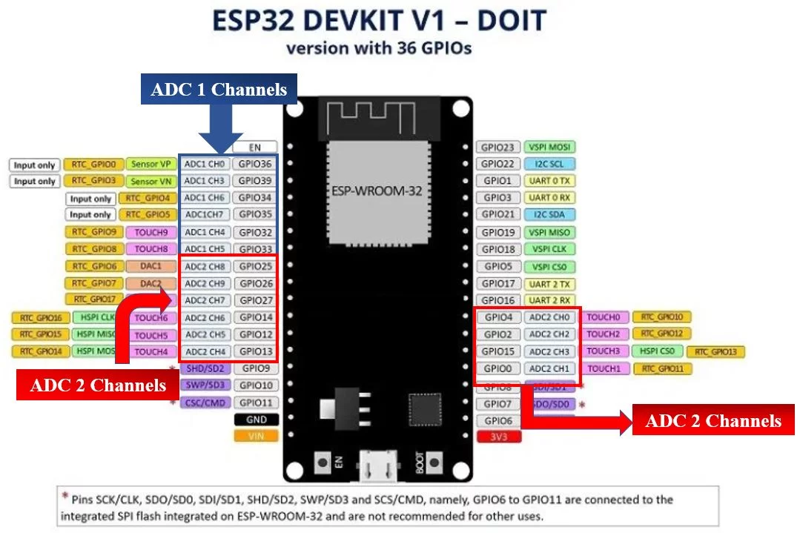

- Can read 0 - 3.3V
- Measured voltage is given value 0 - 4095
- Close values will be matched up to similar voltages



ESP32 has two 12-bit ADCs (ADC 1 & ADC 2) and supports a maximum of 18 analog channels.

| Name              | Value                                                                                                                          |
| ----------------- | ------------------------------------------------------------------------------------------------------------------------------ |
| Resolution        | 12-bit                                                                                                                         |
| Voltage           | 0 - 3.3V                                                                                                                       |
| Assigned value    | 0 - 4095                                                                                                                       |
| Analog pin        | GPIO0, GPIO2, GPIO4, GPIO12, GPIO13, GPIO14, GPIO15,GPIO 25,GPIO 26, GPIO27, GPIO32, GPIO33,GPIO34, GPIO35, GPIO36, and GPIO39 |
| Resolution change | Can change                                                                                                                     |

The ESP32 board has 8 channels for ADC1 but the DEVKIT V1 only supports 6 of them. ADC2 has 10 analog channels. The analog pins of both of these channels are listed below

- *ADC1 pins*:
	- ADC1_CH0: GPIO 36
	- ADC1_CH1: GPIO 37  (**NOT AVAILABLE**)
	- ADC1_CH2: GPIO 38  (**NOT AVAILABLE**)
	- ADC1_CH3: GPIO 39
	- ADC1_CH4: GPIO 32
	- ADC1_CH5: GPIO 33
	- ADC1_CH6: GPIO 34
	- ADC1_CH7: GPIO 35

- *ADC2 pins*:
	- ADC2_CH0: GPIO 4
	- ADC2_CH1: GPIO 0
	- ADC2_CH2: GPIO 2
	- ADC2_CH3: GPIO 15
	- ADC2_CH4: GPIO 13
	- ADC2_CH5: GPIO 12
	- ADC2_CH6: GPIO 14
	- ADC2_CH7: GPIO 27
	- ADC2_CH8: GPIO 25
	- ADC2_CH9: GPIO 26



ESP-IDF ADC libraries:
```c
#include "driver/adc.h"
#include "esp_adc_cal.h"
```

Setup voltage range:

| Attenuation | Attenuation Parameter | Input Voltage Range |
| ----------- | --------------------- | ------------------- |
| 0dB         | ADC_ATTEN_DB_0        | ~100 - 950mV        |
| 2.5dB       | ADC_ATTEN_DB_2_5      | ~100 - 1250mV       |
| 6dB         | ADC_ATTEN_DB_6        | ~150 - 1750mV       |
| 11dB        | ADC_ATTEN_DB_11       | ~150 - 2450mV       |

Use `adc1_config_channel_atten()` to set range

```c
adc1_config_channel_atten(ADC1_CHANNEL_0, ADC_ATTEN_DB_11);
adc2_config_channel_atten(ADC2_CHANNEL_0, ADC_ATTEN_DB_11);
```

ADC calibration:
```c
esp_adc_cal_characteristics_t adc1_chars;

esp_adc_cal_characterize(ADC_UNIT_1, ADC_ATTEN_DB_11, ADC_WIDTH_BIT_DEFAULT, 0, &adc1_chars);
```

ADC bit width:
- ADC_WIDTH_BIT_DEFAULT (12-bit)
- ADC_WIDTH_BIT_9
- ADC_WIDTH_BIT_10
- ADC_WIDTH_BIT_11
- ADC_WIDTH_BIT_12

```c
adc1_config_width(ADC_WIDTH_BIT_DEFAULT);
```

ADC get value:
```c
int adc_value = adc1_get_raw(ADC1_CHANNEL_4);
```

ADC get voltage:
```c
int adc_value = adc1_get_raw(ADC1_CHANNEL_4);
voltage = esp_adc_cal_raw_to_voltage(adc_value, &adc1_chars);
```

Full code:
```c
#include <stdio.h>
#include <stdlib.h>

#include "freertos/FreeRTOS.h"
#include "freertos/task.h"
#include "driver/adc.h"
#include "esp_adc_cal.h"


static esp_adc_cal_characteristics_t adc1_chars;

void app_main(void)
{

    esp_adc_cal_characterize(ADC_UNIT_1, ADC_ATTEN_DB_11, ADC_WIDTH_BIT_DEFAULT, 0, &adc1_chars);

    adc1_config_width(ADC_WIDTH_BIT_DEFAULT);
    adc1_config_channel_atten(ADC1_CHANNEL_4, ADC_ATTEN_DB_11);

    while (1) 
    {
        int adc_value = adc1_get_raw(ADC1_CHANNEL_4);
        printf("ADC Value: %d", adc_value);
        printf("\n");
        vTaskDelay(500/ portTICK_PERIOD_MS);
    }
}
```
