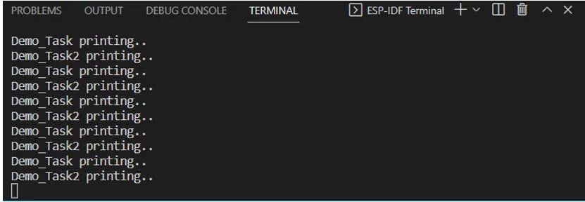
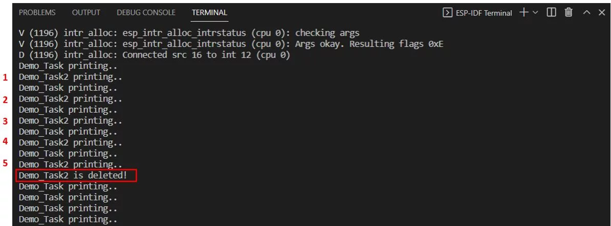
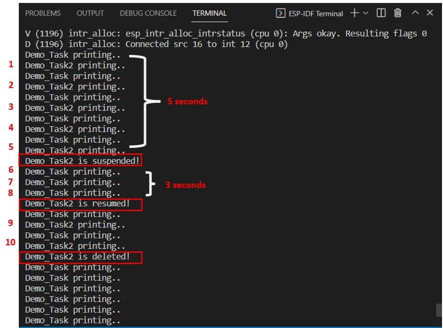

- In a real-time application or RTOS, an application usually consists of a set of independent tasks or subroutine
- On a single-core MCU, only one task can run at a time. On the other hand, in a dual-core processor such as ESP32 two tasks can run concurrently given these two tasks have no dependency on each other
- FreeRTOS scheduler schedules these tasks based on their priority, time period, and execution time

- The FreeRTOS scheduler will frequently start and stop every task as the application keeps executing
- A task does not have an understanding of the RTOS scheduler activity, therefore, it is the responsibility of the FreeRTOS scheduler to confirm that the processor context (register values, stack contents, etc) when a task is switched in is exactly that as when the same task was swapped out. For this purpose, each task is provided with its own stack
- When the task is swapped out, the execution context is saved to the stack of that task so it can also be exactly restored when the same task is later swapped back in

- FreeRTOS APIs provide features to schedule, create, delete, suspend, resume, and setting tasks priority

- Find more information about FreeRTOS tasks [here](https://www.freertos.org/taskandcr.html "here")

```c
xTaskCreate(Demo_Task, "Demo_Task", 4096, NULL, 10, &myTaskHandle);
```
`xTaskCreate()` (for 1st task) arguments:
- Name of the function
- Name of the task
- Stack size of the task (User can set the stack size after creating the task and obtaining the stack size of the task)
- Value passed as parameter for the created task (Used to specify a variable that is being used in the main function and whose value needs to be added to the task). Set to NULL if we don't use it
- Priority of the task (In this case it's priority 10)
- The handle used to change the function of the task (suspend, delete, resume, get or set a config of task). Set to NULL if we don't use it
```c
TaskHandle_t myTaskHandle = NULL;
```

Task 1 function:
```c
void Demo_Task(void *arg)
{
    while(1){
        printf("Demo_Task printing..\n");
        vTaskDelay(1000/ portTICK_RATE_MS);
    }
}
```
- You have to use an infinite loop otherwise the microcontroller will keep on resetting

```c
xTaskCreatePinnedToCore(Demo_Task2, "Demo_Task2", 4096, NULL,10, &myTaskHandle2, 1);
```
`xTaskCreatePinnedToCore()` (for 2nd task):
- This will enable the user to select which core (core 0 or core 1) will run the particular task
- The 7th argument that indicates the core that will be used for the created task ('0' or '1')
- Task handler:
```c
TaskHandle_t myTaskHandle2 = NULL;
```

Task 2 function:
```c
void Demo_Task2(void *arg)
{
    while(1){
        printf("Demo_Task2 printing..\n");
        vTaskDelay(1000/ portTICK_RATE_MS);
    }
}
```

Complete code:
```c
#include <stdio.h>
#include <freertos/FreeRTOS.h>
#include <freertos/task.h>

TaskHandle_t myTaskHandle = NULL;
TaskHandle_t myTaskHandle2 = NULL;

void Demo_Task(void *arg)
{
    while(1){
        printf("Demo_Task printing..\n");
        vTaskDelay(1000/ portTICK_RATE_MS);
    }
}

void Demo_Task2(void *arg)
{
    while(1){
        printf("Demo_Task2 printing..\n");
        vTaskDelay(1000/ portTICK_RATE_MS);
    }
}

void app_main(void)
{
   xTaskCreate(Demo_Task, "Demo_Task", 4096, NULL, 10, &myTaskHandle);
   xTaskCreatePinnedToCore(Demo_Task2, "Demo_Task2", 4096, NULL,10, &myTaskHandle2, 1);
 }
```
- The 2 tasks will run simultaneously


FreeRTOS delete task example:
- Task 2 will print a new message every second:
```c
void Demo_Task2(void *arg)
{
    for(int i = 0; i < 5; i++){
        printf("Demo_Task2 printing..\n");
        vTaskDelay(1000/ portTICK_RATE_MS);
    }
}
```

- Task 1 will keep track of count and delete the second task after 5s:
```c
void Demo_Task(void *arg)
{
    int count = 0;
    while(1){
        count++;
        printf("Demo_Task printing..\n");
        vTaskDelay(1000/ portTICK_RATE_MS);
        if (count == 5)
        {
          vTaskDelete(myTaskHandle2);
          printf("Demo_Task2 is deleted!\n");
        }
    }
}
```


FreeRTOS suspend and resume task example:
```c
vTaskSuspend(myTaskHandle2);
vTaskResume(myTaskHandle2);
```

- Task 2 will count to 10 seconds:
```c
void Demo_Task2(void *arg)
{
    for(int i = 0; i < 10; i++) {
        printf("Demo_Task2 printing..\n");
        vTaskDelay(1000/ portTICK_RATE_MS);
    }
}
```

- Task 1 will suspend task at 5 second, resume task at 8 second and delete task at 10 second:
```c
void Demo_Task(void *arg)
{
    int count = 0;
    while(1){
        count++;
        printf("Demo_Task printing..\n");
        vTaskDelay(1000/ portTICK_RATE_MS);
        if (count == 5)
        {
          vTaskSuspend(myTaskHandle2);
          printf("Demo_Task2 is suspended!\n");
        }
        if (count == 8)
        {
          vTaskResume(myTaskHandle2);
          printf("Demo_Task2 is resumed!\n");
        }
        if (count == 10)
        {
          vTaskDelete(myTaskHandle2);
          printf("Demo_Task2 is deleted!\n");
        }
    }
}
```


Get tick count:
- To calculate the time of the application we use `xTaskGetTickCount()`
- This function returns us the number of ticks since the application started

Interrupts:
- Set the GPIO interrupt trigger type: `gpio_set_intr_type()`
```c
gpio_set_intr_type(gpio_num_t gpio_num, gpio_int_type_t intr_type)
```

- Install the driver’s GPIO ISR handler service: `gpio_install_isr_service()`
- This handler service permits GPIO interrupt handlers per pin
- Parameter: The flag that is responsible for allocating the interrupt
```c
gpio_install_isr_service(int intr_alloc_flags)
```

- Add ISR handler for a particular GPIO pin: `gpio_isr_handler_add()`
```c
gpio_isr_handler_add(gpio_num_t gpio_num, gpio_isr_t isr_handler, void *args)
```

> **Note**: GPIO6, GPIO7, GPIO8, GPIO9, GPIO10, and GPIO11 cannot be used as ESP32 interrupt pins

LED button toggle using interrupts:
```c
#include <stdio.h>
#include <freertos/FreeRTOS.h>
#include <freertos/task.h>
#include "driver/gpio.h"

#define ESP_INR_FLAG_DEFAULT 0
#define LED_PIN  27
#define PUSH_BUTTON_PIN  33

TaskHandle_t ISR = NULL;

void IRAM_ATTR button_isr_handler(void *arg){
  xTaskResumeFromISR(ISR);
}

void interrupt_task(void *arg){
  bool led_status = false;
  while(1){
    vTaskSuspend(NULL);
    led_status = !led_status;
    gpio_set_level(LED_PIN, led_status);
    printf("Button pressed!\n");
  }
}

void app_main(void)
{
  gpio_pad_select_gpio(PUSH_BUTTON_PIN);
  gpio_pad_select_gpio(LED_PIN);

  gpio_set_direction(PUSH_BUTTON_PIN, GPIO_MODE_INPUT);
  gpio_set_direction(LED_PIN ,GPIO_MODE_OUTPUT);

  gpio_set_intr_type(PUSH_BUTTON_PIN, GPIO_INTR_POSEDGE);

  gpio_install_isr_service(ESP_INR_FLAG_DEFAULT);

  gpio_isr_handler_add(PUSH_BUTTON_PIN, button_isr_handler, NULL);

  xTaskCreate(interrupt_task, "interrupt_task", 4096, NULL, 10, &ISR);
}
```
- `vTaskSuspend(NULL);` suspends current task

```c
void IRAM_ATTR button_isr_handler(void *arg){
  xTaskResumeFromISR(ISR);
}
```
- Resumes the `interrupt_task`
