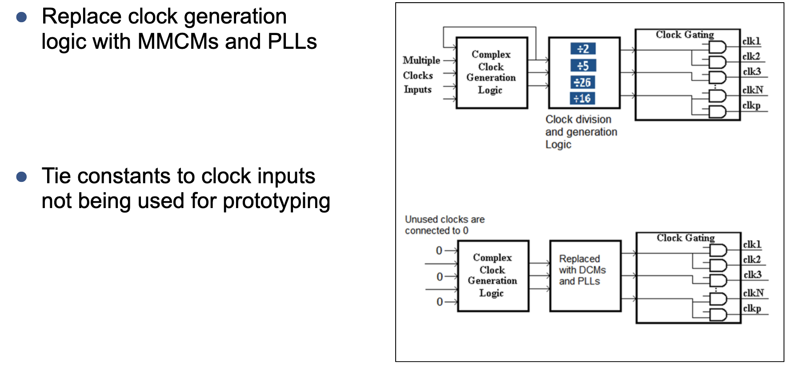
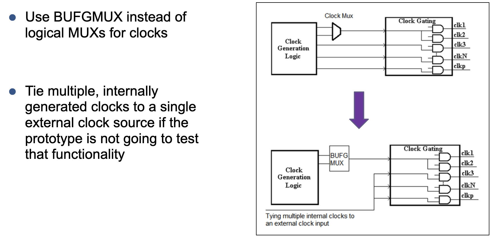
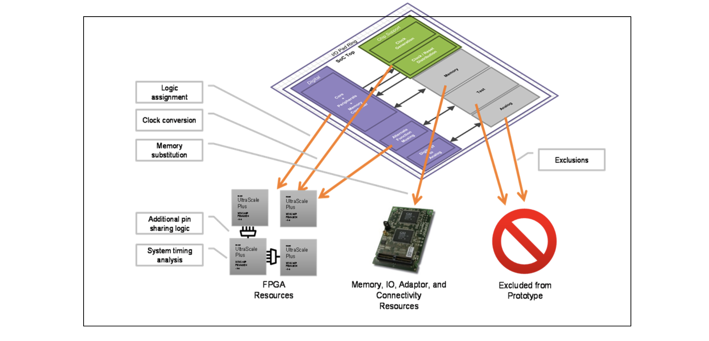

# Objectives
- I/O pads: instantiation of SoC pads
- Gate-level netlist: module in the design is available as mapped netlist of SoC library cells
- Cell instantiations: leaf cells from the SoC library are instantiated in RTL
- Memories: instantiations of SoC memory
- IPs: SoC specific IPs such as CPU or interface IPs. If RTL is not available, it must be added
- BIST: Test related logic is usually built during the SoC. Test logic can be instantiated in the RTL
- Clocks: Clock gating is written directly in RTL. Generated clocks may require simplification

# ASIC clocks
- ASIC design usually have complex clock generation logic to generate numerous internal clocks
- These designs also use clock gating to reduce dynamic power consumption

- Make sure all the ASIC design clocks fit into the limited clock resources of FPGA by doing:
	- Simplifying the clock networks
	- Using clock conversion feature to convert the remaining gated and generated clocks

# Example 1

# Example 2

# Gated clock conversion
- After simplifying the clock networks, gated clocks may still exist in the design
- Use clock conversion feature in synthesis tool (moves the gating clock logic from clock pin of sequential elements to enable pin) to eliminate these clocks.

# Common IP in ASIC designs
- Instantiated Synopsys DesignWare components
- Full CPU subsystems or interface IP
- Instantiated third-party digital IP
- Analog IP (excluded from prototype)

- Digital IP to be prototyped can be provided in one of the following forms:
	- RTL source code
	- Encrypted source code (to prevent theft)

# IPs common in ASIC designs
- Digital IP to be prototyped can also be provided as follows:
	- FPGA netlist (simple - for optimizing, secured - for capturing only timing info and optimize logic around IP block, encrypted netlist - treated as black box)
	- Hard IP

# Handling BIST logic
- Can be used as follows:
	- Inferred during SoC flow
	- Instantiated directly in RTL

# Conclusion

# HAPS design advisor
- Available under Help -> HAPS Design Advisor

