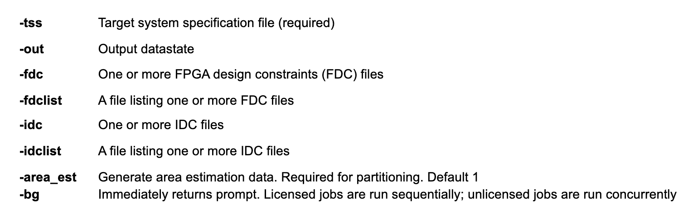
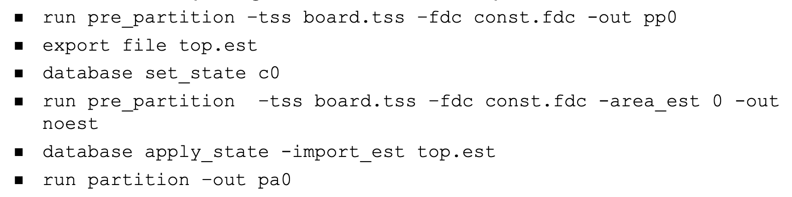

# TSS file
- A tcl file that defines the hardware system to the software
- File includes `board_system` commands to define system config in terms of boards, interconnect, clocks, resets, and voltage regions
- The TSS file describes the following hardware:
	- Number of FPGAs in the system
	- Connection details between FPGAs
	- Connection details for daughter boards
	- UMRBus chaining details
	- Clock/reset connection details
	- Board voltage configuration details

# Define target system
- TSS (Target System Specification) is the software representation of the hardware

- TSS can be defined using TSS builder or TSS interactive shell

- `board_system` commands:
	- `board_system_configure`: Defines HAPS system clock and voltage-region parameters of single- or multiple-board system
	- `board_system_create`: Defines board config in multi-board system
	- `board_system_list`: Defines board config in multi-board system
	- `board_system_save`: Saves a board definition to a specified file
	- `report_board_system`: Writes a board-system report to a specified file that outlines the complete config

- Target system report:


# Unified Compile Flow


- Input and setup files for UC flow:
	- RTL files
	- UPF files
	- Simon options files (based on requirement)
	- VCS file (Verilog Compiler Simulator)
	- UTF file (Unified TCL Format)
	- synopsys_sim.setup file for libraries
- Output of UC:
	- Generates UCDB database which will be taken as input to compile state\


- Command usage:


- VCS command (Design is provided via VCS command script, similar to simulation command script):
	- Specify RTL source files
	- Specify compilation library 
	- Define design top
	- Top level parameters
	- Include paths
	- Top level Verilog macros
	- Library paths
	- Verilog library file name extension

```
vlogan -sverilog -full64 \
-l vlogan.log \
+incdir+./DESIGN \
+define+synthesis \
-timescale=1ps/1ps \
-skip_translate_body \
+libext+.svh+.sv+ \
-f src_file_list.txt
```

```
vcs +error+1000 \
+vcs+lic+wait -sverilog \
-full64 -l vcs_cmd.log \
-timescale=1ps/1ps \
-skip_translate_body \
-hw_top=top top
```

- `sysnopsys_sim.setup` (map logical libraries to physical libraries using `sysnopsys_sim.setup` file) 


- `uc.log` file: Available in `<uc_database>/uc.log` file:
	- VCS parsing
	- VCS elaboration
	- Simon synthesis
	- Simon netlist dump


- Enable logic (flops/memory) corruption: Specify this in VCS command line
```
[-power=seqcorrupt] [-power=hw_corrupt_memory]
```

- tcl run compile:


- Log file in GUI:


# Log file snapshots
- UC report:


- UPF related info is available in `<ucdb>/mvsim_native_reports`


# Report CTC
- Generate a clock tree conversion report
- Generated post compile stage
- Usage: `report ctc [-out <value>] [-gcc <value>] [-fdc <value>] [-fdclist <value>]`

- Report CTC log lists Clock Optimization Summary, Clock Summary and Clock Load Summary


# Pre-partitioning
- A step in the design process where the design is prepare for pre-partitioning
- Pre-partitioning:
	- Reads TSS (target system specification) file and performs area estimation
	- Reads IDC file (Instrumentation file) and inserts IICE logic for instrumented designs
	- Performs HAPS clock optimization

- Inputs and outputs:
	- Inputs:
		- Compiled netlist
		- TSS TCL file describing the number of FPGAs used and the available interconnect 
		- FDC file containing timing constraints and design attributes
		- IDC containing details of instrumented signals
	- Outputs:
		- Netlist ready for partitioning
		- Area estimation report
		- Summary of all clocks

- Run pre_partitioning command:
```
-tss tssFilename.tcl [-out stateName] [-bg] [-nle netEditFilename] [-fdc fdcFilename] [-fdclist fdcFileList] [-upf upfFilename] [-upflist updFileList] [-idc idcFilename] [-idclist idcFileList] [-area_est 0|1]
```



## Area estimation
- Gives approximate area reference for determining if the target HAPS system has sufficient resources for partitioning the design
- Tool calls Xilinx mapper executable to do estimation
- Estimation results in `area_estimation.log`

- Commands:


> It is recommended to skip area estimation only if it's run once and design model is not significantly changed

## Constraints handling
- To edit FDC constraints file: `edit fdc -mode gui fdcFilename.fdc`

- At each stage, make sure constraints is honored

# Debug and diagnose


- Pre-partition log includes clock summary, timing constraint application:


## Pre-partition logs
- Area estimation log gives messages generated when area estimation is run


- TSS log describes the results of board-system compilation and generation:


- Area estimation report can be generated from `export file -all`
