# Flow overview
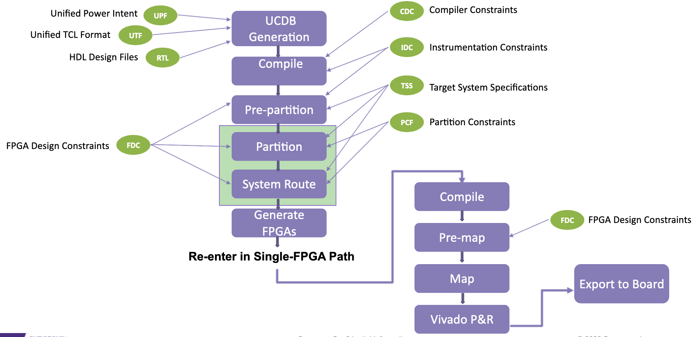

# Auto-partitioning
- Automatically partitions design between multiple FPGAs
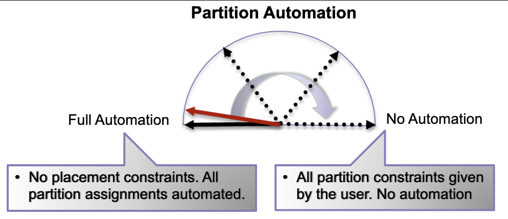

## Partitioning basics
- Iterative process: 
	- Inputs: design netlist, TSS, partitioning constraints, area estimation, timing constraints embedded in database with netlist
- Uses partition and system-route steps in ProtoCompiler
- Partition step:
	- Logical partitioning into groups and placing groups into FPGA bins
	- Estimates TDMs
	- Output: partitioned design netlist with global routing

## Run partitioning command
- Generates a partitioned netlist based on PCF constraints:
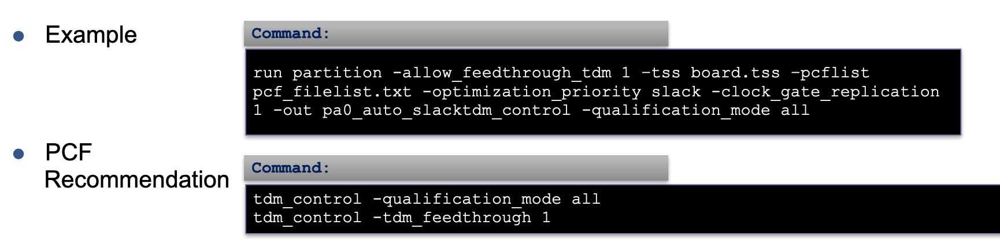

## System route step
- Determines and inserts TDM ratios
- Routes post-TDM design nets to board-level traces
- Output: fully partitioned design and routed netlist (TDM and trace)
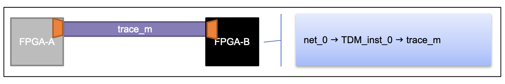

- `system_route` command: insert TDM logic on the partitioned design and route all inter-FPGA signals to system traces
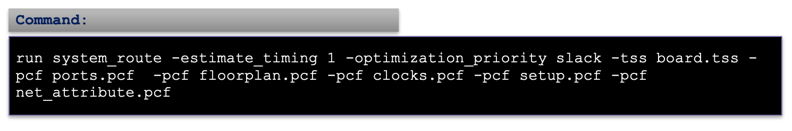

# Time Domain Multiplexing
- A group of nets sampled periodically at a higher clock rate and transmitted for effective utilization of the available channels
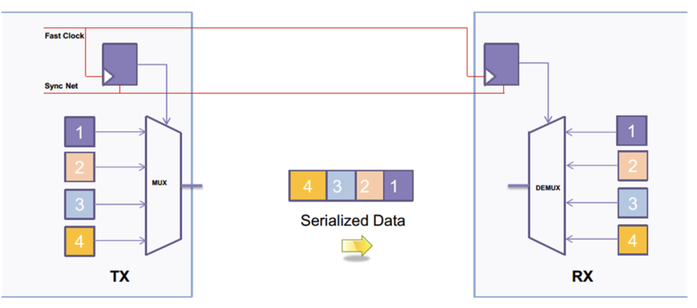

- Typical exclusion for TDM:
	- Reset paths
	- Clocks
> Recommended to use `-qualification_mode all` in default

## HSTDM 
- A High Speed TDM model that uses synchronous differential signaling to achieve faster multiplexing speeds and greater pin capacity
- It uses source-synchronous clocking for data and synchronizes the data using circuit training

## TDM controls
- PCF command syntax:
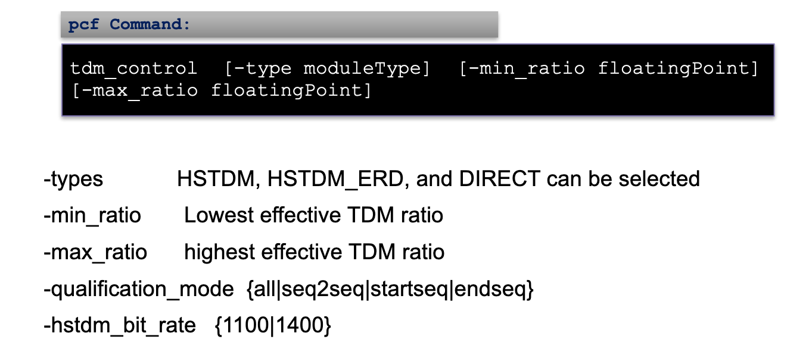

# Multi Hops & Feedthrough
## Multi-Hop optimization
- Hop: An FPGA boundary that a path crosses between start and end points
- Optimizing to minimize hops is important

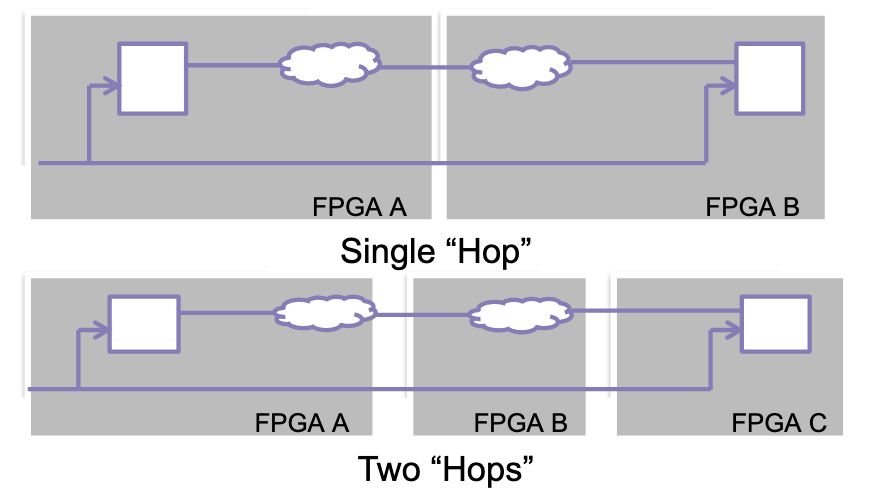

## Feedthrough
- Feedthrough is passage of nets through immediate devices 
- Number of feedthrough should be minimum
- Use inter-FPGA feedthrough and avoid port feedthrough
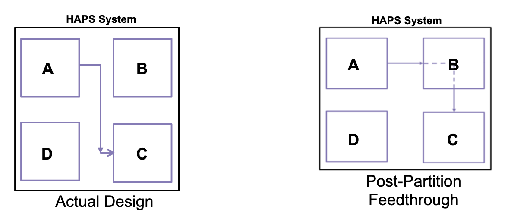

- Run partition command syntax:
```
run partition -optimization_priority multi_hop_path
```
- Specifying `multi_hop_path` attempts to to reduce number of combinational paths that crosses between FPGAs

# Partition constraints (PCF) and reports
- PCF:
	- Guides automatic partitioning engine
	- Specifies constraints for:
		- Basic assignments of cells and ports
		- bin/FPGA utilization
		- floorplan
		- hierarchy control
		- replicate logic
		- HSTDM 
		- clock and reset

## PCF commands
```
# Floorplan design by assigning cells and ports
assign cell {dut_mod_inst.sub0.core0} {mbl.uA}

# Define resource availability and set maximum utilization constraints with the bin_utilization command
bin_utilization -bin mbl.uA resource_ratio {LUT 0.9}
bin_utilization -bin mbl.uB resource (LUT 100000)

# Force replication of modules on different FPGAs
replicate_cell my_clk (FPGA1 FPGA2}

# Assign global signals to global traces (clocks)
assign_global_net clk_P clk1
net_attribute clk P-function GCLK
```
- The TSS user-specified clock name should be specified in the PCF

```
# Assign reset ports to special bins
assign_virtual_port -port rst -type USR_LOCAL_RESET -bin f1
reset_synchronize -net rst -init 0 -clock clk
```

## Analyzing partition logs and reports
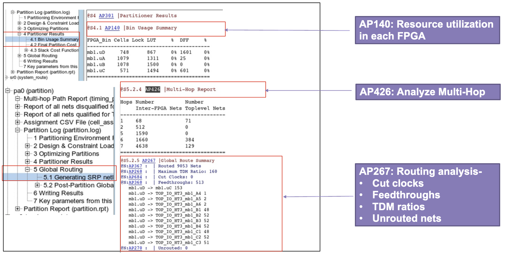

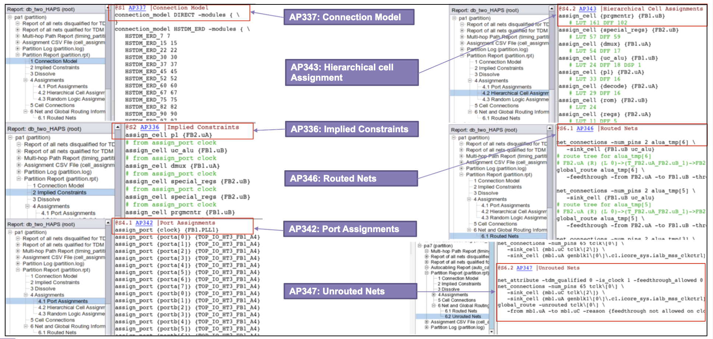

- Export file: `export file cell_assignments.csv`

# System route report
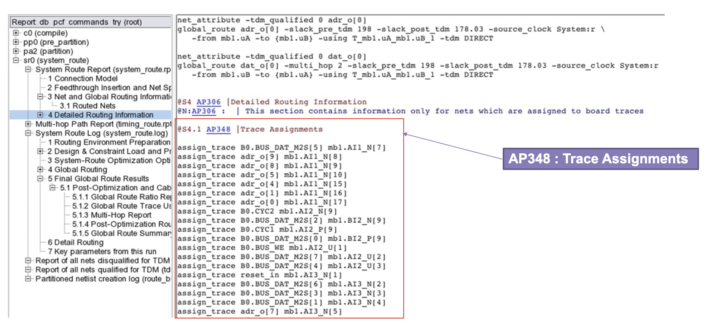

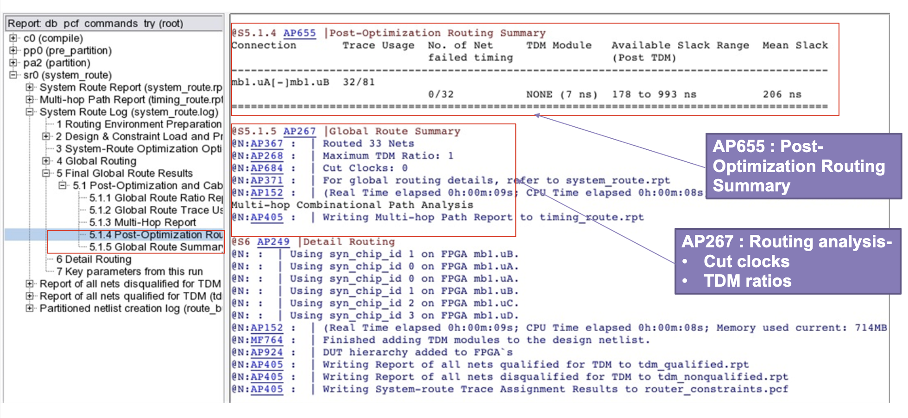
