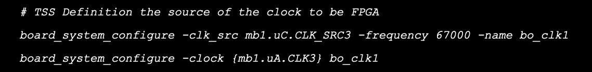
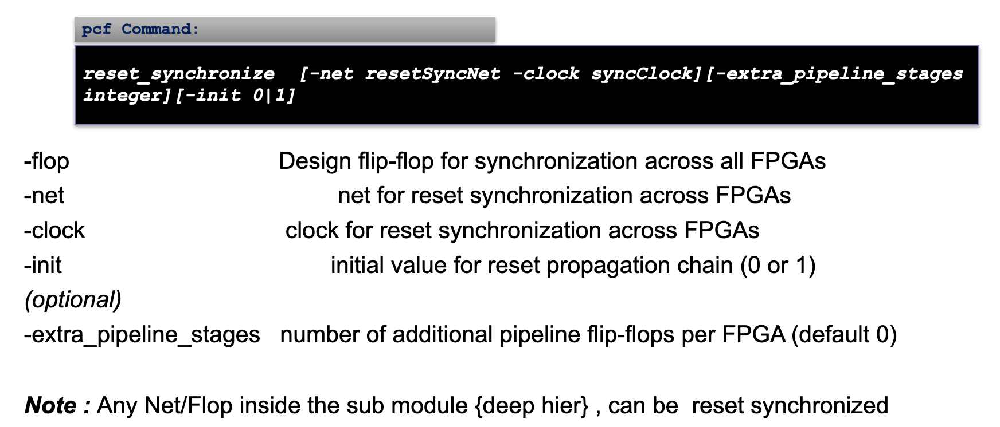
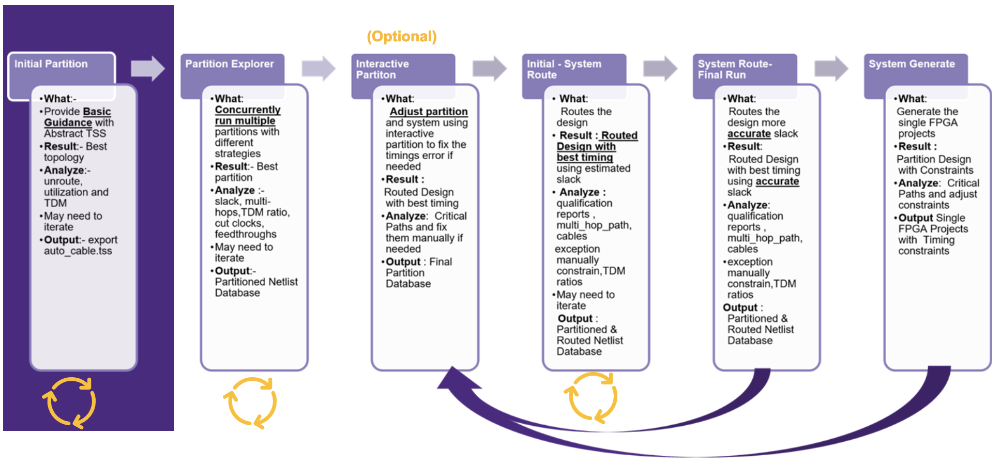

# Clock management
- Design at partition stage by partitioner based on guidance or automatic

- Onboard PLL to drive MMCM (FPGA A and FPGA C) with H-100:


- FPGA A `clk2` to drive `A_CLK_SRC[1]` which will drive FPGA-D and FPGA-B
- FPGA C `clk1` to drive `C_CLK_SRC[1]` which will drive FPGA-A and FPGA-C


- Enable clock replication:


# Resets
## Reset handling
- Asynchronous reset to any sequential element can give ambiguous results
- Similar scenario can occur when reset is synchronized to other clock domains
- No single reset can be global when design has multiple asynchronous clocks
- Reset signal must enter design at a single source and be synchronized per clock domain

- Asynchronous reset is synchronized, pipelined, replicated, and distributed through HT3 cables

- PCF command syntax: 


# Partitioning methodology
- Methodology flow:


## Decision on iterations


- Launch interactive partition flow:
```
run partition -pcf mypcf.pcf -optimization_priority slack -interactive 1
```
- Step 1: Complete partition and wait for interactive commands: `run_flow`
- Step 2: Type interactive commands like report summary: `report_timing -summary`
- Step 3: Type interactive commands to get worst paths: `report_timing -type hops -worst_paths 10`


- Step 4: Assign/replicate the cells given below: `assign_cell {un1_temp_7} mbl.uA`
- Step 5: Check results: `report_timing -summary`
- Step 6: Commit solution: `solution_commit`
- Step 7: Repeat 3 - 6

## System route
```
run partition -pcf pre_assign.pcf
run system_route -optimization_priority slack -mapped_timing_models 1 -estimate_timing 1
```