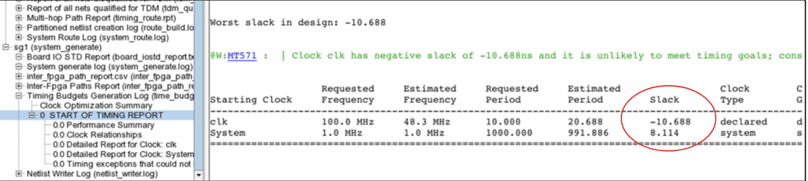

# System generate
- The last step in basic partitioning flow
- Auto create a timing budget and generates partitions based on hardware spec in TSS, PCF, FDC files
- Creates individual FPGA projects (SRS based)
- Creates required files for individual FPGA (SRS netlist, constraints, TCL files)
- Creates required files for post-partition sim

- Input:
	- Fully partitioned and routed netlist
	- FDC file containing timing constraints and design attributes
- Output:
	- Partitioned SRS project
	- Individual FPGA constraints
	- Time-budgeting report

- Command:


- Flow:


# Time budgeting
- Automatically budgets the top-level timing constraints for each FPGA and annotates this info into the individual synthesis constraint (`timing.fdc`) files
- For better time budgeting, design must be properly constrained

# TDM constraints


- If Slack is `-ve`, either verify the constraints or repartition the design
```
run system_generate -path ./timing_results -fdc top_new.fdc
```



# Post-partition simulation
- Simulation flow:


# Launch synthesis
- Script method:
	- `launch protocompiler -parallel 4 -script fpga1.tcl -script fpga2.tcl`
	- The command processes each script and implement FPGAs in parallel
- Manual method:
	- database load `<mb_u*_*>` (load individual FPGA database)
	- run compile
	- run pre_map
	- run map
