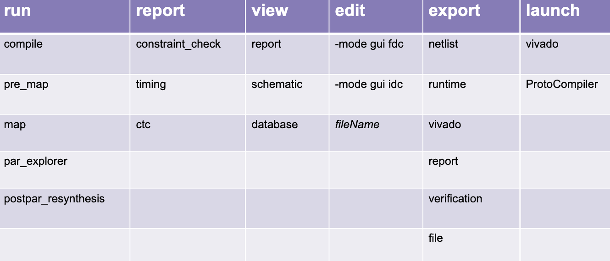
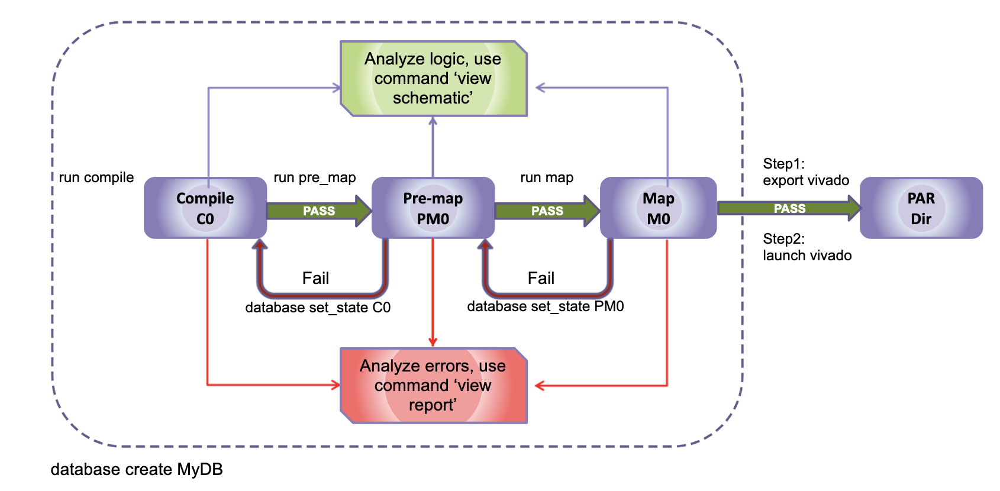
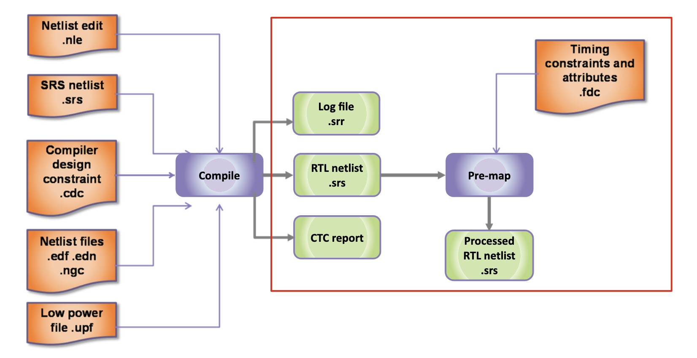
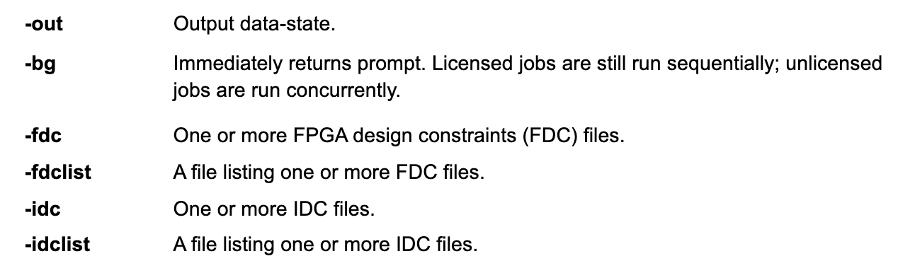
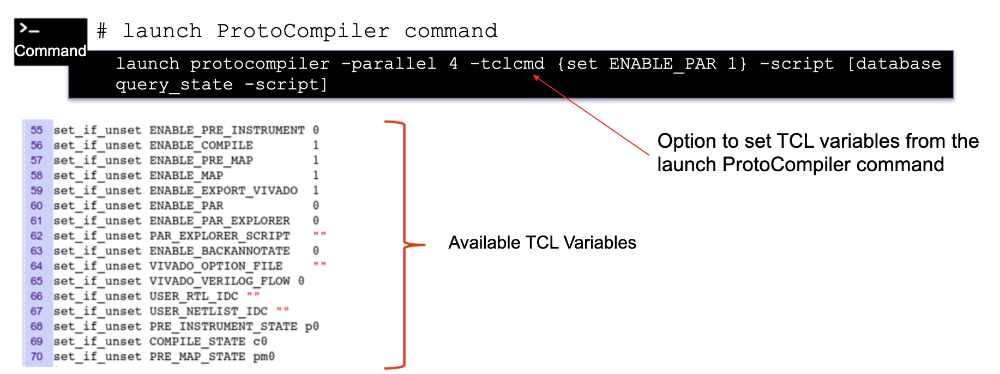
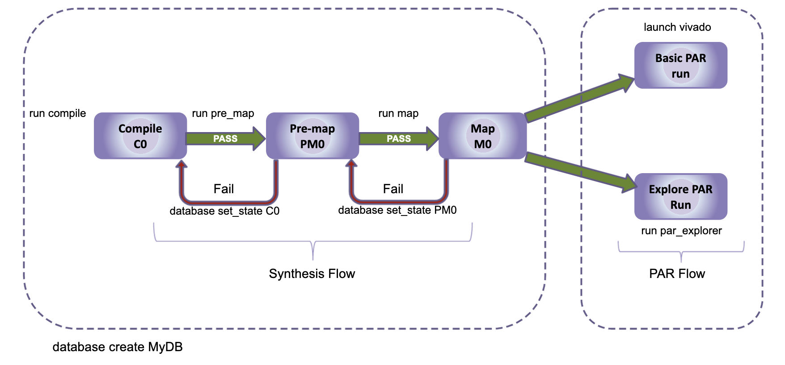
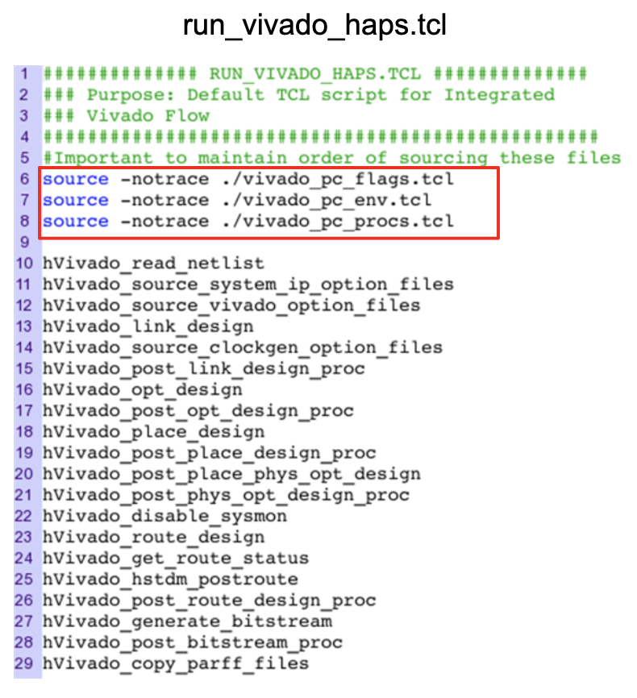
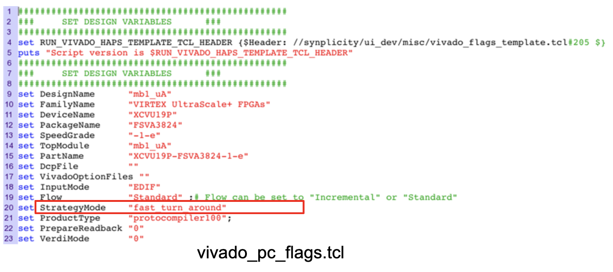
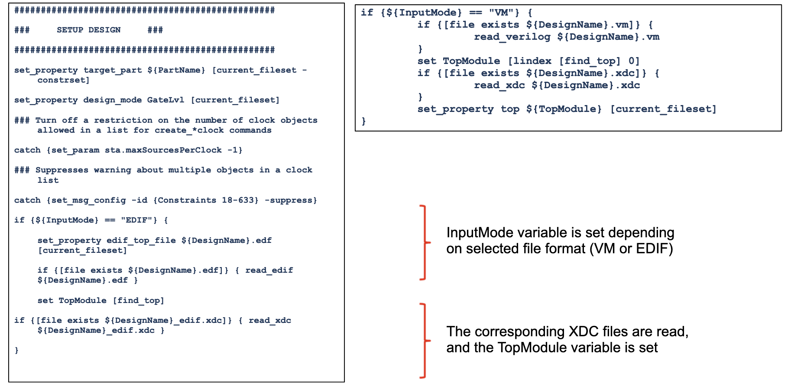

- Commands (for ProtoCompiler during single FPGA synthesis):


- Environment setting:
```
setenv XILINX_VIVADO ./path/vivadoVersion/
setenv SYNOPSYS ./path/synVersion/
```

- Flow:


# Compile
- Command:
```
run compile [-out stateName] [-bg] [-src sourceFile] [-srclist sourceFileList] [-top_module modName] [-cdc cdcFile] [-cdclist cdcFileList]
```

# Pre-map


- Command:
```
run pre_map [-out stateName] [-bg] [-fdc constraintFile] [-fdclist constraintFileList] [-idc idcFilename] [-idclist idcFileList]
```


# Map
- Maps logic to tech primitives
- Generates tech netlist and forward-annotates constraints

- Command:
```
run map [-out stateName] [-bg]
```
- `-out`: Output datastate
- `-bg`: Immediately returns prompts

# Mapping
- Launch ProtoCompiler command:


# Vivado PnR flow
- Setup: `set_env XILINX_VIVADO ./VivadoInstallationPath/Vivado/version`

- Flow:


## Run pnr
- Step 1: Write required files to location outside of database: `export vivado -path pathtoExportDir`
- Step 2: Run Vivado pnr on exported files: `launch vivado -script exportDir/run_vivado_haps.tcl`
- Step 3: Import the pnr results back to export directory: `databases apply_state -import_vivado exportDir`
- Step 4: Create external runtime directory for access by the debugger: `export runtime -path runtimeDir`

- Specify options through a TCL file for integrated PnR
- This file is used to modify options according to the user

- The default `run_vivado_haps.tcl` script is created using information from both the design and the implementation options
- The script is automatically copied into the export directory
- The script is a template that is filled out by the UI
- `run_vivado_haps.tcl` file includes 3 tcl files


- StrategyMode (Vivado PnR strategy):


- `vivado_pc_env.tcl`: Used to set tcl vars for environment vars
- `vivado_pc_procs.tcl`: 
	- StrategyMode: `timing_qor`, `fast_turn_around`, `default`
	- Add desired directives under the new switch
	- Set value of StrategyMode var to new 'switch'
	- Run modified script to get PnR results
- `run_vivado_haps.tcl`:

