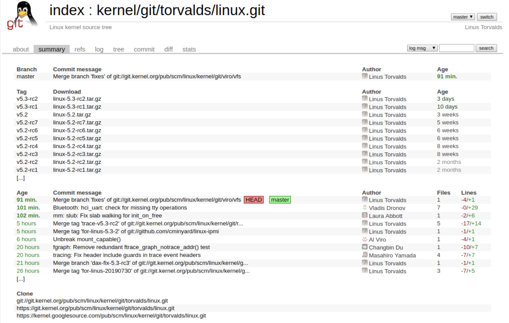
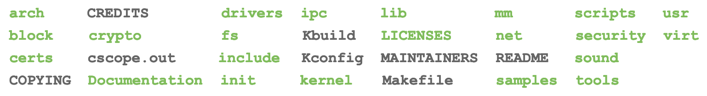
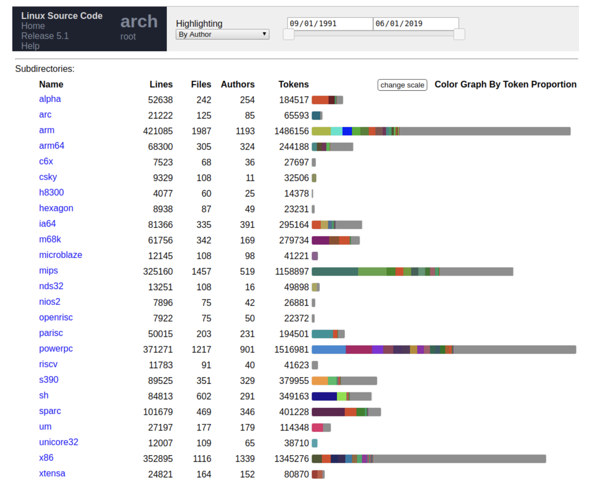
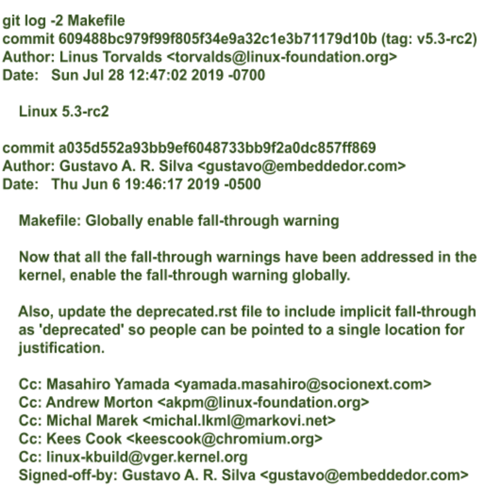

# Linux mainline
- Linux mainline source: [Linus's tree](https://git.kernel.org/pub/scm/linux/kernel/git/torvalds/linux.git/)


# Cloning the Linux mainline
```sh
cd /linux_work  
git clone git://git.kernel.org/pub/scm/linux/kernel/git/torvalds/linux.git linux_mainline
cd linux_mainline
ls -h
```


# What's in the root directory
- Most of the code is in the drivers directory
- Architectures supported by Linux:

> Screenshot taken from [cregit](https://cregit.linuxsources.org/)

# Exploring the sources
- Take a look at the **Makefile** and **MAINTAINERS** files in the main directory and **scripts/get_maintainer.pl** and **scripts/checkpatch.pl**. You will be using them in your everyday kernel development life
- Look at individual commits and generate a patch or two using:
```sh
git format-patch -1 <commit ID>
```


# The `linux-kselftest` repo
- The branches:

