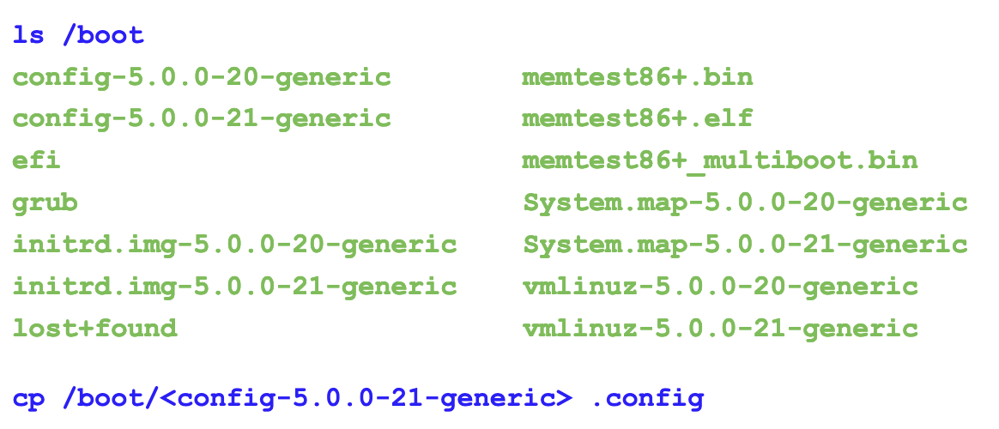

```sh
git clone git://git.kernel.org/pub/scm/linux/kernel/git/stable/linux-stable.git linux_stable

cd linux_stable

git branch -a | grep linux-5
    remotes/origin/linux-5.12.y
    remotes/origin/linux-5.11.y
    remotes/origin/linux-5.10.y

​git checkout linux-5.12.y
```

# Copy the config for current kernel from `/boot`
- Copy the configuration for your current kernel from **/proc/config.gz** or **/boot**
- Example: On Ubuntu 19.04,  **config-5.0.0-21-generic** is the configuration in **/boot** on a system
- Pick the latest configuration you have on your system and copy that to **linux_stable/.config**


- Compile kernel with `make -j3 all`

# Install kernel
- Installation:
```sh
sudo -i make modules_install install
```

- Save kernel logs
```sh
dmesg -t > dmesg_current  
dmesg -t -k > dmesg_kernel  
dmesg -t -l emerg > dmesg_current_emerg  
dmesg -t -l alert > dmesg_current_alert  
dmesg -t -l crit > dmesg_current_crit  
dmesg -t -l err > dmesg_current_err  
dmesg -t -l warn > dmesg_current_warn  
dmesg -t -l info > dmesg_current_info
```

- Make sure secure boot is disabled:
```sh
mokutil --sb-state
SecureBoot disabled  
Platform is in Setup Mode
```

# Booting kernel
- By default, grub tries to boot the default kernel, which is the newly installed kernel
- We change the default grub configuration file **/etc/default/grub** to the boot menu, and pause for us to be able to select the kernel to boot

- Configuration:
	- Uncomment **GRUB_TIMEOUT** and set it to 10: **GRUB_TIMEOUT=10** (So that grub pauses the menu long enough to choose a kernel to boot)
	- Comment out **GRUB_TIMEOUT_STYLE=hidden**
	- Enable printing early boot messages to vga using the **earlyprintk=vga** kernel boot option: **GRUB_CMDLINE_LINUX="earlyprintk=vga"**
	- Run update-grub to update the grub configuration in **/boot**: **sudo update-grub**
