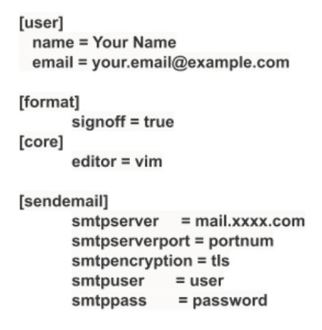

- Create a user specific git config file `.gitconfig` in home directory


- Configure `signoff = true` with `git commit -s`

- The Linux kernel is completely configurable. Drivers can be configured to be installed and completely disabled. Here are three options for driver installation:
	- Disabled
	- Built into the kernel (**vmlinux** image) to be loaded at boot time
	- Built as a module to be loaded as needed using **modprobe**.

- It is a good idea to configure drivers as modules, to avoid large kernel images
- Modules (**.ko** files) can be loaded when the kernel detects hardware that matches the driver
- Building drivers as modules allows them to be loaded on demand, instead of keeping them around in the kernel image even when the hardware is either not being used, or not even present on the system

# Creating a new branch
- Add a remote named `linux` to help us fetch changes and choose a tag to rebase from
```sh
git remote add linux git://git.kernel.org/pub/scm/linux/kernel/git/torvalds/linux.git  
git fetch linux

git checkout -b work
```

# Change a driver
- Run `lsmod` to see the modules loaded on the system and pick a driver to change. 
- Use git grep to find modules location:
```sh
git grep uvcvideo -- '*Makefile'
drivers/media/usb/uvc/Makefile:uvcvideo-objs := uvc_driver.o uvc_queue.o uvc_v4l2.o uvc_video.o uvc_ctrl.o drivers/media/usb/uvc/Makefile:uvcvideo-objs += uvc_entity.o  
drivers/media/usb/uvc/Makefile:obj-$(CONFIG_USB_VIDEO_CLASS) += uvcvideo.o
```

- **uvcvideo** is a USB Video Class (UVC) media driver for video input devices, such as webcams. It supports webcams on laptops. Let’s check the source files for this driver:
```sh
ls drivers/media/usb/uvc
```

- Let's make a small change to the probe function of the **uvcvideo** driver. A probe function is called when the driver is loaded
- Add `pr_info("I changed uvcvideo driver in the Linux Kernel\n");` to the `uvc_probe` function (`pr_info()` writes a message to the kernel log buffer, which we can check using `dmesg`)

# Configure module
- Configure **uvcvideo** as a module and a built-in to play with installing, loading and unloading modules

- Configure as a module:
	- Configure `CONFIG_USB_VIDEO_CLASS=y`
	- Recompile your kernel and install. Note that you don't have to reboot your system. You can load your newly installed module
- Load module:
	- `sudo modprobe uvcvideo`
	- Run `dmesg | less` and search for **"I changed"** to see the message
	- Run `lsmod | grep uvcvideo` to see the module
- Unload module:
	- `sudo rmmod uvcvideo`
	- Check `dmesg` for any messages about the **uvcvideo** module removal
	- Run `lsmod | grep uvcvideo` to see the module
- Configure Built-in:
	- Configure `CONFIG_USB_VIDEO_CLASS=y`
	- Recompile your kernel, install, and reboot the system into the newly installed kernel
	- Run `dmesg | less` and search for **"I changed"** to see the message

# checkpatch
- Run `checkpatch.pl` on the diff before testing and committing the changes
- Once `checkpatch` is happy, commit the change and run this to generate the patch
```sh
git format-patch -1 <commit ID>
```

