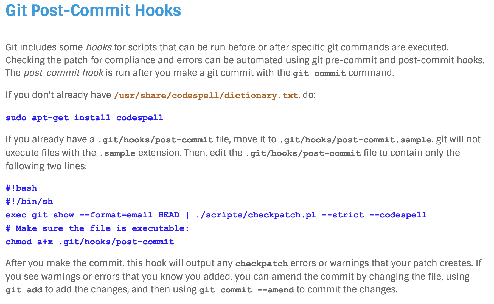

- Run `get_maintainer.pl` to get the maintainer's email
```
scripts/get_maintainer.pl drivers/media/usb/uvc/uvc_driver.c
```

- Then run this to generate a patch:
```sh
git format-patch -1 <commit ID> --to=laurent.pinchart@ideasonboard.com --to=mchehab@kernel.org --cc=linux-media@vger.kernel.org --cc=linux-kernel@vger.kernel.org
```

- Send this patch using this:
```sh
git send-email <patch_file>
```

- Response to patch will usually take 1 week


