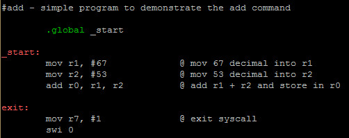
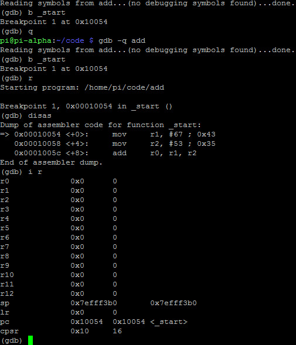
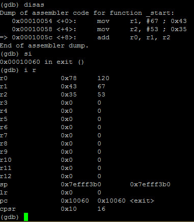
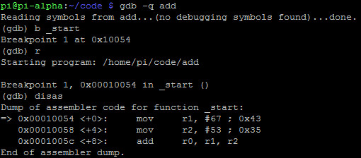
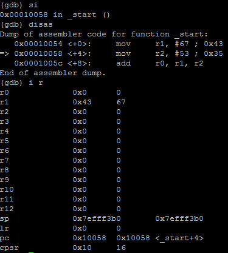
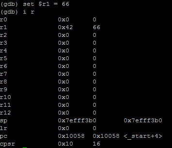
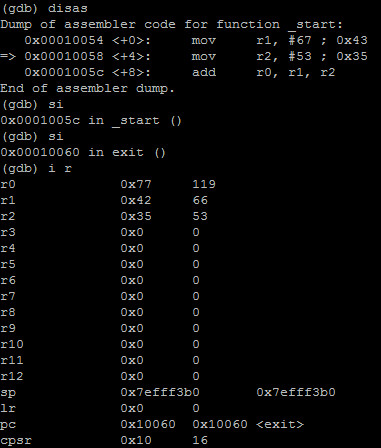

# ADD
- In ARM Assembly, we have three instructions that handle addition: 
	- **ADD** 
	- **ADC**: Add with carry 
	- **ADDS**: Set flag

- Example: 

# Debugging ADD
- Example: 

- Debugging with GDB:

- We can see that **cpsr** is 0x10

- **Note**: The flags register (**cpsr**) remains unchanged by this operation

# Hacking ADD
- Example:

- The value 67 is moved into r1:

- Let's set r1 to 66:

