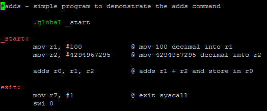
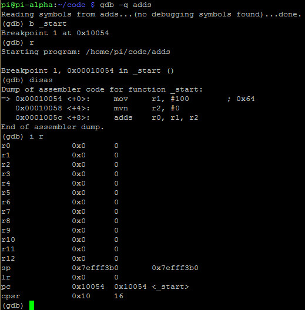
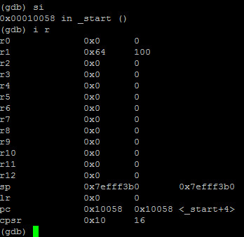
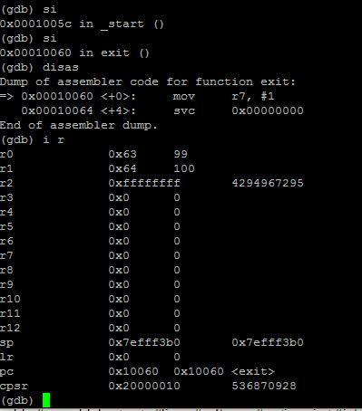
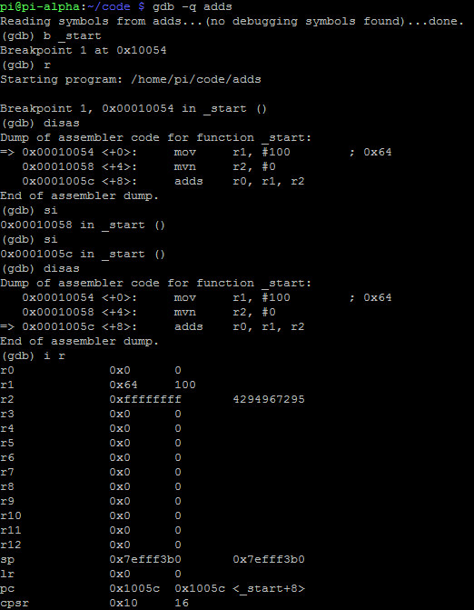
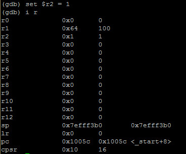
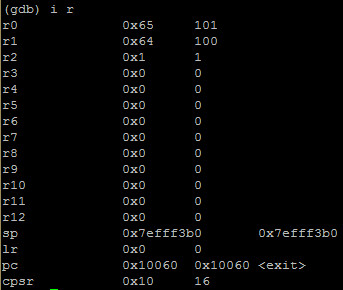

# ADDS
- **ADDS** is the same as **ADD** except it sets the flags accordingly in the **CPSR**

- Example:

- The value of the CPSR is in hex. In order to see what flags are set, we must convert the hex to binary
- Bits 31, 20, 29 and 28 in the CPSR indicates:
	- **bit 31 - N** = Negative flag
	- **bit 30 - Z** = Zero flag
	- **bit 29 - C** = Carry flag
	- **bit 28 - V** = Overflow flag

- If the value in binary was **0110** of bit 31, 30, 29 and 28 (**NZCV**), that would mean:
	- Negative flag NOT set
	- Zero flag SET
	- Carry flag SET
	- Overflow flag NOT set

# Debugging ADDS
- Example:

- Debugging with GDB:

- The **cpsr** is **10 hex**. **10 hex** in binary is **00010000**
- Therefore if the value in binary was **0001** of bit 31, 30, 29 and 28 (**NZCV**) that would mean:
	- Negative flag NOT set
	- Zero flag NOT set
	- Carry flag NOT set
	- Overflow flag set

- the value in **r0** is 99 decimal after 100 decimal and 4294967295 decimal were added together. That's because we overflowed the 32-bit register of **r0**
- If we examine the **cpsr** we now see 20000010 hex or 0010 0000 0000 0000 0000 0000 0001 0000 binary. We only have to focus on the most significant bits which are **0010**:
	- Negative flag NOT set
	- Zero flag NOT set
	- Carry flag set
	- Overflow flag NOT set

- The **Carry flag** was set and the **Overflow flag** was NOT set
- The **Carry flag** is set when two unsigned numbers were added and the result is larger than the register where it is saved
- We are dealing with a 32-bit register. We are also dealing with unsigned numbers therefore the **CF** is set and the **OF** was not as the **OF** flag deals with signed numbers

# Hacking ADDS

- We see 4294967295 decimal or **0xffffffff** in **r2**. If we step again we will cause the CPSR to change from 0001 to 0010
- This action sets the carry flag

- Let's set r2 to something else:

- This kept **cpsr** at 0x10 or 0001 in binary