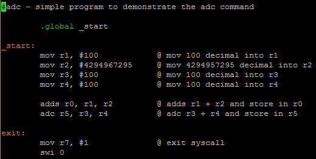
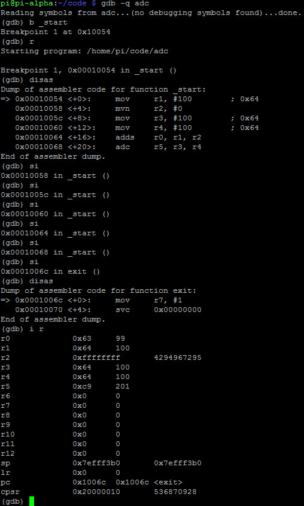
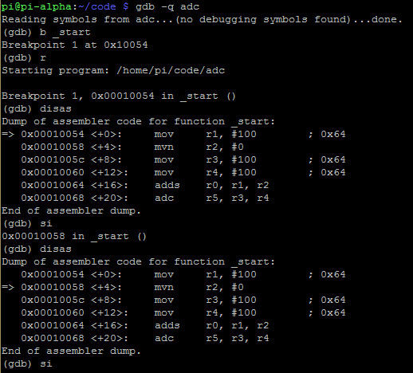
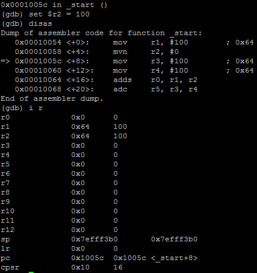
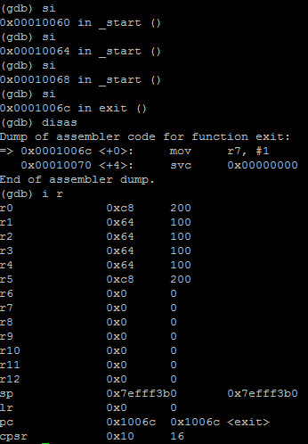

# ADC
- ADC is the same as ADD except it adds a 1 if the carry flag is set
- We need to pay attention to the CPSR or Status register when we work with ADC

- Example:

# Debugging ADC
- Program: 

- Debugging with GDB:

- The **adds** instruction before the **adc** instruction sets the cpsr flag to **20000010** in hex or **0010** in binary. This means the carry flag (3rd flag from the left) is set to 1, so the **adc** will add the 2 registers together and then add a 1

# Hacking ADC
- Program:

- **r2** is currently 4,294,967,295

- Let's change the value of **r2**:

- **Note**: The cpsr flag is 0x10, so the value of **r5** is now 200 instead of 201
