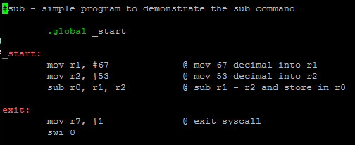
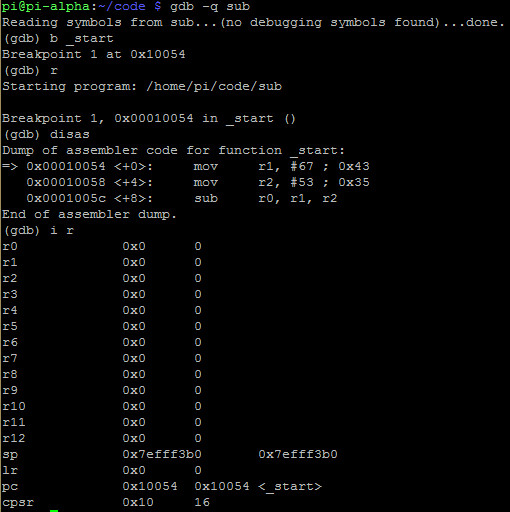
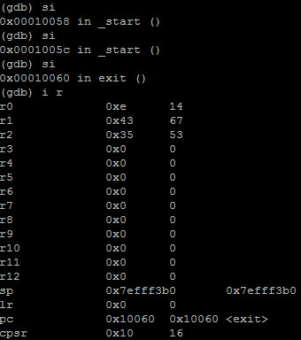
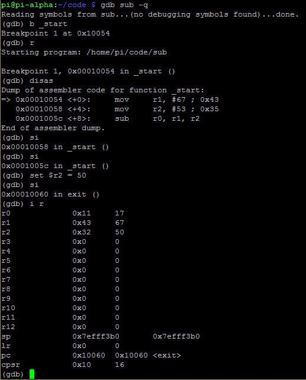

# SUB
- Subtraction in ARM has four instructions: 
	- **SUB**
	- **SBC**
	- **RSB**
	- **RSC**

- **Note**: Adding the S suffix on the end of each such as **SUBS**, **SBCS**, **RSBS**, **RSCS** will affect the flags

- Example: 

# Debugging SUB
- Program:

- Debugging with GDB:

# Hacking SUB
- Program:

- Debugging with GDB:

- Let's set **r2** to 50:

