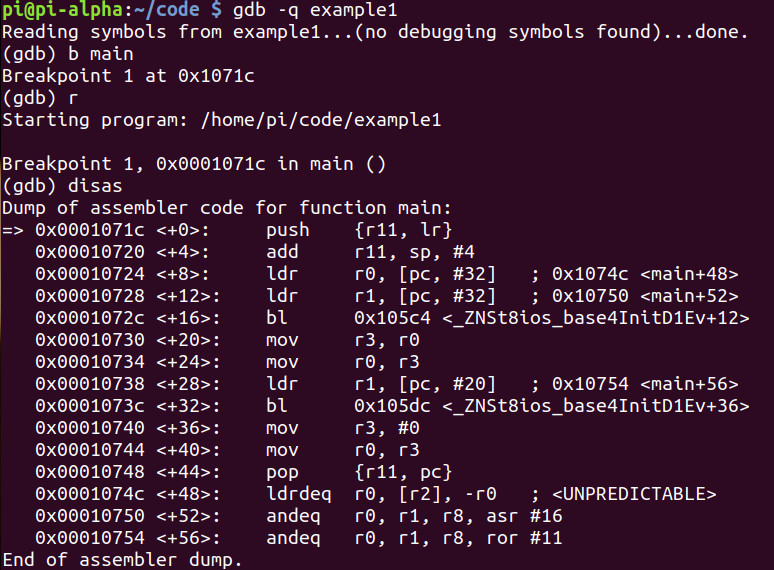
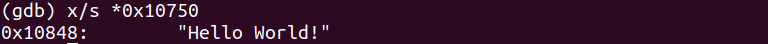
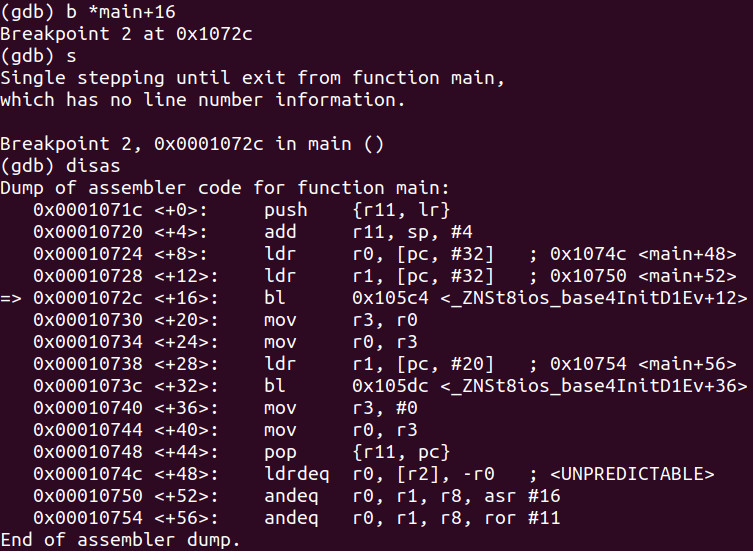
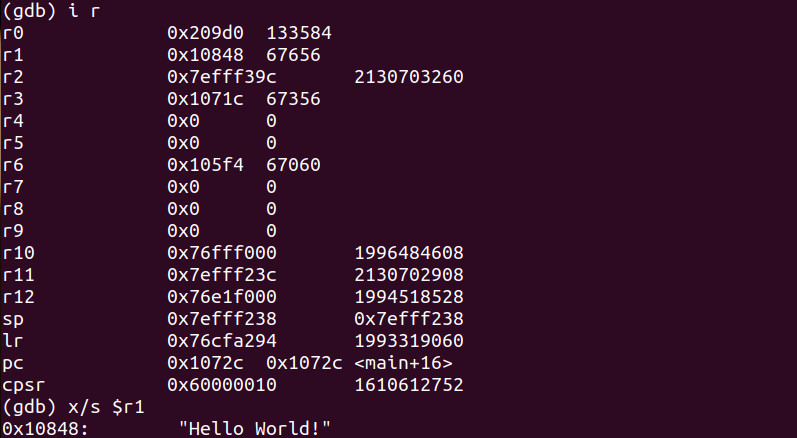
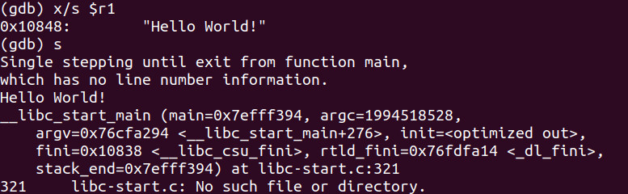
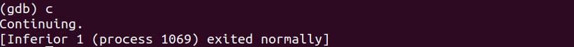
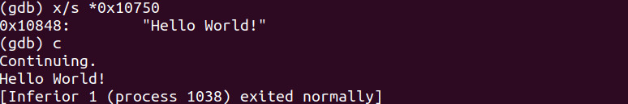
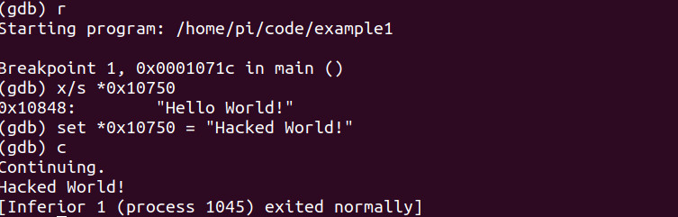
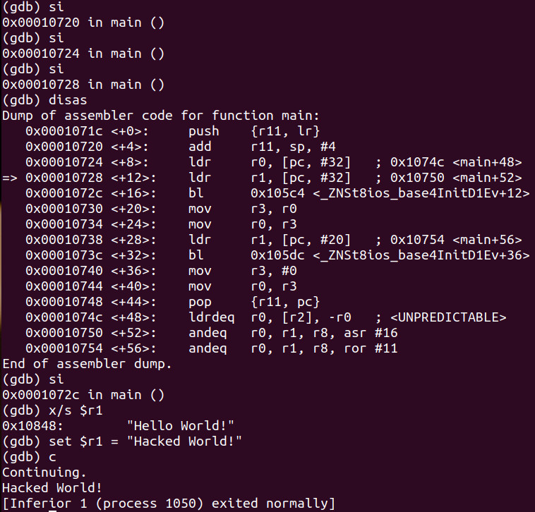

# Hello World
- Program:
```cpp
#include <iostream>

int main(void)
{
	std::cout << "Hello World" << std::endl;
	
	return 0;
}
```

- The **<<** operator is referred to as an overloaded operator. They are essentially a function very similar to **printf** in the C language. We are simply moving the **“Hello World”** string into the **cout** function through the use of the **<<** overloaded operator. We then push the **endl** which creates a new line to the console

- The first thing that occurs is the entire contents of the **iostream** header goes into the source file 
- The compile process is where the C++ code gets translated into machine code. The next stage of compilation occurs when the rest of the lines of our existing code are parsed through. Essentially we have all of the contents of **iostream** into a new file and then all of the contents of our existing file added to a single file

- Compiling takes our text file the cpp file and converts it into an intermediate format called an obj file. An abstract syntax tree is created which is a conversion of constant data, variables and instructions
- Once the tree is created the code is generated. This means we now have machine code that our ARM CPU will execute. Every cpp file (translation units) which will have its own respective obj file associated with it
- Linking takes our obj files, our compiled files, in addition to the C++ Standard Library and finds where each symbol and function is and link them all together into one executable

# Debugging Hello World
- Program:
```cpp
#include <iostream>

int main(void)
{
	std::cout << "Hello World" << std::endl;
	
	return 0;
}
```

- Debugging with GDB:


- We start with loading the link register into **r11** and adding **4** to the stack pointer and then adding it to **r11**. This is simply a routine which will allow the binary to preserve the link register and setting up space on the stack
- The memory address **0x10750** is being loaded from memory to the register **r1**. Let’s do a string examination and see what is located at that address:


- Let's set a breakpoint at `main+16`:




- Let’s take a look at what is inside the **r1** register and then step through the binary:




# Hacking
- Program:
```cpp
#include <iostream>

int main(void)
{
	std::cout << "Hello World" << std::endl;
	
	return 0;
}
```

- Debugging with GDB:




- Let's try to overwrite the value inside of the memory address with the string "Hacked World” and continue execution:


- Let's run again:


- Now let's examine the string inside **r1** by **si**-ing 3 times. We can see that "Hello World" has been loaded into **ldr** (load from memory to register) at `main+12`
- Now let's set **r1** into something else (This is working with the registers instead of the memory):

