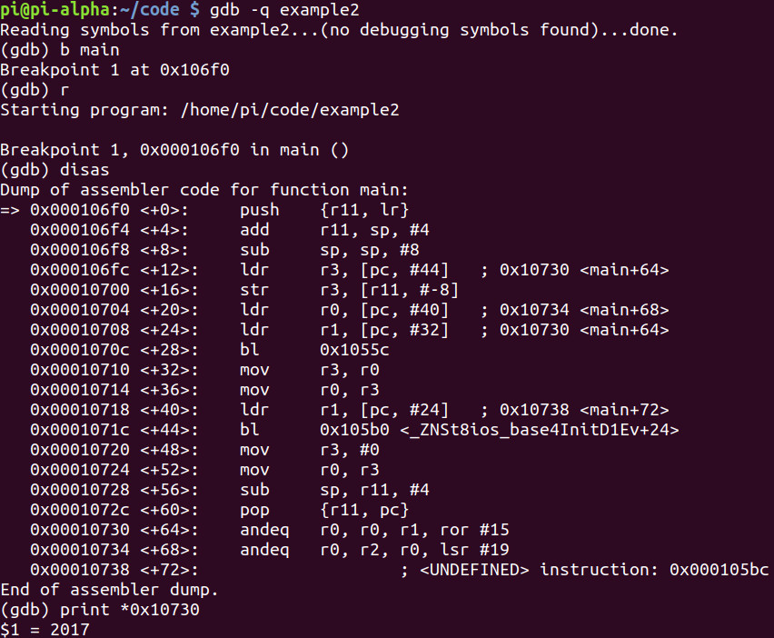
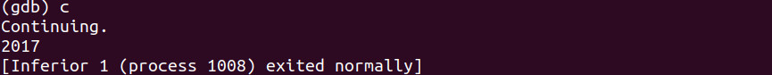
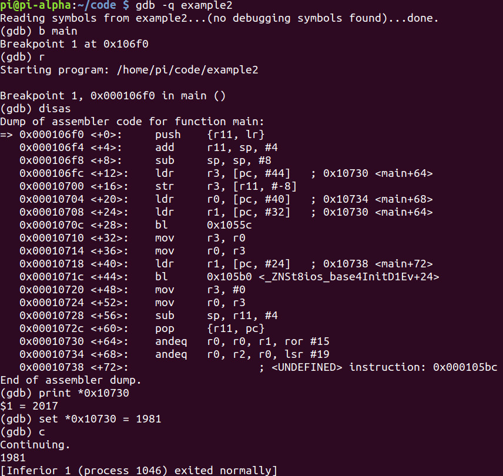
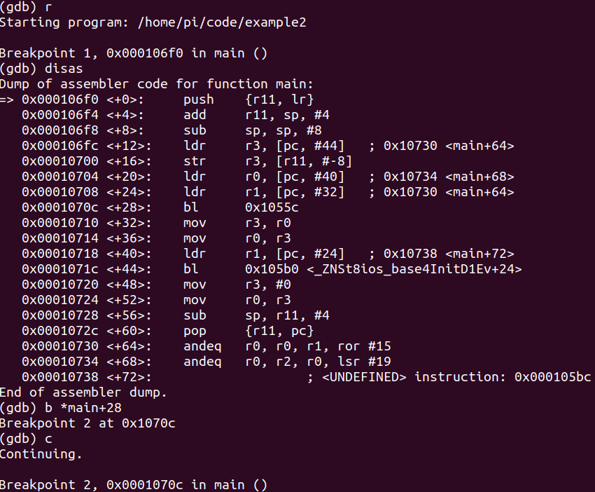
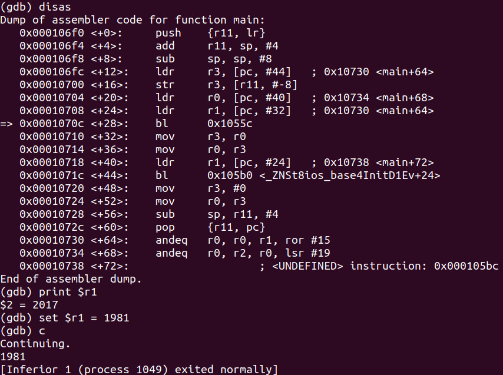

# Program
```cpp
#include <iostream>
 
int main(void) 
{
	const int YEAR = 2017;
	
	std::cout << YEAR << std::endl;
	
	return 0;
}
```

# Debugging

- The value in the memory address **0x10730** is equal to **2017**



# Hacking
- Let's set the value at **0x10730** to something else:


- Let's do it another way, set a breakpoint at `main+28`:

- The value of **r1** gets changed into 2017

- Let's change **r1**:

