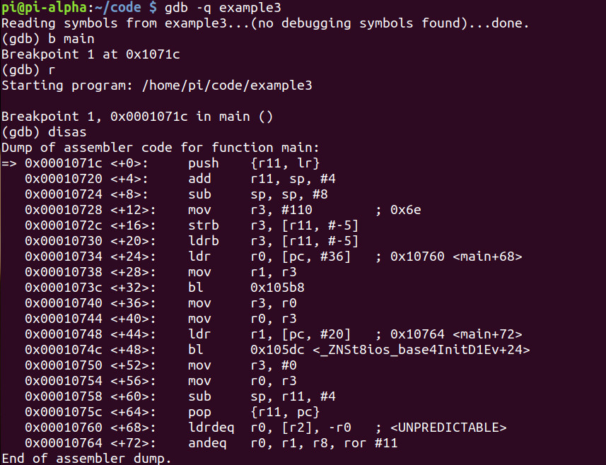
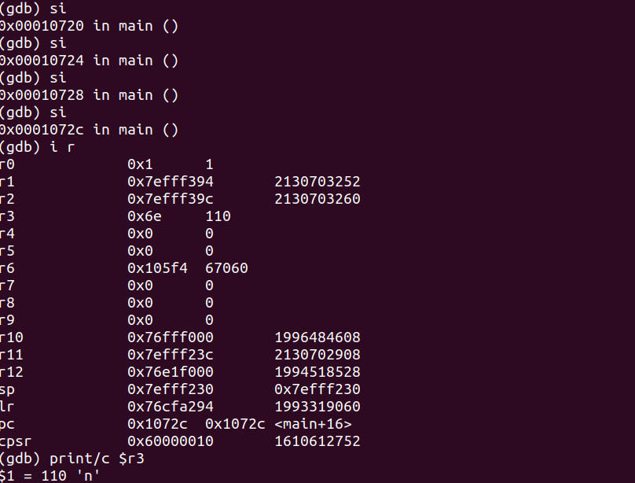
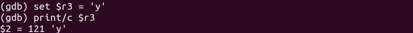
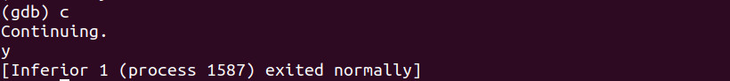

# Program
- Unlike strings, a character only takes up 1 byte of data
- When we deal with any character data, we deal with two hex digits which are the ASCII code that represents an actual character that we see on our respective terminals
- Each hex digit is 4 bits in length. So two hex digits are 8 bits in length or a byte long
- Example: The value of **n** is **0x6e** hex or **110** decimal

- Example program:
```cpp
#include <iostream>

int main(void)
{
	char yes_no = 'n';
	
	std::cout << yes_no << std::endl;
	
	return 0;
}
```

# Debugging
- Debugging the program with GDB:


- We see **0x6e** at `main+12`:


# Hacking
- Load the program up into GDB, run and step in 4 times just like in the [Debugging](#Debugging) section, then check **r3**'s value
- Then we set **r3** to 'y':



