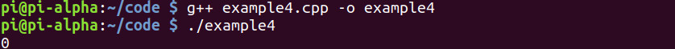
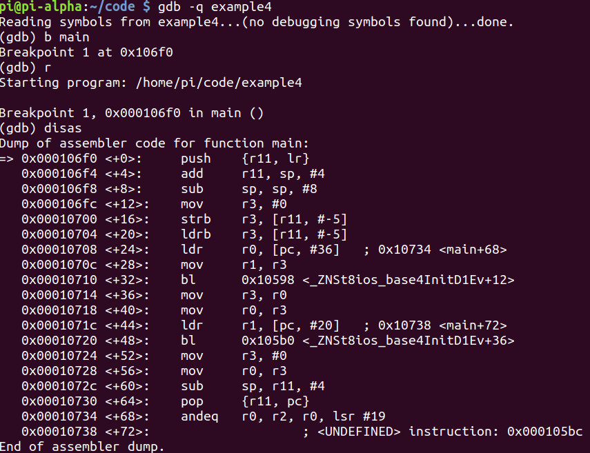
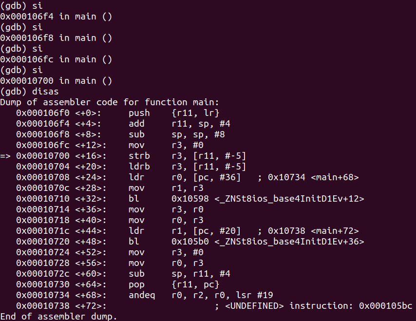
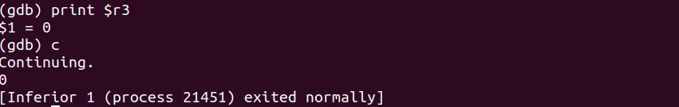
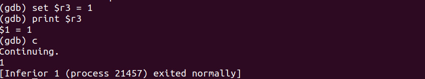

# Program
- Program: 
```cpp
#include <iostream>

int main(void)
{
	bool isHacked = false;
	
	std::cout << isHacked << std::endl;
	
	return 0;
}
```



# Debugging
- Debugging with GDB:






# Hacking
- Load the program up into GDB, run and step into 4 times just like in the [Debugging](#Debugging) section, then check **r3**'s value
- Then change **r3** to **TRUE**:

