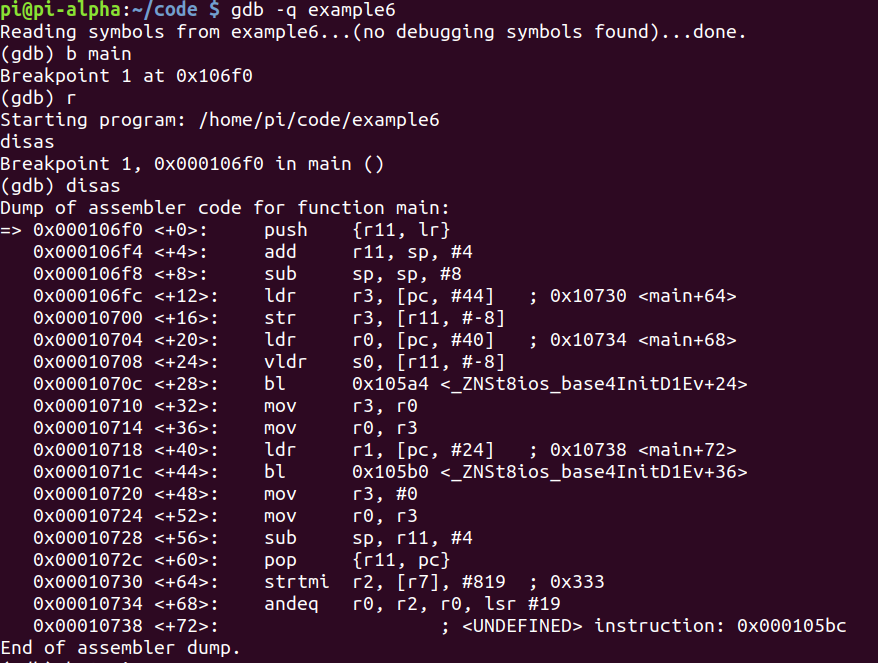
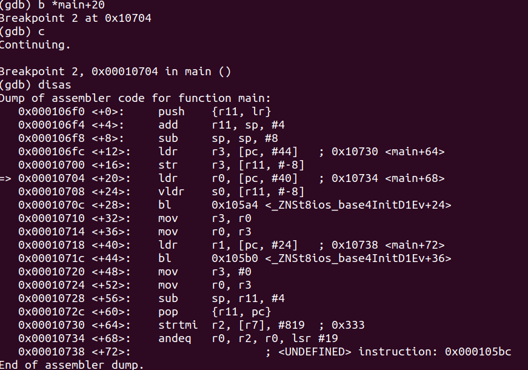
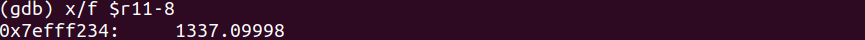
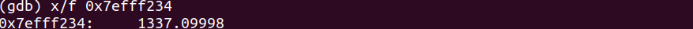
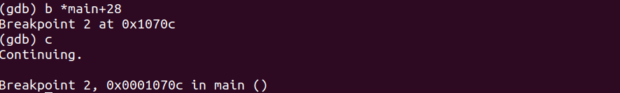
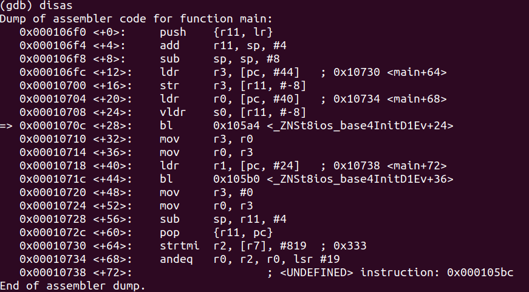
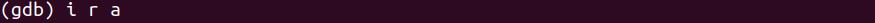
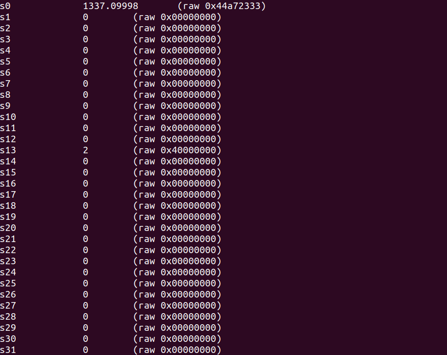
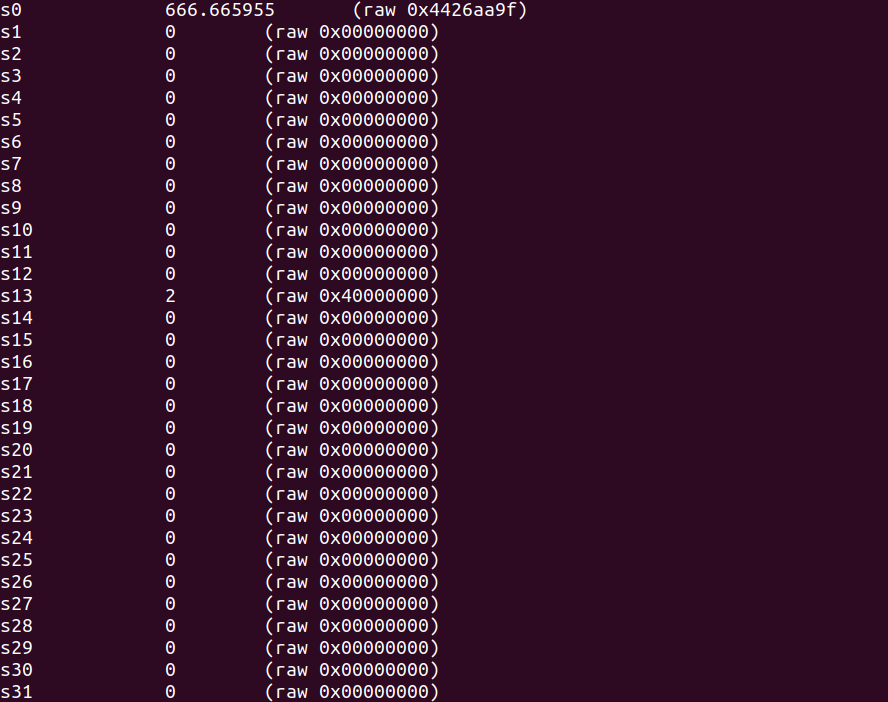
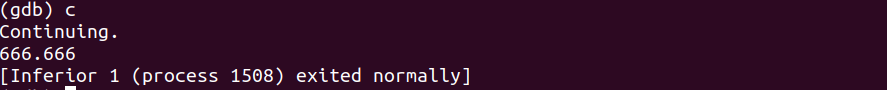

# Program
- Program:
```cpp
#include <iostream>

int main(void)
{
	float myNumber = 1337.1;
	
	std::cout << myNumber << std::endl;
	
	return 0;
}
```

- **Note**: Any fractional values must be manipulated through the math co-processor registers

# Debugging
- Debugging with GDB:


- Let's break at `main+20`:


- Let's check the value inside **r11-8**. We can see the approximate of our float data (because float has roughly 7 decimal digits of precision):


- We can also see this value in high memory:


- Let's break on `main+28`:



- We see a new instruction **vldr**, with the values in **r11, #8** being moved into **s0**
- We have a math co-processor which has a series of additional registers that work with decimal or floating-point numbers
- Here, the value of **1337.09998** is being moved into **s0**
- The **vldr** instruction loads a constant value into every element of a single-precision or double-precision register such as **s0**

- We can only see these special registers if we use info registers all (**i r a**)



# Hacking
- We can do the same thing as in the debugging section
- After doing so, we can set **s0** to something else:


- **i r a**:



