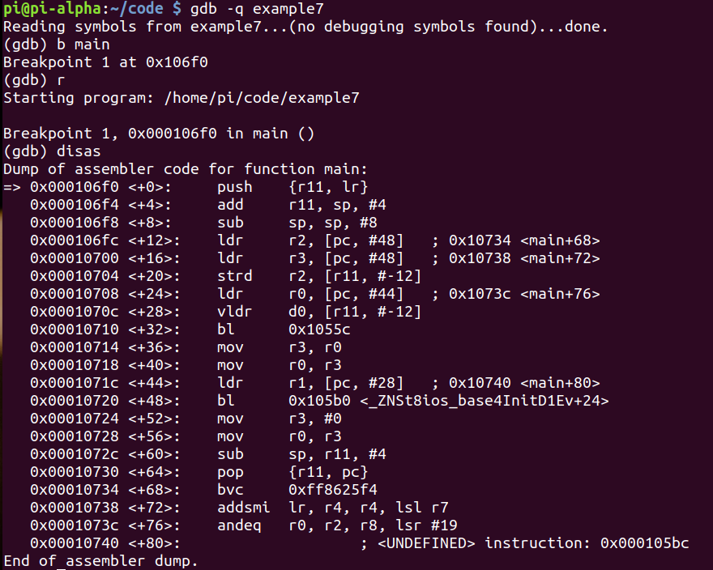
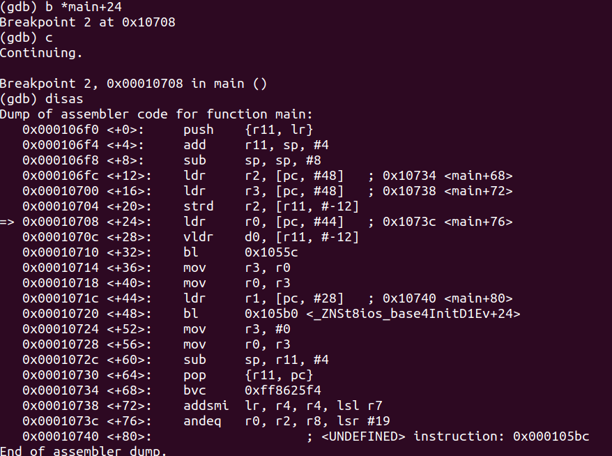
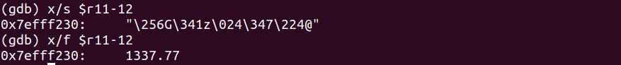
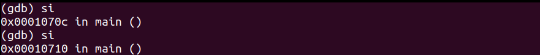
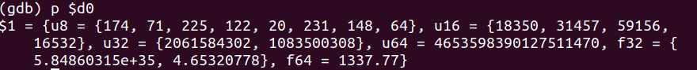
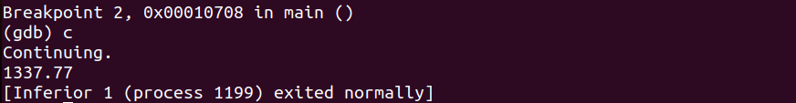
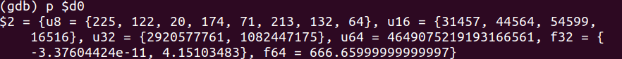
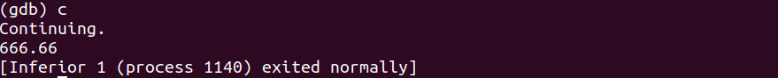

# Program
- A double-precision floating-point variable is different from a floating-point variable as it is 64-bits wide and 15-17 significant digits of precision

- Example:
```cpp
#include <iostream>

int main(void)
{
	double myNumber = 1337.77;
	
	std::cout << myNumber << std::endl;
	
	return 0;
}
```

# Debugging
- Debugging with GDB:


- Let's break at `main+24`:

- **strd r2, [r11, #-12]**: Store the value at the offset of **-12** from register **r11** into **r2**



- Let’s step into twice which executes the **vldr d0, [r11, #-12]**, that means that **1337.77** will now be loaded into the double-precision math co-processor **d0** register


- Let's print the value at **d0**:




# Hacking
- We do the same thing as in the debugging section
- Then after printing **d0**, we set the value in it to something else:





