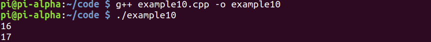
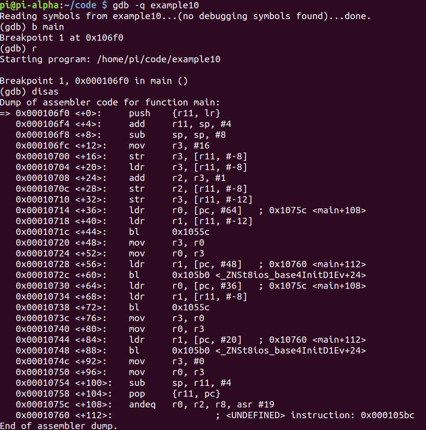
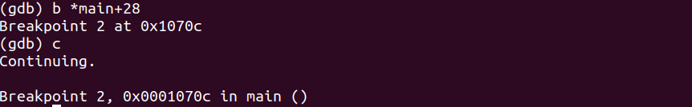
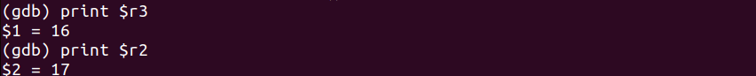
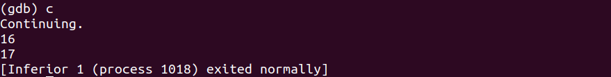
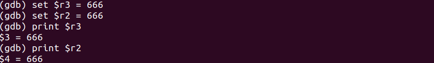
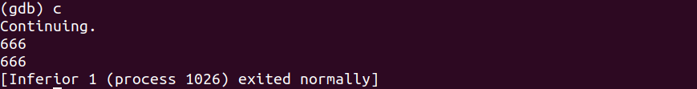

# Program
- Program:
```cpp
#include <iostream>

int main(void)
{
	int myNumber = 16;
	int myNewNumber = myNumber++;
	
	std::cout << myNewNumber << std::endl;
	
	return 0;
}
```



# Debugging
- Debugging with GDB:


- Break on `main+28`:






# Hacking
- Break on `main+28`, then set **r2** and **r3**:



