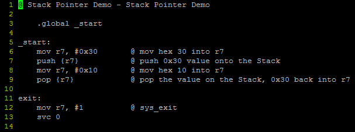
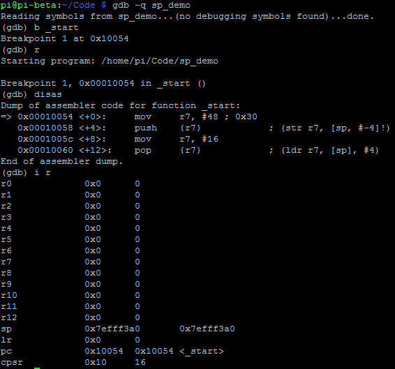
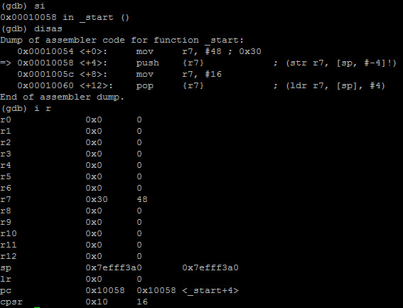
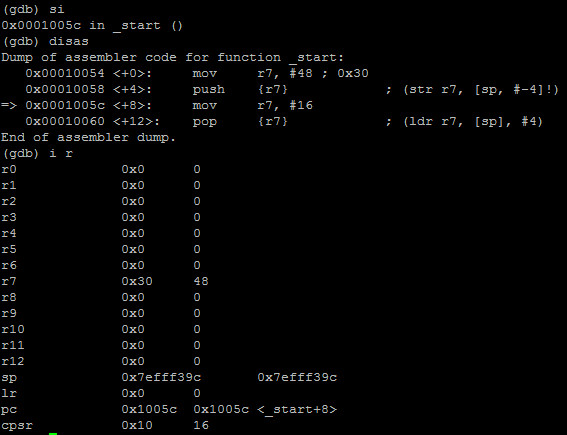
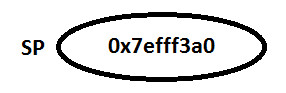
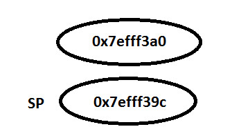
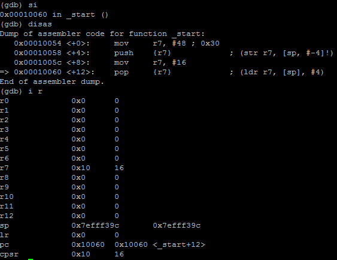
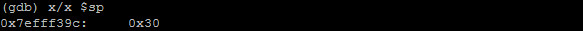
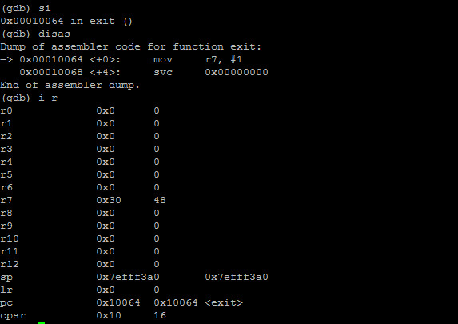

- When we push a value onto the stack, it goes into the stack pointer and when it is popped off of the stack,  it pops the value off of the stack and into a register of your choosing

- Example: 

- Debugging with GDB:

- We see the value of the **sp** change from **0x7efff3a0** to **0xefff39c**. It moves back by  **4 bytes** (stack grow **downwards**)

- Original stack:

- When r7 is pushed onto the stack:

- Step again:

- 16 has moved into **r7**, **sp** did not change

- **sp** value:

- **si** again:

- The value in the stack was popped off the stack and put back into **r7** therefore the value of **hex 30** is back in **r7** as well as the **sp** is back at **0x73fff3a0**