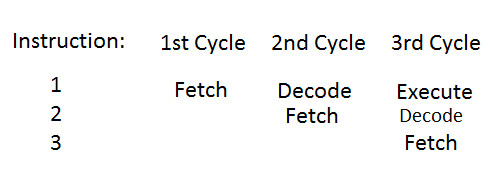

- The processor works in 3 phases:
	1) **Fetch phase**: The control unit grabs the instruction from memory and loads it into the instruction register
	2) **Decode phase**: The control unit configures all of the hardware within the processor to perform the instruction
	3) **Execute phase**: The processor computes the result of the instruction or operation

- When the processor processes instruction 1 we refer to it as being in the fetch phase.
- When the processor processes instruction 2, instruction 1 goes into the decode phase and instruction 2 goes into the fetch phase.
- When the processor processes instruction 3, instruction 2 goes into the decode stage and instruction 1 goes into the execute stage

- **Note**: If a branch instruction occurs, the pipeline may be flushed and started over again with a fresh set of cycles