# Mov
```assembly
section .data

section .text
	global _start

_start:
	mov rax, 0x10

exit:
	mov rax, 60
	mov rdi, 0
	syscall
```

- The **.data** section is where all of the global data is stores. If we had a string or some other form of hard coded data it would go in that block
- The **.text** section declares where the entry point of the program will begin. In this case we use `_start` (we can also use `main`)
- We move the value of decimal 16 or hex 10 into the 64-bit **RAX** register
- The processor will use only the lower **EAX** when debugging in GDB
- The last piece is a simple exit routine (We move 60 into **RAX** and then *syscall*). It returns operation back to the OS

- Compile:
```sh
nasm -f elf64 program.asm -o program.o
ld program.o -o program
```

- Debugging with GDB:
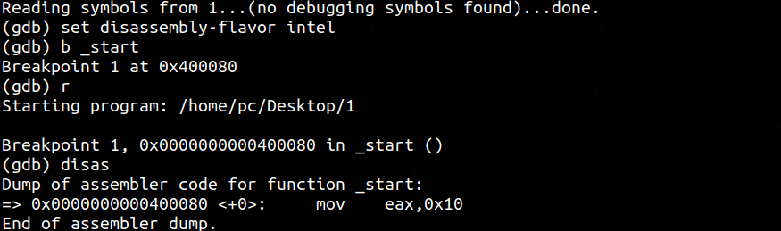
- We can see that 0x10 is about to be moved into **EAX** register

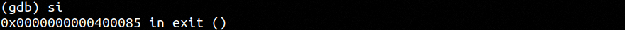
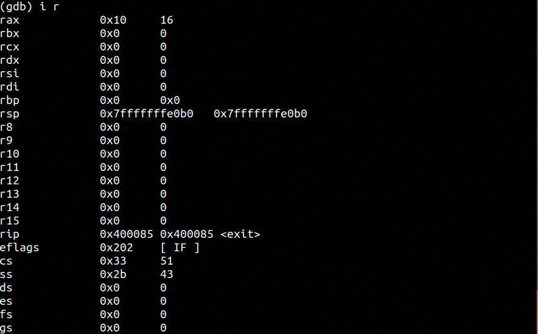
- Now **RAX** holds **0x10**

# Add
- Add 0x05 into the **RAX** register:
```assembly
section .data

section .text
	global _start

_start:
	mov rax, 0x10
	add rax, 0x05

exit:
	mov rax, 60
	mov rdi, 0
	syscall
```

- Debugging:
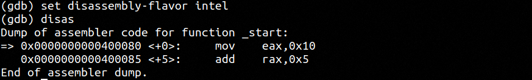
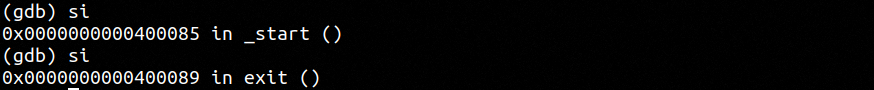
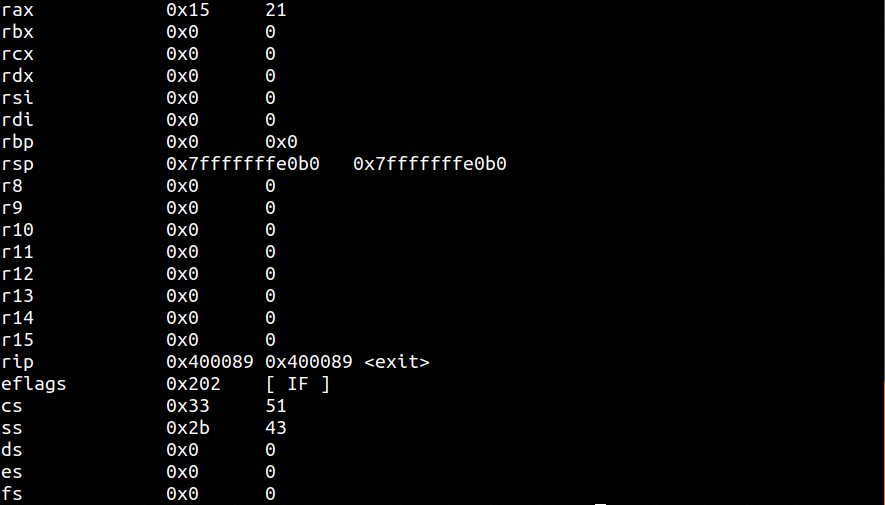

# Sub
- Subtract 0x05 from **RAX** register:
```assembly
section .data

section .text
	global _start

_start:
	mov rax, 0x10
	add rax, 0x05

exit:
	mov rax, 60
	mov rdi, 0
	syscall
```

- Debugging:
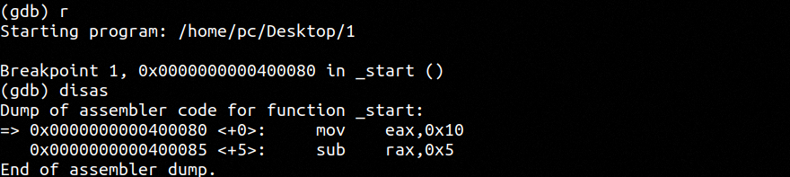
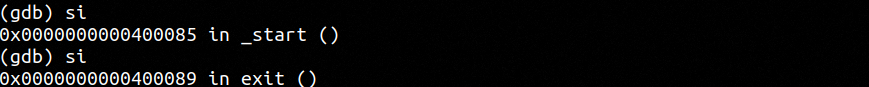
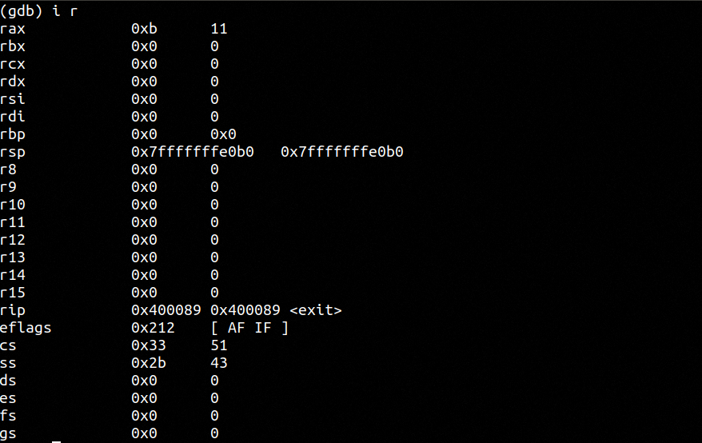

# Hello World
- Hello world program in x64 assembly:
```assembly
section .data
	text db "Hello World!", 0xA

section .text
	global _start

_start:
	mov rax, 1        ; write system call
	mov rdi, 1
	mov rsi, text
	mov rdx, 13
	syscall

exit:
	mov rax, 60
	mov rdi, 0
	syscall
```
- **0xA** is a return character
- We perform a simple write call which utilizes the OS's interrupt vector table to print the string in the standard output or terminal
- *Note*: the label **text** is not to be confused with the **.text** section

- x64 registers table: [[1. General architecture]]

- There are 3 sections in Linux-based assembly:
	- **.data**: contains data definitions
	- **.bss**: contains variable data allocation
	- **.text**: actual code

- Our compiler will take all of our labels and determine an actual mapped memory location and replace each label with the memory in the actual binary file

- Each string character is a byte in length, represented by two hex digits:
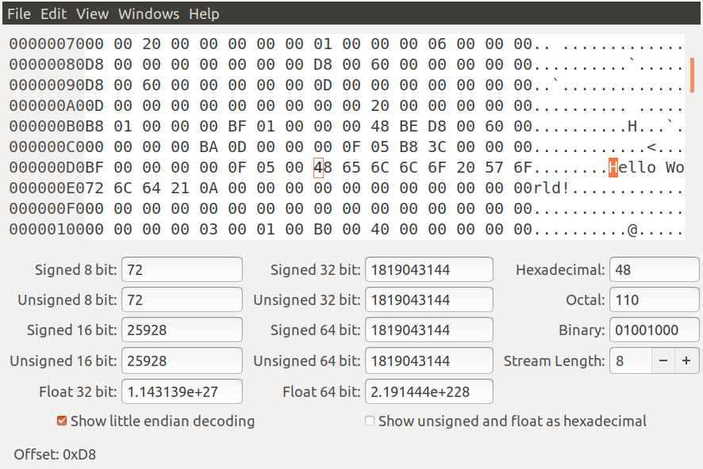

- A *syscall* is completely dependent on the OS and will differ depending on the OS because each OS has a different kernel and each have their own vector interrupt tables which have an ID associated with them with a corresponding number value
- A *syscall* is when a binary requests a service from a respective kernel to which will take arguments or a list of inputs. System call arguments or inputs correspond to specific registers:
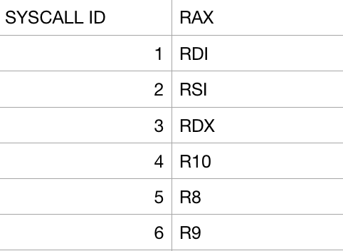

- There are 328 *syscall*s in a traditional linux kernel. We use both the **SYS_WRITE** and **SYS_EXIT**:
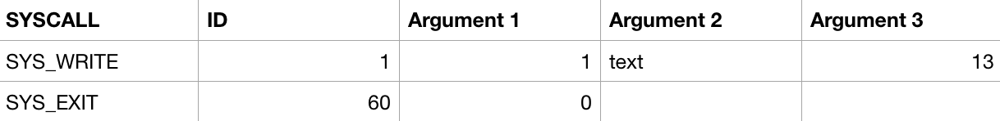

- In **SYS_WRITE** we load **1** into **RAX** which is our *syscall*
- We load **1** into **RDI** (our first argument) which represents our standard output (0 = standard input & 2 = standard error)
- The second argument is loaded into **RSI** (the **text** label) which when compiled will have an actual memory address as you will see this in a debugger
- Finally our third argument will hold the string length which is **13** in our case and loaded into **RDX**

- In addition we have our `_start` label which is what the OS will look for, otherwise it will throw an error when it seeks to find an entry point to our code
- The **global** declaration tells the linker the actual address of the data

# Debugging Hello World
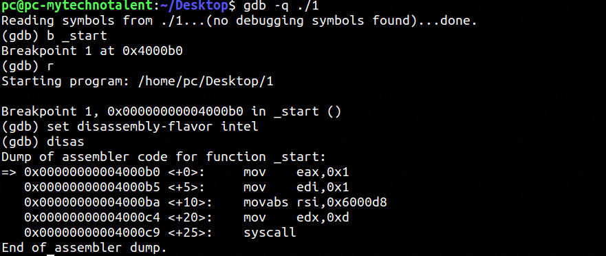
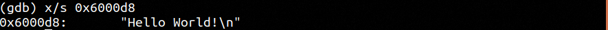

- We can change the string:
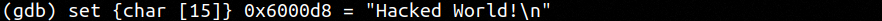

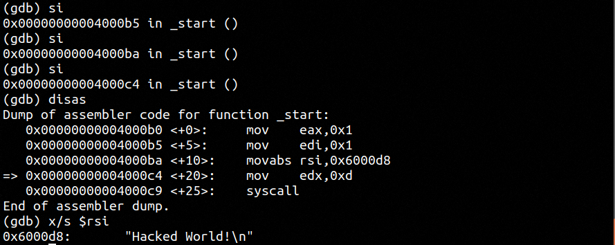

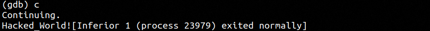
