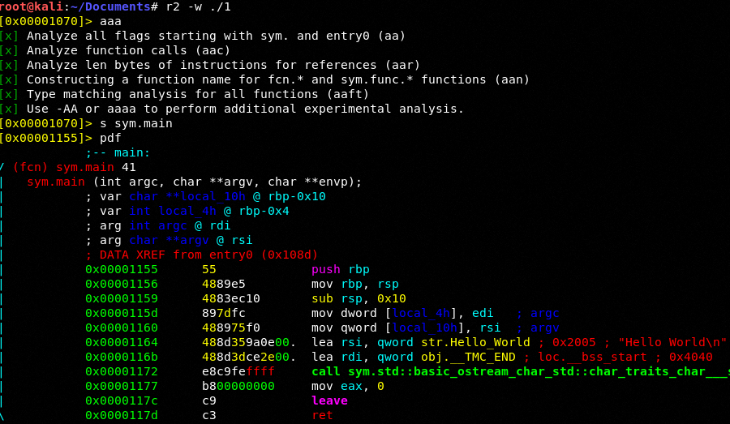
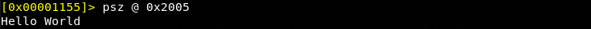
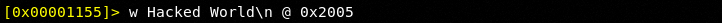
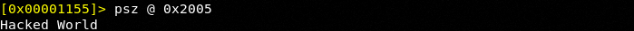
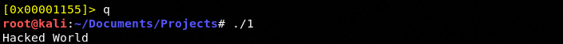

# Program
- Program:
```cpp
#include <iostream>

int main()
{
	std::cout << "Hello World\n" << std::endl;
	
	return 0;
}
```

# Debugging
- Debugging with Radare 2:



- Break down:
**r2 -w ./1**: open Radare 2 in write mode 
**aaa**: analyze the binary
**s sym.main**: seek for the main routine (the entry point)
**pdf**: disassemble the binary

- We push **rbp** the stack base pointer onto the stack. We then move **rsp** into **rbp** for safe keeping and then we reserve 0x10 hex bytes or 16 decimal bytes on the stack to make room for our string
- *"Hello World\n"* is at memory address **0x2005**

# Hacking
- We do the same thing as in the debugging process, then we change the string:



