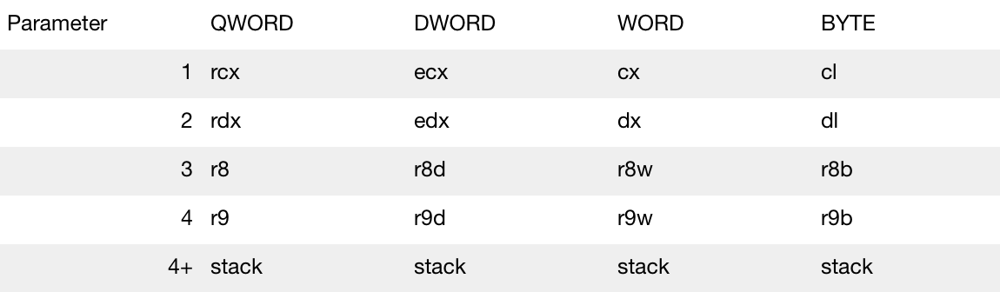

- The x64 processor uses what we refer to as \_\_fastcall.
- The \_\_fastcall calling convention specifies that arguments to functions are to be passed in registers, when possible. This calling convention only applies to the x86 architecture
- The first two DWORD or smaller arguments that are found in the argument list from left to right are passed in **ecx** and **edx** registers; all other arguments are passed on the stack from right to left
- Called function pops the arguments from the stack
- The @ sign is prefixed to names (an @ sign followed by the number of bytes (in decimal) in the parameter list is suffixed to names)

- Breakdown:

- If you have two parameters you are passing from a function, for example int **x** and int **y** and it is a QWORD, **x** will go into **rcx** and **y** will go into **rdx**
- If you have 5 parameters you are passing for example int **a**, int **b**, int **c**, int **d**, int **e** and it is a WORD in length, **a** will go into **cx**, **b** into **dx**, **c** into **r8w**, **d** into r9w and e into the stack
