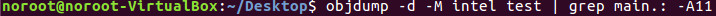

- A CPU reads instruction codes that are stored in memory as each code set can contain one of more bytes of information that guide the processor to perform a very specific task
- As each instruction code is read in from memory, any data needed for the instruction code is also stored and read into memory
- Memory that contain instruction codes are no different than the bytes that contain the data used by the CPU and special pointers are used to help the CPU keep track of where in memory data is and where instruction codes are stored
- A data pointer helps the CPU keep track of where the data area in memory starts which is the stack
- When new data elements are placed in the stack, the stack pointer moves down in memory and as data is read from the stack the stack pointer moves up in memory

- Each and every instruction code must include an opcode that defines the basic function or task to be performed by the CPU (the opcode are between 1 and 3 bytes in length and uniquely defines the function performed)

Example: test.c
```c
int main(void)
{
	return 0;
}
```


- Running objdump:


- Intel syntax:


- On the left is the corresponding memory address
- In the center is the opcodes
- On the right is the corresponding assembly language in Intel syntax

- Let's examine the address **80483de** where we see op codes **b8 00 00 00 00**:
	- The **b8** opcode corresponds with the **mov eax, 0x0** instruction
	- The next series of **00 00 00 00** represents 4 bytes of the value 0. The instruction is **mov eax, 0x0** therefore the value of 0 is moved into **eax** (representing the above code)
	- **Note**: the IA-32 platform uses little-endian notation which means the lower-value bytes appear first in order when reading right to left
	- 
