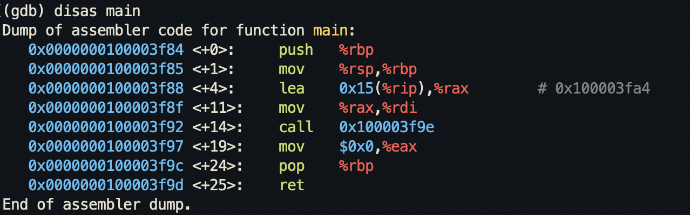
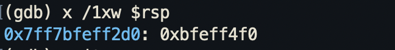

- Memory is measured in bytes, a byte is 8 bits
- 2 bytes are called a word. 2 words are called a double word (4 bytes / 32-bit), and a quad word is 8 bytes (64-bit)

- 8 bits = 2^8 = 256 in size (0 - 255)

- Every byte of memory has a unique address
- Example: Hello world disassembled (sneak peek):

- Example: Examination of the RSP register (64-bit register) (as oppose to the ESP register, a 32-bit register)

The memory locations are 4 bytes (double word), and they are represented in hexadecimals
