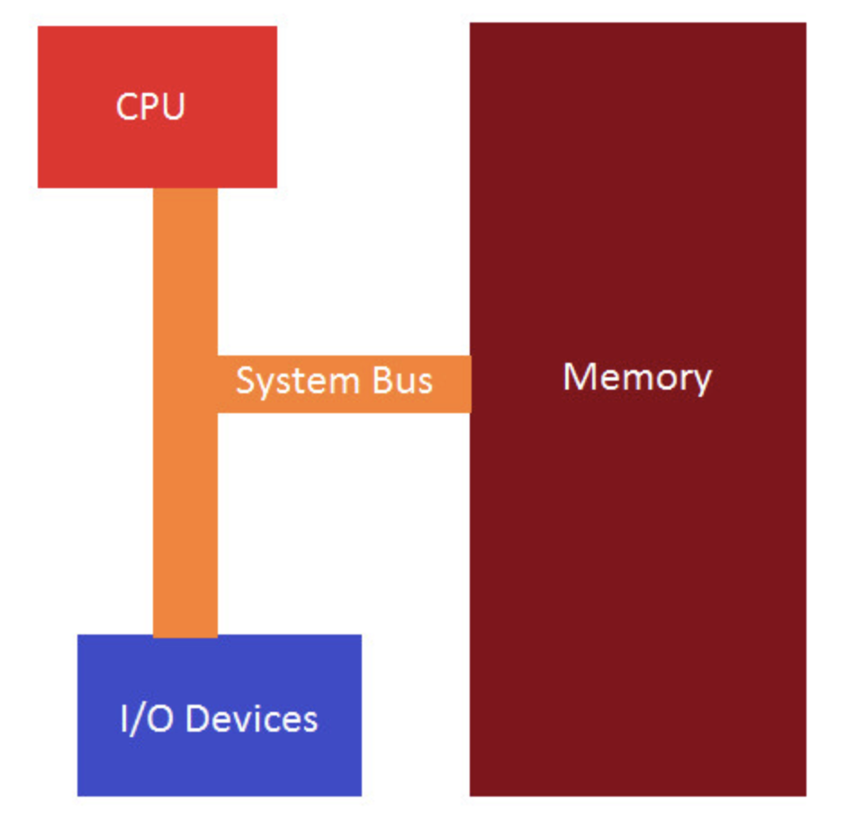
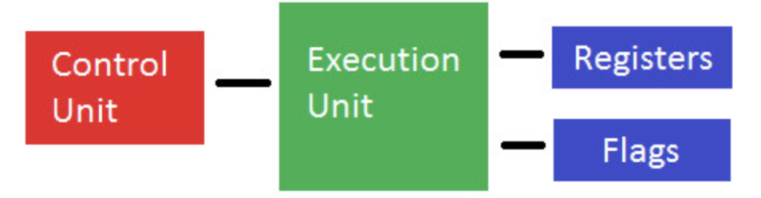

- A computer application is a table of machine instructions stored in memory which the binary numbers that make up the program are unique only in the way the CPU deals with them
- Basic architecture: CPU, memory and I/O devices all connected by a system bus

### CPU:
- **Control unit**: Retrieves and decodes instructions from the CPU, then storing and retrieving them to and from memory
- **Execution unit**: Performs the operations and calculations forwarded from the instruction unit
- **Registers**: Internal CPU memory locations used as temporary data storage
- **Flags**: Status register that contains the current state of the CPU

- A 32-bit CPU first fetches a double word (4 bytes or 32-bits in length) from a specific address in memory and load it into the CPU. Then the CPU executes the instructions that has been fetched
- Upon completion of executing an instruction, the CPU goes to memory and fetches the next machine instruction in sequence. The CPU has a register called the EIP register or instruction pointer that contains the address of the next instruction to be fetched from memory and then executed
- If we control the flow of the EIP, we can alter the program to do things it was NOT intended to do. This is a popular technique upon which malware operates
- The entire fetch and execute process is tied to the system clock which is an oscillator that emits square-wave pulses at precise intervals
