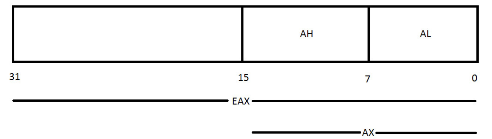
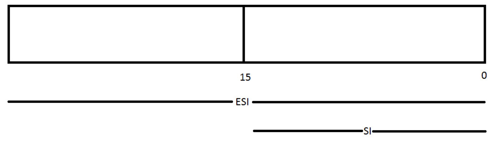

- Used as temporary data storage as the data is processed in the processor
- Each new version of general-purpose registers is created to be backward compatible with previous processors (This means that code utilizing 8-bit registers on the 8080 chips will still function on today's 64-bit chipset)

- General purpose registers can be used to hold any type of data that is used in the program

- Example: 8 general purpose registers in an IA-32 architecture 
	- **EAX** (accumulator): The main register for arithmetic calculations. It holds results of arithmetic operations and values from functions
	- **EBX**: The base register. It is a pointer to data in the DS segment. It stores the base address of the program
	- **ECX**: The counter register, often used for holding a value representing the number of times a process is to be repeated. Used for loops and string operations
	- **EDX**: A general purpose register. Used for I/O operations. Additionally, it will extends EAX to 64-bits
	- **ESI**: The source index register. A pointer to data in the segment pointed to by the DS register. Used as an offset address in string and array operations. It holds the address of the location to read the data from
	- **EDI**: The destination index register. A pointer to data (or destination) in the segment pointed to by the ES register. Used as an offset address in string and array operations. Holds the implied write address of all string operations
	- **EBP**: Base pointer. A pointer to data on the stack (in the SS segment). Points to the bottom of the current stack frame. Used to reference local variables
	- **ESP**: Stack pointer (in the SS segment). Points to the top of the current stack frame. Used to reference local variables

- *Note*: 
	- The above registers are 32-bit in length (4 bytes)
	- Each of the lower 2 bytes of the EAX, EBX, ECX, and EDX registers can be referenced by AX, then subdivided by the names AH, BH, CH and DH for high bytes and AL, BL, CL and DL for the low bytes, both of which are 1 byte each
	- ESI, EDI, EBP and ESP can be referenced by their 16-bit equivalent which is SI, DI, BP and SP

- EAX would have AX as its 16-bit segment and then subdivide AX into AL for the low 8 bits and AH for the high 8 bits. The same for EBX, ECX and EDX, except for EBX would have BX as its 16-bit segment, with BH and BL, and same thing for the other 2

- ESI, EDI, EBP and ESP can also be broken down into 16-bit segments:

- ESI would have SI as its 16-bit segment, EDI would have DI as its 16-bit segment, etc.
