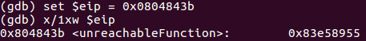
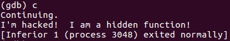

- The instruction pointer register (EIP register) is the most important register to deal with in reverse engineering
- The EIP register keeps track of the next instruction code to execute (it points to the next instruction to execute)
- If we alter the pointer to jump to another area in the code, we have complete control of the program

- Example: 
```c
#include <stdio.h>
#include <stdlib.h>

void unreachableFunction(void)
{
	printf("This is a hidden function\n");
	exit(0);
}

int main(void)
{
	printf("Hello world\n");

	return 0;
}
```

Compile to work with IA-32 instruction:


Program disassembled:


The $=>$ indicates where the EIP pointer is pointing to when we step to the next instruction. Continuing the program will just print "Hello world!"

Run the program and examine where the EIP is pointing to:


It's pointing to *main+17* or the address of **0x680cec83**

Let's examine the *unreachableFunction* and see where start in memory:


To hijack the program flow to run the *unreachableFunction*, we need to set the EIP to the address **0x0804843b**:


Now we can continue the program:

