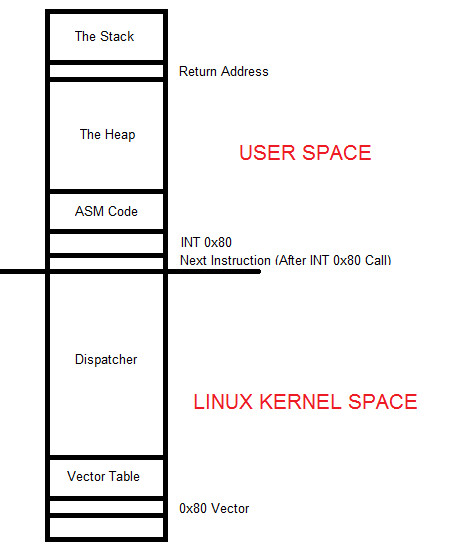

# Programming
- Every assembly programs can be divided into 3 sections:
	- **Data section**: Used for declaring initialized data or constants as this data does not change at runtime (Declare constants values, buffer sizes, file names, etc)
	- **BSS section**: Used for declaring uninitialized data or variables
	- **Text section**: Used for code (begins with global `_start` which tells the kernel where the execution begins)

- In AT&T syntax, the # symbol is used for comments

- Example program (Moves immediate data to a register and immediate data to memory):

- Compilation:
```bash
as –32 -o moving_immediate_data.o moving_immediate_data.s
ld -m elf_i386 -o moving_immediate_data moving_immediate_data.o
```


- Intel version: 

- Compilation:
```bash
nasm -f elf32 moving_immediate_data.asm
ld -m elf_i386 -o moving_immediate_data moving_immediate_data.o
```

- Line 20 - 22 (in both versions):
	- This set of instructions takes advantage of *software interrupt*
	- **movl $1, %eax**: moves the decimal value of 1 into EAX which specifies the sys_exit call (sys_exit call properly terminate program execution so that there's no segfault)
	- **movl $0, %ebx**: moves 0 into EBX to show that the program successfully executed
	- **int $0x80**: the software interrupt

### Software interrupt
- In Linux, there are 2 distinct areas of memory:
	- At the bottom of memory in any program execution is the kernel space which is made up of the dispatcher section and the vector table
	- At the top of memory in any program execution is the user space which is made up of the stack, the heap and finally our code



- When the values are loaded and **int 0x80** is called, the next instruction's address in the user space (ASM Code section which is our code) is placed into the return address area in the stack
- This is critical so that when **int 0x80** does its work, it can properly know what instruction is to be carried out next to ensure proper and sequential program execution

### Protected mode
- In modern versions of Linux, we are utilizing protected mode which means you do **NOT** have access to the Linux kernel space
- Linux will **NOT** allow your code to access operating system internals as that would be very dangerous as any malware could manipulate those components of the OS to track all sorts of things such as user keystrokes, activities, etc
- Additionally, modern Linux OS architecture changes the address of these key components constantly as new software is installed and removed in addition to system patches and upgrades. This is the cornerstone of Protected Mode operating systems
- The way that we have our code communicate with the Linux kernel is through the use of a kernel service call gate which is a protected gateway between user space where your program is running and kernel space which is implemented through the Linux software interrupt of 0x80

- At the very bottom of memory where segment 0, offset 0 exists is a lookup table with 256 entries
- Every entry is a memory address including segment and offset portions which comprise of 4 bytes per entry as the first 1,024 bytes are reserved for this table and **NO OTHER CODE** can be manipulated there
- Each address is called an interrupt vector which comprises the whole called the interrupt vector table where every vector has a number from 0 to 255 to which vector 0 starts off occupying bytes 0 to 3. This continues with vector 1 which contains 4 to 7, etc
- **Note**: None of these addresses are part of permanent memory. What's static is vector 0x80 which points to the services dispatcher which point to Linux kernel service routines
- When the return address is popped off the stack returns to the next instruction, the instruction is called the Interrupt Return or IRET which completes the execution of program flow

# Debugging
- Binary of the moving data program in GDB:


- We coded a **nop** which means no operation or 0x90 (from an opcode perspective) for proper debugging purposes which the breakpoint properly hit. This is good practice when creating assembly programs


- **si**: step into
- At `_start+0`, hex value 0x64 is moving into eax. This is moving the number 100 into eax (moving immediate data)


- **i r**: Give information on the state of the CPU registers (eax now has the value 100)


- This moves the value 0x50 into the buffer label (/x shows value in hex)


- At `_start+5`, 0x50 is loaded into the address of the buffer (**0x8049090**)

# Hacking
- Moving data program in GDB:


- Let's try setting eax to 0x66:


