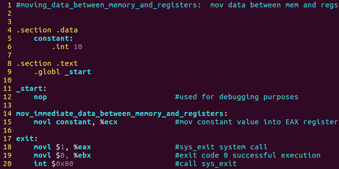
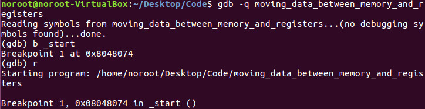
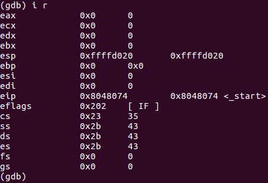
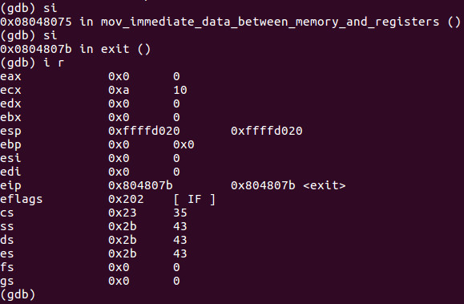
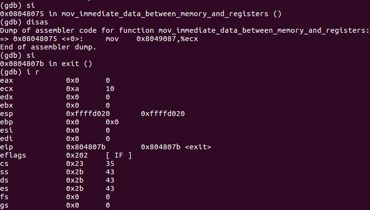
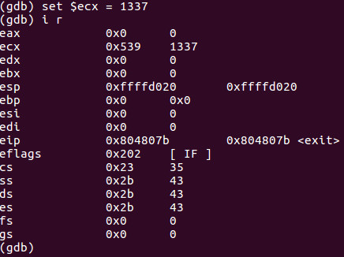

# Programming
- Moving data between memory and registers:

- Move the constant integer 10 from memory into the ECX register

# Debugging
- Program:

- Debugging with GDB:

- The ECX register is 0:

- Step in twice, the ECX now holds the value 10 or 0xa

# Hacking
- Hacking time:

- The value of ECX is 0. Let's do 2 **si**:

- Now the ECX value is 10 decimal

- Set ECX to 1337:

