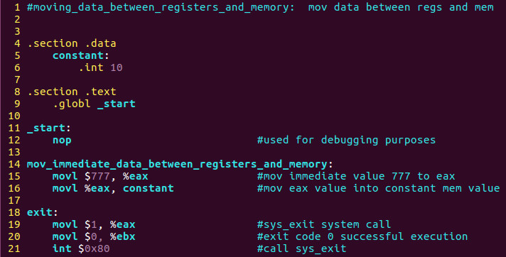
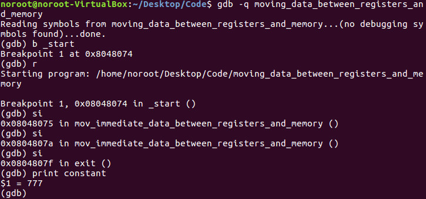
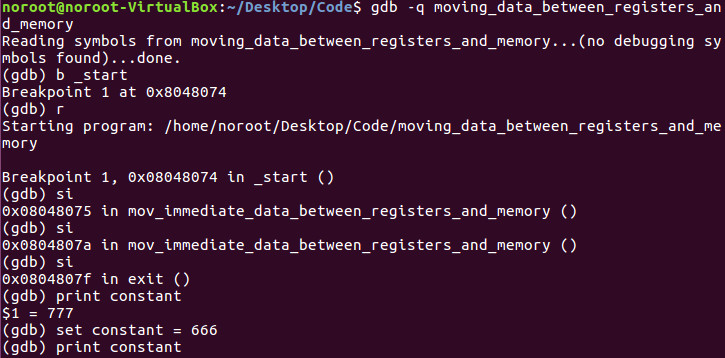

# Programming
- Move data between registers and memory program:

- Move 777 (immediate data) into EAX, then move the value in EAX to into the constant value stored in memory (initially has the value 10 in it)
- **Note**: *constant* is just a name, we can change it to anything
- This code is purely an exercise as variable data normally would be set up under the *.bss* section

# Debugging
- Program: 

- Debugging with GDB:

- In line 16 of the code the value of 777 decimal was successfully moved into EAX and into the memory value of constant

# Hacking

