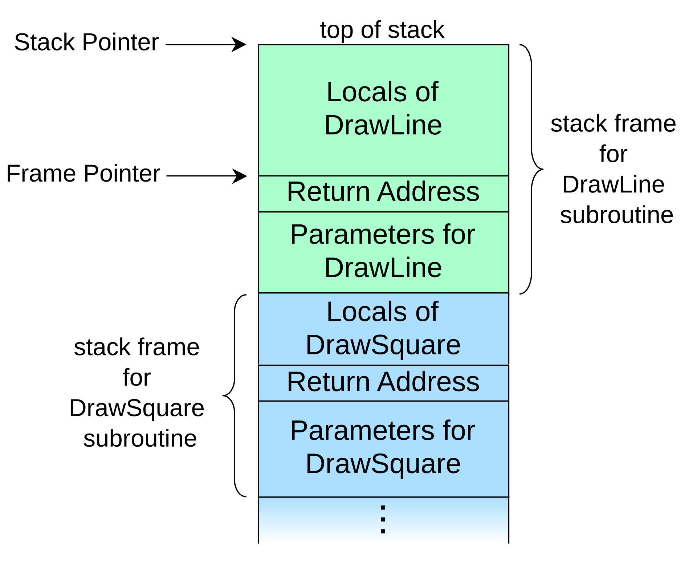

```c
#include <stdio.h>

void win()
{
    printf("This function is TOP SECRET! How did you get in here?!\n");
}

void register_name()
{
    char buffer[16];

    printf("Name:\n");
    scanf("%s", buffer);
    printf("Hi there, %s\n", buffer);    
}

int main()
{
    register_name();

    return 0;
}
```

```bash
gcc prog.c -o prog -fno-stack-protector -z execstack -no-pie -m32
```

Entering a string with more than 16 characters will cause the program to crash with a segfault, probably because we overwrote some important memory in the program. There's no code that's checking if our input will fit the buffer.

When we call a function, the next instruction after the original function call will be stored on the stack. That's how functions know where to return to after they are finished executing. To beat this challenge, we have to overwrite the return address of `register_name` to the address of `win`.

When working with the stack, there's 2 important pointers: the stack pointer and the base pointer. The stack pointer will point to the top of the stack, the base pointer will point to the bottom of the stack. We use the base pointer to access the elements inside the stack and the stack pointer to put elements onto the stack.

The local variables of a function will be stored after the return address and the parameters of the function. Below is the diagram for the stack of 2 example functions. Because the stack grows downwards, the local variables will be stored at lower-value memory address. So we can actually access the higher-value memory address through inputing more characters than the number of bytes our buffer was allocated with.



Seems like when we input a string with too many characters, the return address of `register_name` will be overwritten by that because the buffer is stored at a memory lower than the return address memory, which will be overwritten when our buffer is overflowed.

After testing some a 100 character input, I found that it takes the 29-32 string was the part that ended up in the `eip` register, which is the part that overwrote the return address. So we need an input with 28 characters + the return address of `win`.

Here's a python program to exploit this:

```python
python -c 'import sys; sys.stdout.buffer.write(b"A" * 28 + b"\x82\x91\x04\x08")' > ./prog
```

> Note: `-no-pie` will make it so that the address of the memory is absolute, so the address of `win` will be the absolute memory address. But with `PIE` enabled, if we try to disassemble the program in a debugger, the `win` function's memory address won't be an absolute memory, it will be an offset of the program's base address. For these situations, we'd have to calculate the base address of the program and work out the memory address of `win` from there.