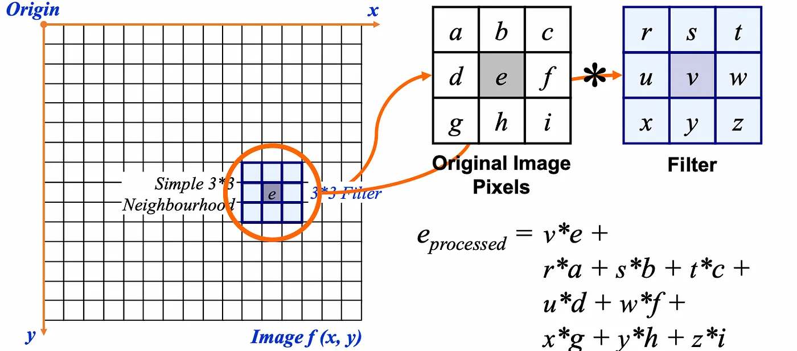
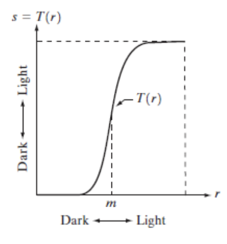
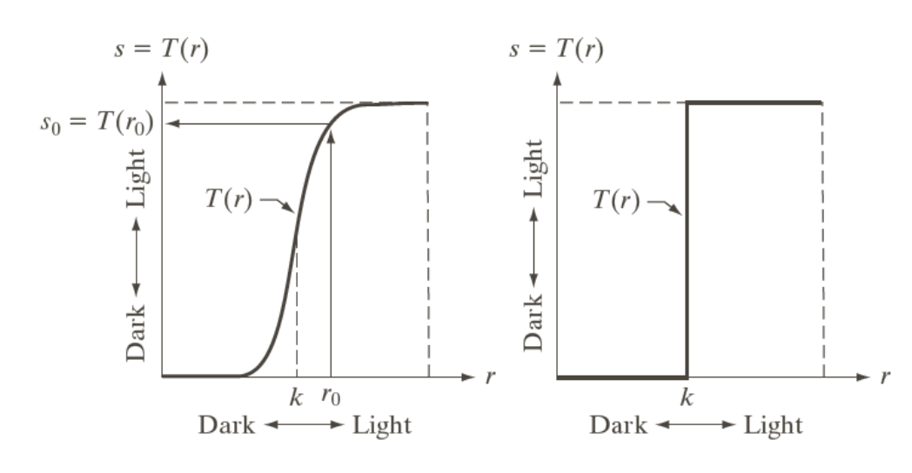

# Spatial filtering

Neighborhood operation operate on a larger neighborhood of pixels than point operations. They are mostly a square around a central pixel and any size rectangle and any shape filter are possible.

Neighborhood operations:
- *Min*: Set the pixel value to the minimum in the neighborhood.
- *Max*: Set the pixel value to the maximum in the neighborhood.
- *Median*: Set the pixel value to the midpoint in the neighborhood (set). Sometimes the median works better than the average.

[Spatial filtering](https://medium.com/@gokcenazakyol/what-is-spatial-filtering-image-processing-4-2354215843a0) is a technique used to enhance the image based on the spatial characteristics of the image. It can be used for image sharpening, edge detection, blurring, image sharpening and noise reduction.

Bellow is the smoothing spatial filter:

This process is repeated for every pixel in the original image to generate the filtered image.

There are a few approaches to dealing with missing edge pixels:
- Omit missing pixels.
- Pad the image.
- Replicate border pixels.
- Truncate the image.
- Allow pixels wrap around the image (Can cause some strange image artefacts).

# Contrast stretching and thresholding

Contrast stretching is a piecewise linear function used to enhance low contrast images. It is a technique used to stretch the histogram of an image so that the full dynamic range of the image is filled. 

The histogram of a low contrast image is usually skewed either to the left (mostly light), to the right (mostly dark), or located around the right (mostly gray).

Produce higher contrast image than the original image by:
- Darkening levels below $m$ in the original image
- Brightening levels above $m$ in the original image

- Contrast stretching means darkening the intensity levels below $k$ and brightening levels above $k$.
- Thresholding produces a binary image with a threshold of $k$.

# Negative transformation

Formula:

$$
T(r) = L - 1 - r
$$

# Gamma correction

Gamma correction is a non-linear operation for adjusting the luminance. With $c$ being the scaling factor, it determines the strength of the transformation. With $\gamma$ being the gamma correction value.

Gamma values:
- $\gamma < 1$: This is *gamma compression*. It compresses the signal, making dark areas appear lighter and bright areas appear darker.
- $\gamma > 1$: This is *gamma expansion*. It expands the signal, making dark areas appear darker and bright areas appear lighter.

$$
T(r) = c \times r^\gamma
$$

# Dynamic range compression

Dynamic range compression (DRC) helps adjusting the contrast of an image by reducing the difference between the lightest and darkest areas. It makes details in both shadows and highlights more visible.

Dynamic range refers to the ratio between the maximum and minimum luminance values. An HDR image captures a wide range of luminance (From the darkest shadows to the brightest highlights). But displays often have limited dynamic ranges, making it hard to present HDR images. DRC helps compressing the dynamic range of HDR images to work with devices with limited dynamic ranges.

Below is the formula for DRC. With $c$ being the scaling factor for the compression level.

$$
T(r) = c \times \log(1 + r)
$$

[Practice notebook](https://colab.research.google.com/drive/1FAK7cUE1219pCRkNT2eFiyiFrDt9i39f?usp=sharing)