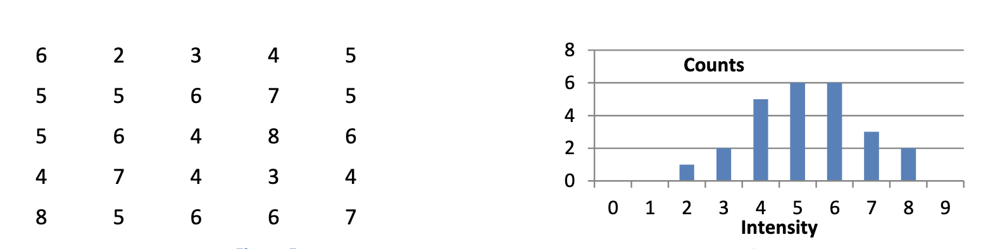
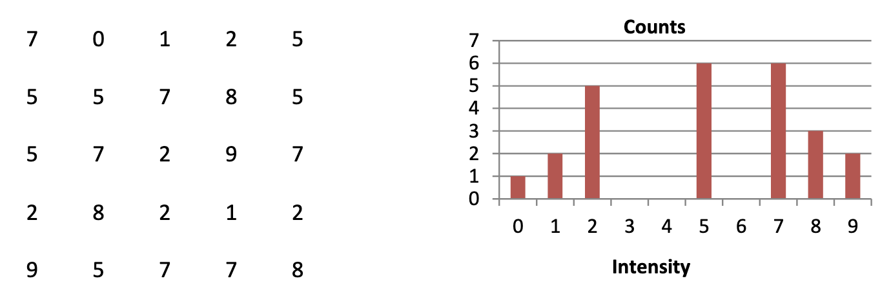

Histogram equalization helps mapping the image pixels to new pixels values to increase the overall contrast in the image.

The intensity value of an image can have a random variable with the value in the range of $[0, L-1]$. This random event has a *cumulative distribution function* (CDF) associated to itself. It describes the likelihood that the random variable will be assigned a value less than or equal to a specific value. 

For example, a thrown dice's probability of ending with a value of or less than 2 is $1/6 + 1/6 = 2/6 = 1/3$. This means that $\text{CDF}(dice \le 2) = \text{probability}(dice=1) +  \text{probability}(dice=2)$

Below is the equation for CDF of a random variable with an intensity value associated with it. It describes the CDF for the probability that the pixel has an intensity lower than $t$:

$$
\text{CDF}(i \le t) = \sum^t_{k=0} p_k
$$

$p_k$ describes the probability that a random pixel has the intensity value of $k$. The probability is calculated by dividing $n_k$, which is the number of pixels with the intensity value of $k$, with $n_i$, which is the number of total pixels:

$$
p_k = \frac{n_k}{n_i}
$$

The values are often normalized so that $p_0 + p_1 + ... +p_{L-1} = 1$. The total probability that any pixel has an intensity value in the acceptable range $(0 \le i \le L-1)$ is 1.

The goal is to create a transformation $s = T(i)$ that creates a new image with a histogram that's more spread out. This means the CDF should be more of a linear function than a strict increasing function (which is non-linear btw).

Example: Image with an intensity range of $[0, 9]$

This tells us that most pixels is around the 5 and 6 values. We can calculate the probability of a random pixel having a specific intensity within this range like this:

$$
\begin{aligned}
&p_0 = \frac{0}{25} = 0,\;
p_1 = \frac{0}{25} = 0,\;
p_2 = \frac{1}{25} = 0.04,\;
p_3 = \frac{2}{25} = 0.08,\;
p_4 = \frac{5}{25} = 0.2,\;
\\
&p_5 = \frac{6}{25} = 0.24,\;
p_6 = \frac{6}{25} = 0.24,\;
p_7 = \frac{3}{25} = 0.12,\;
p_8 = \frac{2}{25} = 0.08,\;
p_9 = \frac{0}{25} = 0
\end{aligned}
$$

Summing up all of these values will give us a value of 1, which is the correct value.

Now comes the transformation that spreads the intensity distribution out, which is given by this equation:

$$
s = T(i) = \text{floor}\biggr( (L-1)\times \text{CDF}(i) \biggl) = \text{floor}\biggr( (L-1)\times \sum^i_{k=0} p_k \biggl)
$$

This transformation uses the probability value for each intensity value and the available range to create a new pixel value for a given pixel with the intensity value of $i$. Because the CDF basically create a probability that a pixel value is less than or equal to $i$, which ranges from 0 to 1, we can normalize it to a pixel value by multiplying it with the maximum pixel value, effectively translating that intensity probability into a new pixel intensity value.

Applying that transformation to our example has the following effect:

This has the effect of increasing the contrast of the entire picture.