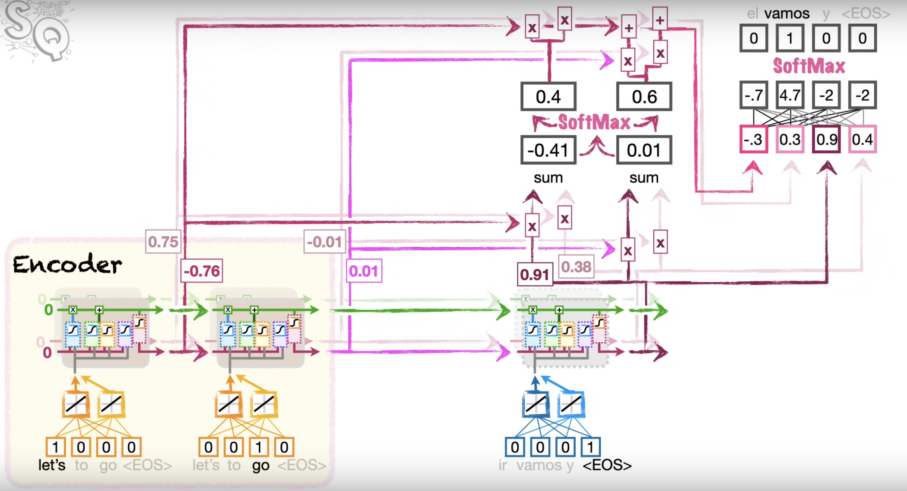

# Context vector problem

The problem with the [[Encoder-Decoder Neural Network]] model is that unrolling the LSTM layers compresses the entire input sequence into a single context vector. This works fine for short phrases but for long and complicated sentences, earlier inputs will be forgotten.

Even when we have 2 separate paths for long-term memory and short-term memory, for long sequences with lots of information, it's easy for information to be lost.

# Attention

The main idea of attention is add a bunch of new paths from the encoder to the decoder, 1 per input value, so that each step of the decoder can directly access input values.

So we start with decoding the `<EOS>` token. Now we add attention to the model. There are conventions and the main idea of Attention is the same but there's no rules for how attention should be added to an Encoder-Decoder model though.

For our case, we want to calculate the similarity score between the 1st input in the encoder's LSTM cells and the 1st input of the decoder's LSTM cells, and the similarity score between the 1st input in the encoder's LSTM cells and the 1st input of the decoder's LSTM cells. There's a lot of ways to calculate the similarity between word embeddings.

A method for calculating the similarity score is *cosine similarity*.

$$
\text{Cosine Similarity} = \frac{\sum_{i=1}^nA_iB_i}{\sqrt{\sum_{i=1}^nA_i^2}\sqrt{\sum_{i=1}^nB_i^2}}
$$

The numerator is what calculates the similarity between 2 sequences of numbers and the denominator scales them to a range of $[-1, 1]$.

Let's take an example, the 1st input in the encoder's LSTM cells is the embeddings for the word "Let's", the hidden states of the cells is this vector $A = [-0.76, 0.75]$. The 1st input in the decoder's LSTM cells is the embeddings for the `<EOS>` token, the hidden states of the cells is this vector $B = [0.91, 0.38]$. So the cosine similarity score for this is:

$$
\text{Cosine Similarity} = \frac{(-0.76 \times 0.91) + (0.75 \times 0.38 )}{\sqrt{-0.76^2 + 0.75^2}\sqrt{0.91^2 + 0.38^2}} = -0.39
$$

A more common way of calculating the similarity score is to just use the numerator in cosine similarity, which is just the dot product between the 2 vectors. Because the denominator's scaling functionality is only useful if we want to compare the similarity score between 2 LSTM cells and 3 LSTM cells. Since we always use the same number of LSTM cells, we don't really need the denominator term and can remove it for more computation efficiency.

$$
\text{Dot Product} = \sum_{i=1}^nA_iB_i
$$

Roughly speaking, large positive numbers mean things are more similar.

For our example, we can calculate the similarity scores for both input words "Let's" and "go" relative to the `<EOS>` token in the decoder, which are -0.41 and 0.01, respectively. Since the score for "go" is higher, we want the encoding for "go" to have more influence on the first word that comes out of the decoder. We do that by running the scores through Softmax. We can think of the Softmax function here as a way to determine what percentage of each encoded input word we should use when decoding. For our example, we use 40% of the 1st encoded word "Let's" and 60% of the 2nd encoded word "go".

The percentages are then used to scale the 1st encoded word's output and 2nd encoded word's output. This scaled version of the encoded words's outputs are the attention values for `<EOS>`.  is then fed into a fully-connected layer, we also want to fed the hidden state of the decoder into this fully-connected layer.

The word with the highest probability in the fully-connected layer's output is then fed back into the decoder's input and we repeat the process until we get `<EOS>` or hit the max output length.

Note that with attention added into the model, we don't entirely need the LSTMs anymore. To learn more, check out [[Transformer]].