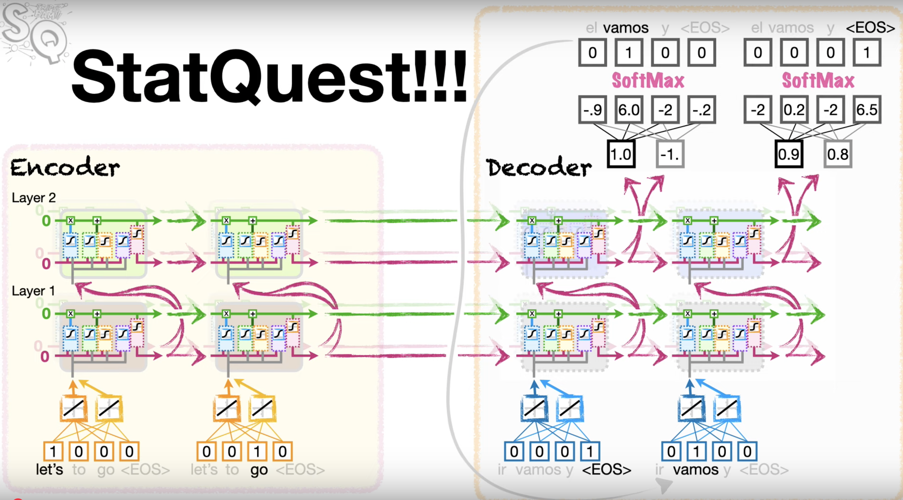

# Seq2Seq

Seq2Seq problem means translating sequences of a particular type of thing into sequences of another type of thing. 

A way to solve this problem is with an encoder-decoder neural network. It's also a stepping stone for the Transformer model.

# Encoder-Decoder Model

Example: Translating English to Spanish

The model needs to be able to handle variable input and output lengths. This is the perfect task for the [[Long Short-Term Memory]]. First we need to use the [[Word Embedding]] model to create embeddings for the tokens. For each sentences, we also want to embed an `<EOS>` symbol, which is just an end of sentence symbol.

The output embeddings will be fed into the input of the LSTM model. For the example, we have a 1 in the token "let's" and 0 in everything else. When we unroll (reuse) the LSTM model, we have 1 in the token "go" and 0 in everything else.

In theory, this is all we need to encode the input "Let's go". In practice, in order to have more weights and biases in the model, additional LSTM cells are often added to the model. To keep things simple, we just add 1 extra LSTM cells for each of the cells already present in the encoder model. This means the 2 embedding values of a token will both be used by the encoder model in 2 different LSTM cells with different weights and biases.

To add even more weights and biases, additional LSTM layers are often added to the model. Both the unrolled output (short-term memory / hidden state) of the 1st layer's cells will be fed into the 2nd layer's inputs.

For our example, the encoder model has 4 short-term memory outputs (cell states) and 4 long-term memory outputs (hidden states), these are called the *context vector*. It has 2 layers of LSTM cells and 2 LSTM cells per layer.

The decoder model will decode the context vector into an output sequence. The decoder model will also have 2 layers of LSTM cells and 2 LSTM cells per layer, so similar architecture to the encoder model. The context vector is used to initialize the cell states and hidden states of the decoder model. The input for the decoder's LSTM cells will be embeddings of the Spanish-equivalence of the sequence of tokens that the encoder model just encoded, so in this example, the input will be the "Vamos" embedding with an `<EOS>` token. We have the `<EOS>` token inputed first because that's what they used in the original manuscript, we can also use in place of it some other tokens like `<BOS>` (Beginning of sentence) or `<SOS>` (Start of sentence).

The hidden states from the top layer of the LSTM cells will be fed into a fully-connected layer, which uses Softmax to calculate the probability of the next word. In our case, there are 4 outputs, corresponding to the 4 tokens in our Spanish vocabulary. Note that for the model to be correct, the decoded sequence needs to end with the `<EOS>` token, so the output of the fully-connected layer will be fed back into the decoder as an input and go through the same processing steps until it gets the `<EOS>` token or hits the max output length.

All these weights and biases are trained with backpropagation. During training, the Encoder-Decoder model uses *teacher forcing*, meaning it plugs in known words into the decoder and stops at the known phrase length, rather than using the predicted token for everything.

# The Original Seq2Seq Model

The original model uses an input vocabulary with 160K tokens and an output vocabulary with 80K tokens. Each token has 1000 embeddings. The original model also uses 4 layers of LSTM cells with 1000 cells per layer. The fully-connected layer has 1000 input nodes to accomodate the 1000 hidden states in the 4th layer plus 80K outputs to match the output vocabulary size.