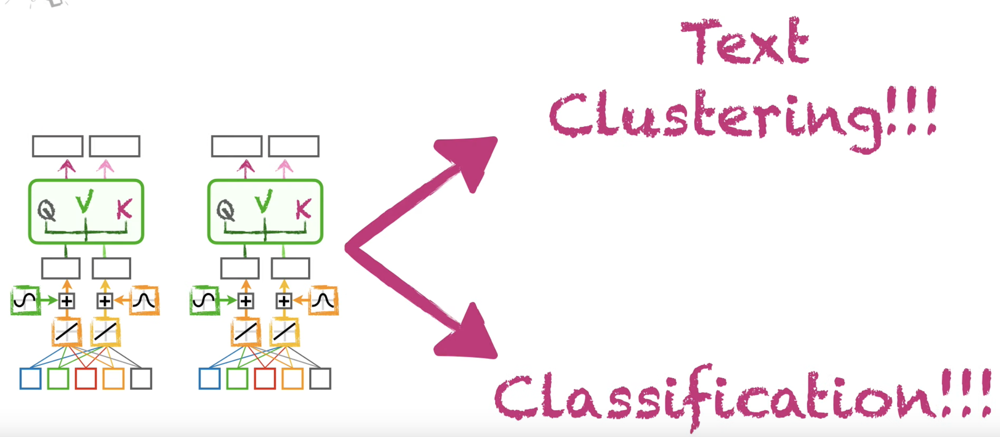
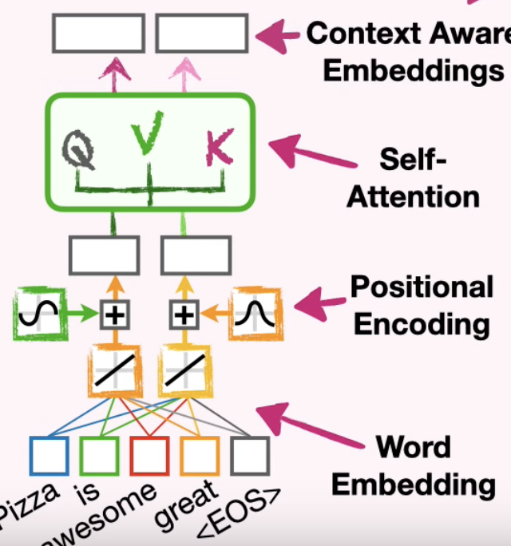
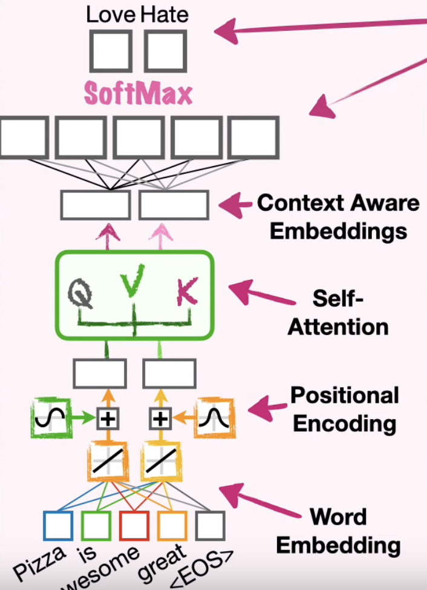

# Encoder-Only Transformer

This class of transformers are good at doing classification and sequence clustering. One of the most popular encoder-only transformer model is BERT.

The encoder-only transformer model basically takes everything from the encoder part of the transformer up to the self-attention mechanism. After the self-attention is a new embedding layer that takes position and relationships among words into account. This is called *context aware embedding* or *contextualized embedding*. This is just the output of the self-attention layer with a fancy name.

Contextualized embeddings can help cluster similar sequences. This ability to cluster information is the foundation for *Retrieval-Augmented Generation* (RAG). RAG works by breaking a document into blocks of text then use encoder-only transformer to create contextualized embeddings for each of those blocks. Then when there's a new block of text (new sentence), RAG generates the embeddings for that and try to cluster it with other blocks of text it has already processed.

Another thing we can do with encoder-only transformer is feeding the contextualized embeddings into a fully-connected layer to classify the sentiment of the input.

Alternatively, we can use the contextualized embeddings as an variables for logistic regression.