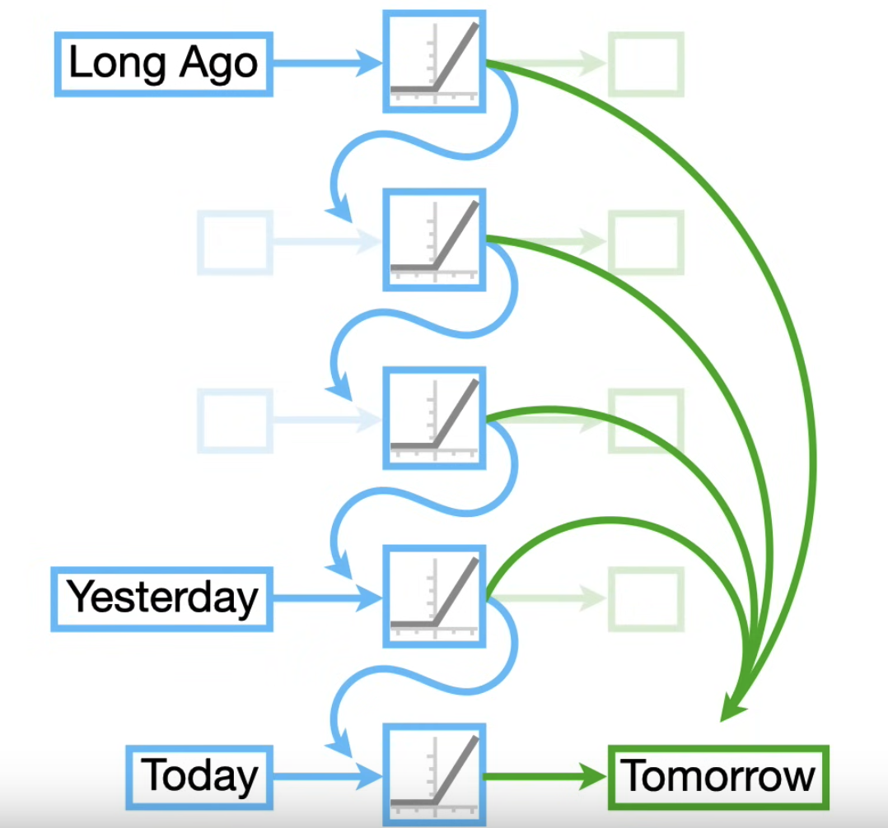
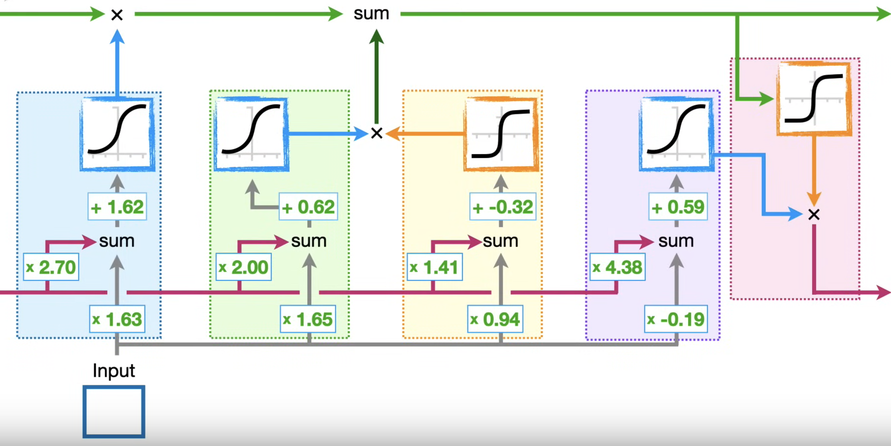

LSTM is a version of the [[Recurrent Neural Network]], made to solve the vanishing/exploding gradient problem. It's also a learning stepping stone for the Transformer.

# Relation to RNN

RNNs are hard to train because gradients can explode or vanish. LSTM is a type of RNN designed to solve these 2 problems.

Going with the same stock price prediction example as the [[Recurrent Neural Network]] note, the main idea of LSTM is that instead of using the feedback loop connection like RNN which eventually build up to make a prediction on the stock price, LSTM uses 2 separate paths to make a prediction on the stock price: 1 path for long term memory (green paths), 1 path for short term memory (blue paths).

# The Long Short-Term Memory neural network

LSTM is much more complicated compared to RNN.

Our LSTM model will use the sigmoid and tanh activation functions.

$$
\begin{aligned}
\text{sigmoid}(x) &= \frac{1}{1 + e^{-x}}
\\
\tanh(x) &= \frac{e^x - e^{-x}}{e^x + e^{-x}}
\end{aligned}
$$

This is a diagram for a simple LSTM model:

The green line running on the top is called the cell state and it represents the long-term memory. There's no weights and biases for this line. It can be modified by several factors like $x$ and $\text{sum}$. This lack of weights allows the long-term memory to flow through a series of unrolled units without causing the gradients to explode or vanish.

The pink line running through the blocks is called the hidden state and it represents the short-term memory. It's directly connected to weights that can modify them.

## The first stage

For illustrative purposes, let's assume $x = 2$ for the long-term memory, and $x = 1$ for the short-term memory, and the input value will be 1. So in the first block, the sum of the short term memory and input will be $(1 \times 2.7) + (1 \times 1.63) + 1.62 = 5.95$. This value will be fed into the sigmoid function, which will output $0.997$. Finally, the long-term memory value will be multiplied with the output of the first stage's sigmoid function: $2 \times 0.997 = 1.99$. So this reduced the long-term memory's value by a little bit. In contrast, if the input is a large negative number, the output of the sigmoid function will be close to 0, making the model forget most of its long-term memory.

Another way to think of this is the output of the first stage of LSTM determines the percentage of the long-term memory that the model will remember. This part is called the *Forget gate*.

## The second stage

The second stage of the LSTM contains 2 blocks, the green block and the yellow block. The yellow block will combine the short-term memory and the input to create a potential long-term memory. The green block will combine the short-term memory and the input to determine the percentage of the potential long-term memory to remember. The potential long-term memory value will then be combined with the long-term memory value calculated from the first stage.

So if the model has an input of 1, and a short-term memory value of 1, then the yellow block will produce a value of 0.97, the green block will produce a value of 1. So the second stage will retain all of the potential long-term memory value 0.97. So we add the value 0.97 to the existing long-term memory value, which is 1.99, to create a new long-term memory: $0.97 + 1.99 = 2.96$. This part is called the *Input gate*.

## The final stage

The final stage of the LSTM contains 2 blocks: The purple block and the pink block. This stage is used to update the short-term memory.

In the pink block, we start with the new long-term memory value being fed into the tanh function in the pink block, which gives the value 0.99. This represents the potential short-term memory value. The output of the purple block will determine the percentage of the potential short-term memory value to remember. For our case, the output value of the purple block will be 0.99, so it will remember 99% of the potential short-term memory value, creating a new short-term memory value: $0.99 \times 0.99 = 0.98$. The new short-term memory value is the output of the LSTM model. The long-term memory value is kept the same in this last stage. This part is called the *Output gate*.

> Note: The long-term memory value and short-term memory value will both be initialized to 0 before being fed any data.

# Training the model

We can train the model on sequential data by unrolling the LSTM. We basically chain together a bunch of the same LSTM network with the same weights and biases, with different input and long-term memory and short-term memory. For the stock price example, the long-term memory and short-term memory is 0, and the input will be the stock price on day 1. The output long-term memory and short-term memory for the day 1 stock price will be fed back into the network with the input being the day 2 stock price. This repeats up until the day we want to predict the stock price for.