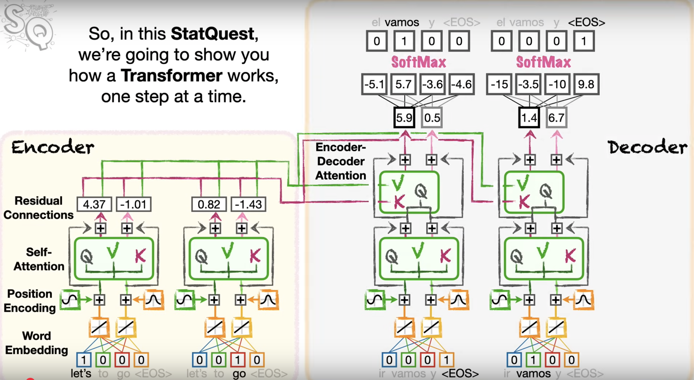
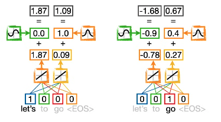
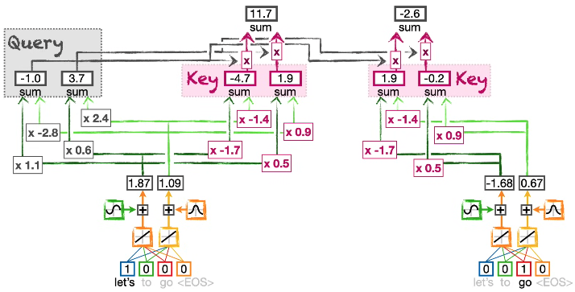
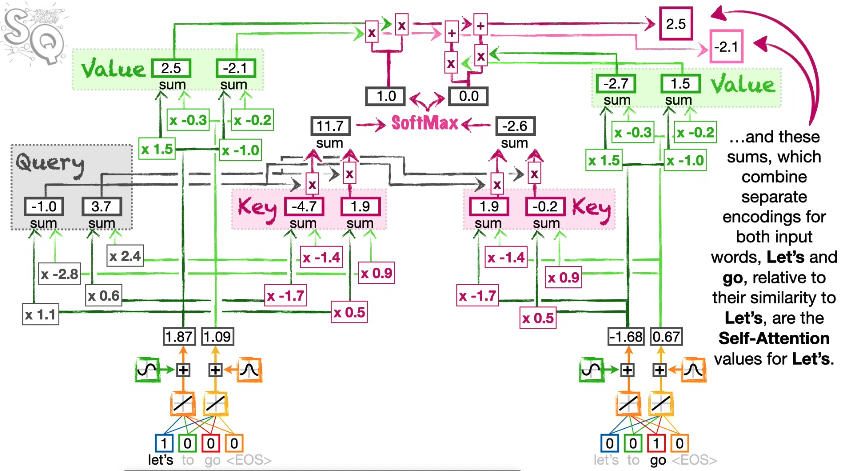
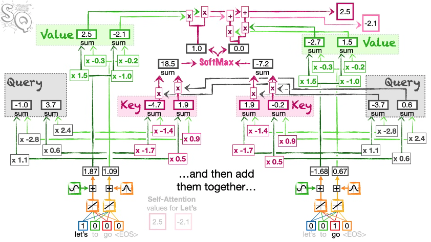
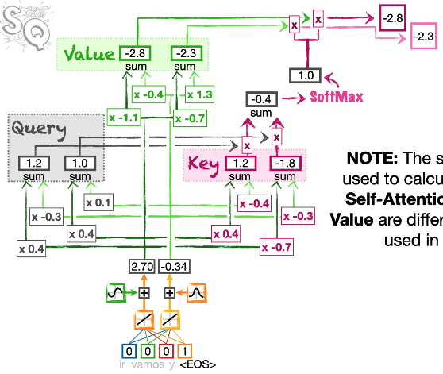
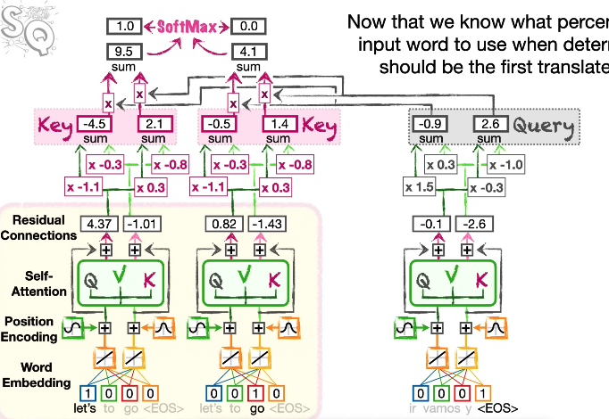
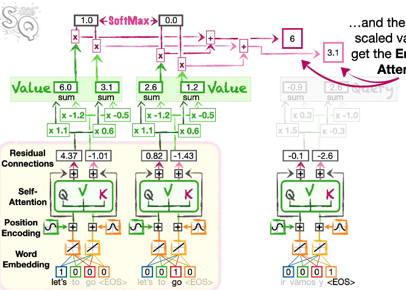

# Transformer

LLMs are based on Transformers. To understand this model, we'll take an example of translating an English sentence into Spanish.

Firstly, we perform word embedding on the input words. For this case, we just use a simple word embedding architecture with 2 embeddings per token.

# Position encoding

Next, we have a position encoding layer. The positional encoding layer keeps track of the order of the words. Let's take this sentence "Squatch eats pizza". We first create 4 word embeddings per token. Now we add a set of numbers that correspond to the word order to the embedding values for each word. In this case, the numbers that represent the word order come from a sequence of alternating sine and cosine (which goes from -1 to 1). Since we have 4 embeddings per token, each token will have 4 sine and cosine waves that will give them positional encodings.

Because the sine and cosine are repetitive, it's possible that 2 words might get the same position and positional encoding value, however, because the waves for latter embeddings has much lower frequencies, we'll always end up with a unique sequence of position values for each token. Once we have the positional values, we add them up with the word embeddings to get the positional encoding for the word. Repeat this for all tokens.

Even if we switch the word order around, the positional values for each token stays the same, so when added up, we get different positional encoding. The position encoding keeps track of the word order.

# Self-Attention

Next, we have the self-attention layer. This layer helps keeping track of the relationships among words.

Take this sentence for example: "This pizza came out of the oven and it tasted good". The word "it" could potentially refer to "pizza" or "oven". It's important that the model correctly associates the word "it" with "pizza".

This is where self-attention comes in. It works by seeing how similar each word is to all of the words in the sentence, including itself.

Once the similarities are calculated, they're used to determine how the transformer encodes each word. If we look at a lot of sentences about "pizza", and the word "it" was more commonly associated with "pizza" than "oven", then the similarity score of "pizza" for "it" would have a larger impact on how the word "it" is encoded.

Now that we have the position encoding of the sentence "let's go", we multiply the encoding for each word by a pair of weights and add it up twice, this will produce 2 outputs. The 2 new values are called *query values*. 

For the next word "go", we create another set of query values for "let's" and a set of query values for "go", these 2 sets are called *key values*. We use them to calculate similarities with the query for "let's". We do this by using dot product. So we calculate the similarity between the query and key for "let's", then we calculate the similarity between the query "let's" and the key "go". Large positive values are similar to each other.

We want "let's" to have more influence on the word "go". We do this by running the 2 similarity scores through Softmax. With the Softmax output, we want to use them for the actual encoding process of the tokens "let's" and "go". We create a set of 2 more values for each token called *values*, which are calculated in a similar fashion to the query values and the key values. We then feed the respective output of Softmax into those values sets through the dot product. Lastly, we add the scaled values together. The sums are the self-attention for "let's".

Now we do the same thing for "go". We don't need to recalculate the keys sets and the values sets. All we need to do is create the query set for "go" then calculate. Calculate the similarity scores between the new query and the keys, run the score through Softmax, scale the values, and sum them up.

Note that we only used 1 set of weights for calculating the query sets, we also reused the weights for calculating the key sets and value sets. We can also calculate the query, key, and value sets for each word at the same time.

The self-attention values for each word contain input from all the other words, this gives each word context. We can also create a stack of these self-attention cells, each with its own set of weights and take in the position encodings for each word, to capture different relationships among the words. This is called *Multi-Head Attention*.

The last thing to do is taking the position encodings and add them to the self-attention values. These bypasses are called *residual connections*, they make it easier to train complex neural networks by allowing the self-attention layer to establish relationships among the input words without having to also preserve the word embedding and position encoding information.

This is all we need to do to encode the input for a simple transformer.

To recap:
- Word embedding: Encode words into numbers
- Positional encoding: Encode positions of the words
- Self-Attention: Encode the relationship among the words
- Residual connections: Enable easy and quick parallel training

# Decoder

The decoder starts with word embeddings but on the Spanish vocabulary instead of the English one. It starts with computing the embedding for the `<EOS>` token. Next, we add positional encoding to the embeddings. Next, we calculate the self-attention value of the token to itself. The weights used to calculate the query, key, value sets are different from the sets we used in the encoder. Then we add residual connection.

Now we need to add attention to the decoder to keep track of the significant words in the input. We first create 2 new values to represent the query set for the `<EOS>` token in the decoder. Then create the 2 key sets for each of the 2 words in the encoder. Now we calculate the similarities between the `<EOS>` token in the decoder and the word in the encoder by calculating the dot product between then. Then run the 2 similarity scores through Softmax. The output of Softmax tells us what percentage of each input word to use when determining what should be the first translated word. 

Now, we calculate the value sets for each encoder input words and scale those values by the Softmax outputs. Then add the pairs of scaled values together to get the *Encoder-Decoder Attention Values*.

Note that the weights used to calculate the query, key, value sets for Encoder-Decoder Attention are different from the weights used for self-attention. The weights are reused for each words though. We can also stack encoder-decoder attention cells just like how we can stack self-attention cells.

Finally, we top the encoder-decoder attention off with a set of residual connections. Now, we just feed the output of this encoder-decoder attention layer into a fully-connected layer with 1 input for each value that represents the current token and 1 output for each token in the vocabulary.

The decoder doesn't stop until it outputs an `<EOS>` token. So we continue the decoding for the word "vamos". Note that the self-attention is now calculated between `<EOS>` and "vamos".