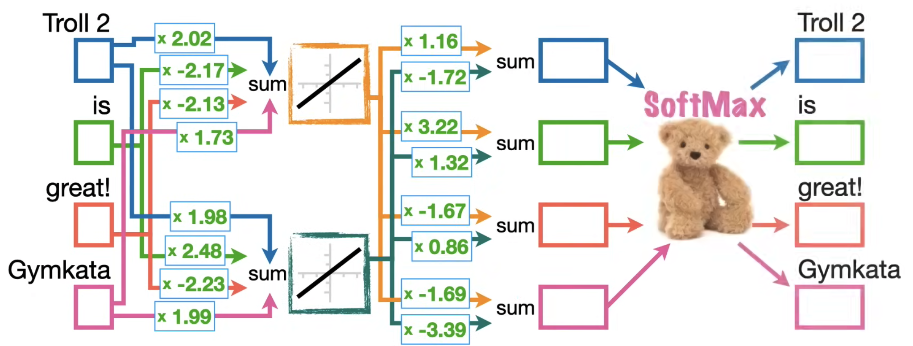
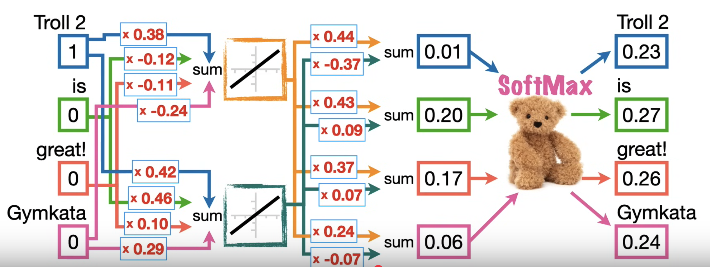
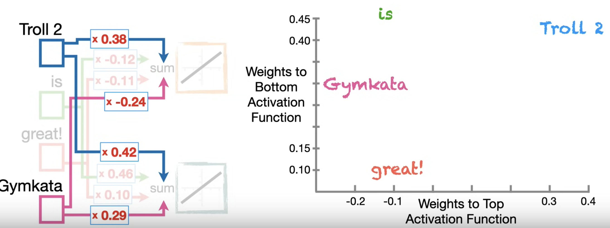
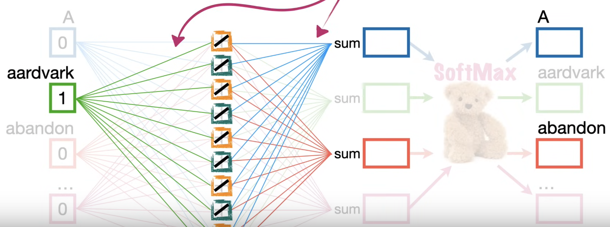

# Word Embedding



Word embedding allows us to turn words into numbers.

We want similar words to be assigned similar numbers (not the same number though) and we want some words to be assigned multiple numbers for different contexts.

Say we have training data with 2 sentences:

```
Trolls is great
Gymkata is great
```

We create an inputs for these data, so 4 inputs since there are 4 unique words. Connect each input to an activation function, which uses the identity function ($y = x$, input is the same as output), it's just a place to sum up. The number of activation functions corresponds to how many numbers we want to associate with each word. Each connection has a weight. The weight of the connection will be the number associated with the word.

The weights will be optimized by backpropagation. To do backpropagation, we need to make predictions. We use the input word to predict the next word. For the phrase "Trolls is great", if the input word is "Trolls", the model will predict the next word "is". We indicate this by putting 0 in all other inputs and put 1 for the 1st input (The "Trolls" input). The output will be the probability distribution, we want the output for the word "is" to have the highest probability.

To make these predictions, we connect the activation functions to sum nodes with weights on each connections and run the sum nodes through Softmax, so we can use cross entropy.



We can plot the word embeddings out on a plot.



As we can see, "Troll 2" is not very similar to "Gymkata", which is not what we want. We want the backpropagation to make these 2 words more similar to each other.

After training the model, we should be able to use that model to predict the next word. Ideally, we want 1 of the output to be as close to 1 as possible and all the other outputs to be as close to 0 as possible.

# Word2Vec

Just predicting the next word doesn't give us a lot of context to understand each words. Word2Vec creates these embeddings that includes more context. It uses 2 methods:

## Continuous Bag-Of-Words (CBOW)

CBOW increases the context by using the surrounding words to predict what occurs in the middle. For example, CBOW could use "Troll 2" and "great" at the same time to predict the word in between them, which is "is".

## Skip-Gram

Skip-Gram increases the context by using the middle word to predict the surrounding words. For example, Skip-Gram could use "is" to predict "Troll 2", "Gymkata", and "great".

## Activation functions

Instead of using just 2 activation functions to create 2 embeddings per word, it is common to use 100 or more activation functions.

The dataset for training is also very large. They can even use everything on Wikipedia. Word2Vec might have a vocabulary of millions of words. For example, we have 3mil words for vocabulary, we have 100 activation functions, we get $3mil \times 100 \times 2 = 600mil$ weights.

## Optimization

A way to speed up Word2Vec is to use *negative sampling*. This works by randomly selecting a subset of words we want the model predict. For example, we can just pick 1 word input, say "aardvark" and we want to predict the word "a", and let all other word inputs be 0. This removes a lot of weights to optimize. Let's imagine Word2Vec randomly selects the word "abandon" and "a" to predict (in practice, it would select between 2-20 words to predict). So all other outputs will be dropped and the model will only make a prediction with these 2 outputs.

