# Linear regression

A model that estimates the linear relationship between between dependent variables.

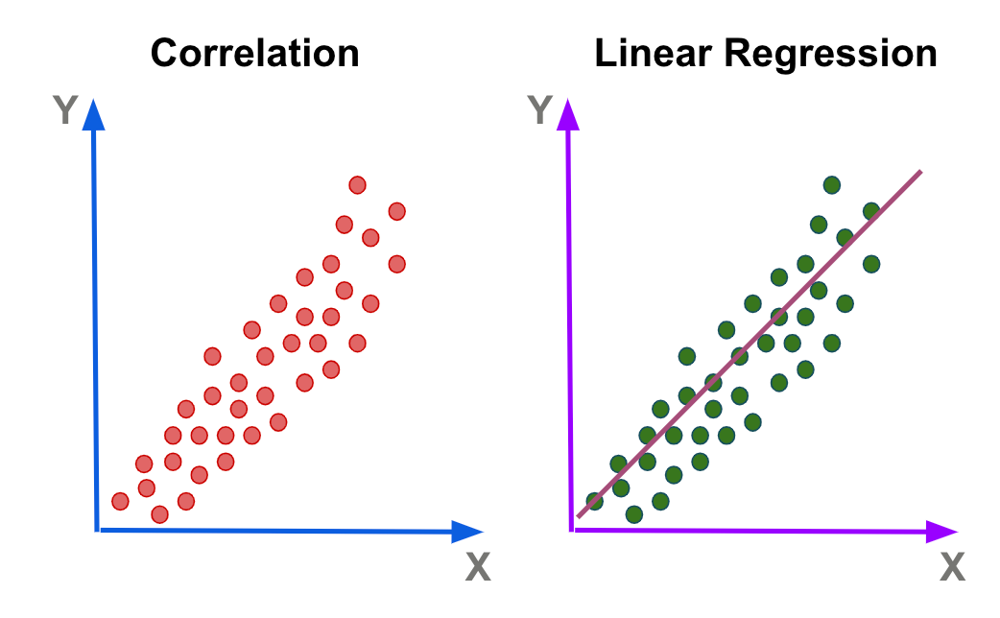

Formula:
$$
\hat{y} = f_{w, b}(x) = wx + b
$$

Where:
- $w$: The slope of the line
- $b$: The y-intercept of the line
- $x$: Independent variable

With $w$ and $b$ as parameters, we need to choose them so that the linear line from the function $f$ fits the data well. Meaning $\hat{y} == y$ with $y$ being the true target for all $x$ input values.

# Cost function

To measure the fitness of the line, we can use a cost function. This function compares $\hat{y}$ with the target $y$ by subtracting them. The difference of the 2 is the *error*. We also want to square the error up (For optimization and no negative signs and high priorities to big differences). Then sum up all the errors calculated:

$$
\sum_{i=1}^{m} (\hat{y}^{(i)} - y^{(i)})^2
$$

Where:
- $m$: Number of training examples
- $i$: Iteration

As the number of example grows, we compute the *average squared error* instead of the total squared error. We do that by dividing $m$:

$$
J(w,b) = \frac{1}{m} \sum_{i=1}^{m} (\hat{y}^{(i)} - y^{(i)})^2
$$

Some conventions divide $m$ times 2 to make the data look neater

$$
J(w,b) = \frac{1}{2m} \sum_{i=1}^{m} (\hat{y}^{(i)} - y^{(i)})^2 = \frac{1}{2m} \sum_{i=1}^{m} (f_{w,b}(x^{(i)}) - y^{(i)})^2
$$

We want to choose the $w$ and $b$ parameters that can reduce the calculated error as much as possible.

# Gradient descent

Gradient descent helps us find the best possible parameters that would lead to the lowest MSE value as possible. Imagine the MSE as a contour map, and you're starting at a point with high error (higher up in altitude) and you want to descend into a point with the low error (lower down in altitude). Gradient descent makes you look around and find a way to take a step in the direction that would lead you to that low error point. You'd only take a small step, then repeat that process.

If MSE maps that has multiple minimum points (or local minima), starting at different points in the map could lead us to different minimum point.

Algorithm:

$$
\begin{aligned}
w = w - \alpha \frac{\partial}{\partial w} J(w, b) = w - \alpha \frac{1}{m} \sum_{i=1}^{m} (f_{w,b}(x^{(i)}) - y^{(i)}) x^{(i)}
\\
b = b - \alpha \frac{\partial}{\partial b} J(w, b) = w - \alpha \frac{1}{m} \sum_{i=1}^{m} (f_{w,b}(x^{(i)}) - y^{(i)})
\end{aligned}
$$

Where:
- $\alpha$: Learning rate (Number between 0 and 1. It controls how big of a step you take downhill)
- $\frac{\partial}{\partial w} J(w,b)$: Partial derivative term of the cost function with respect to a certain parameter. This tells you which direction to take a step in

The algorithm will be repeated until convergence (Reached the local minimum where $w$ and $b$ no longer changes much with each additional step). It will simultaneously update both $w$ and $b$.

We need to choose an appropriate $\alpha$ value. Too small then it's gonna take a long time to reach the local minimum, too large then it's gonna overshoot the minimum and never reach the minimum and may diverge.

Because the linear regression's cost function will always have a single local minimum, gradient descent will always bring us to the global minimum. This cost function is called a *convex function*.

# Batch gradient descent

*Batch*: Each step of gradient descent uses all the training examples.

This means the gradient descent will look at the entire batch of training examples at each update.

There are other versions of gradient descent that look at a small subset of the training examples instead of the entire batch.

# Multiple linear regression

Variables:
- $x_j$: The $j^{th}$ feature
- $n$: Number of features
- $\vec{x}^{(i)}$: Features of the $i^{th}$  training example
- $x_j^{(i)}$: Value of feature $j$ in the $i^{th}$ training example

Model:

$$
f_{\vec{w}, b}(\vec{x}) = w_1 x_1 + w_2 x_2 \; + \; ... \; + \; w_n x_n + b
$$

We can also rewrite this in vector form using dot product:

$$
f_{\vec{w}, b}(\vec{x}) = \vec{w} \cdot \vec{x} + b
$$

# Vectorization

```python
import numpy as np

w = np.array([1.0, 2.5, -3.3])
x = np.array([10, 20, 30])
b = 4

f = np.dot(w, x) + b
```

The `dot` function in NumPy computes the dot product with parallelism, resulting in better performance.

# Gradient descent for multiple linear regression

Parameters: $\vec{w}$, $b$
Model: $f_{\vec{w}, b}(\vec{x}) = \vec{w} \cdot \vec{x} + b$
Cost function: $J(\vec{w}, b)$
Gradient descent:

$$
\begin{aligned}
w_j = w_j - \alpha \frac{\partial}{\partial w_j}J(\vec{w}, b)
\\
b = b - \alpha \frac{\partial}{\partial b}J(\vec{w}, b)
\end{aligned}
$$

The derivative will be like this (for $j = n$):

$$
\begin{aligned}
w_n = w_n - \alpha \frac{1}{m} \sum_{i=1}^{m} (f_{\vec{w},b}(\vec{x}^{(i)}) - y^{(i)}) x_n^{(i)}
\\
b = b - \alpha \frac{1}{m} \sum_{i=1}^{m} (f_{\vec{w},b}(\vec{x}^{(i)}) - y^{(i)})
\end{aligned}
$$

> An alternative to gradient descent for finding $w$ and $b$ for linear regression is called the normal equation. This works *only* for linear regression and it solves for $w$ and $b$ without iterations. It's also kinda slow so don't try implement this, gradient descent is more recommended.

# Feature scaling

For features with large values, the model would pick smaller weights for those values to scale those values correctly. For features with small values, the model would pick larger weights for those values to scale those values correctly.

This is because small changes to the weights associated with the features with large values can have big impacts on the estimation. And small changes to the weights associated with the features with small values have little impacts on the estimation. This may create a cost function that's pretty narrow and unevenly distributed (in terms of the contour map).

Running gradient descent on something like this may end up with an oscillation phenomenon for a long time before it reaches the global minimum. So what we need to do is scale the features for these cases where the data is disproportionate in terms of magnitude.

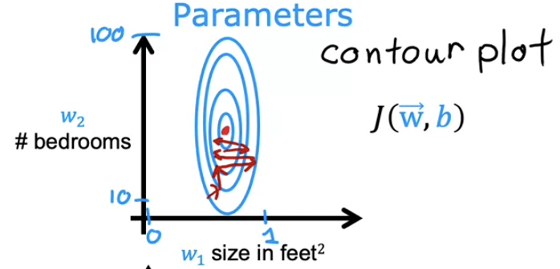

We can the features to a range of $(0, 1)$ making the range comparable to each other. This also makes the contour map of the more evenly distributed.

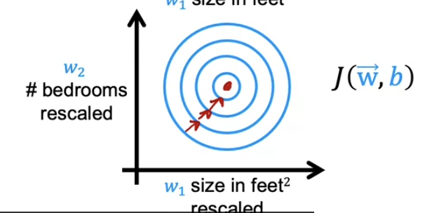

# Implementing feature scaling

## Normalization

We can scale the range of a feature by dividing it by the maximum value of the feature's range:

$$
\begin{aligned}
&300 \le x_1 \le 2000
\\
& x_{1,scaled} = \frac{x_1}{2000} \rightarrow 0.15 \le x_{1,scaled} \le 1
\\
\\
&0 \le x_2 \le 5
\\
&x_{2,scaled} = \frac{x_2}{5} \rightarrow 0 \le x_{2,scaled} \le 1
\end{aligned}
$$

## Mean normalization

We start with the original features, then scale them so that they are centered around 0. Making it so that the features now have both negative and positive values, usually between -1 and +1

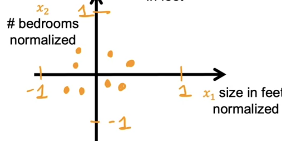

To calculate this, first we need to find the average of the feature. 

$$
\begin{aligned}
&300 \le x_1 \le 2000
\\
&\mu_1 = \text{avg}(x_1) = 600
\\
&x_{1,norm} = \frac{x_1 - \mu_1}{2000 - 300} \rightarrow -0.18 \le x_{1,norm} \le 0.82
\\
\\
&0 \le x_2 \le 5
\\
&\mu_2 = \text{avg}(x_2) = 2.3
\\
&x_{2,norm} = \frac{x_2 - \mu_2}{5 - 0} \rightarrow -0.46 \le x_{2,scaled} \le 0.54
\end{aligned}
$$

## Z-score normalization

We need to calculate the standard deviation $\sigma$ of each feature. Standard deviation is a measure of of the amount of variation of the values of a variable about its mean.

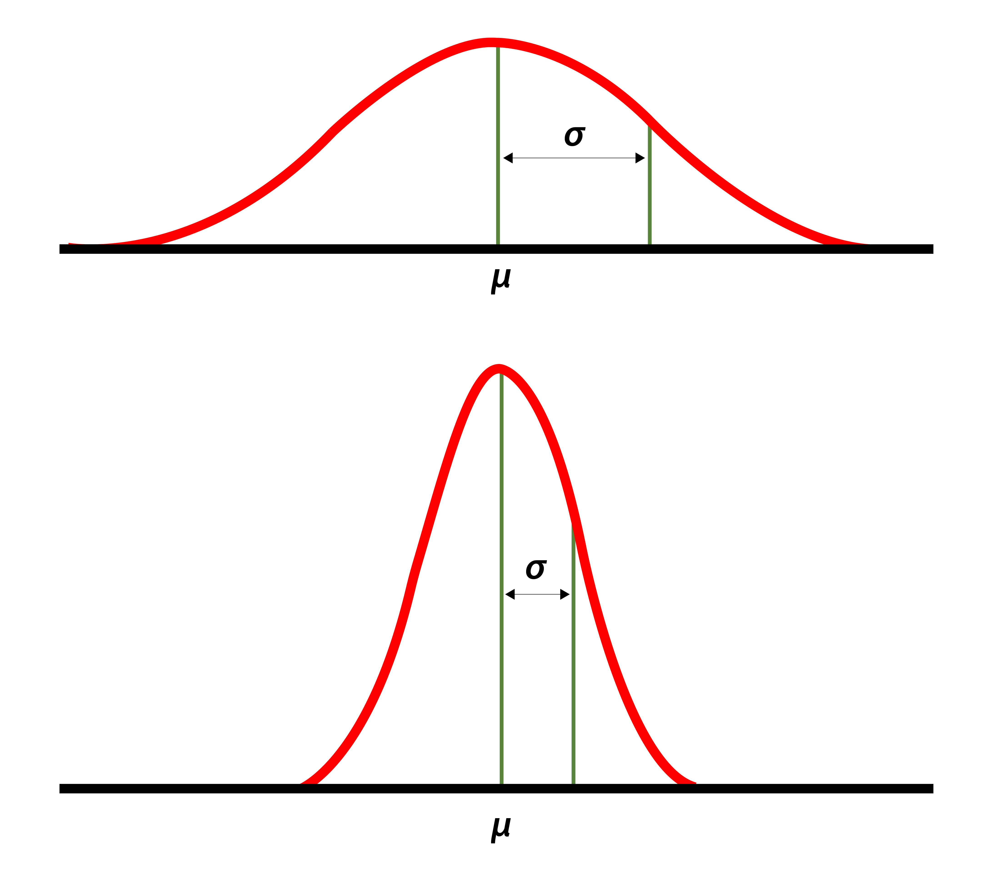

Low $\sigma$ indicates that values tend to be close to the mean. High $\sigma$ indicates that values tend to be more spread out.

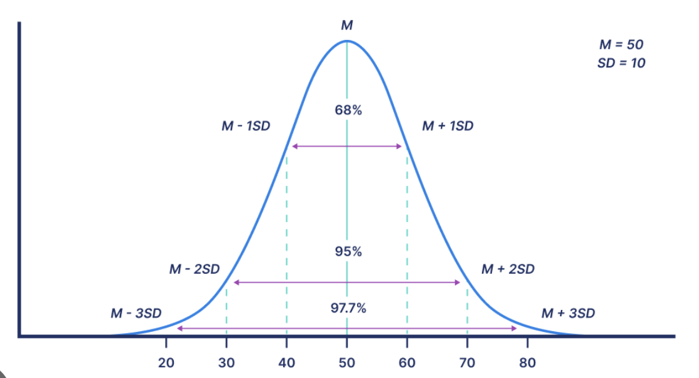

So we need to calculate both the mean $\mu$ and the standard deviation $\sigma$ for this.

$$
\begin{aligned}
&300 \le x_1 \le 2000
\\
&\mu_1 = \text{avg}(x_1) = 600
\\
&\sigma_1 = 450
\\
&x_{1,norm} = \frac{x_1 - \mu_1}{\sigma_1} \rightarrow -0.67 \le x_{1,norm} \le 3.1
\\
\\
&0 \le x_2 \le 5
\\
&\mu_2 = \text{avg}(x_2) = 2.3
\\
&\sigma_2 = 1.4
\\
&x_{2,norm} = \frac{x_2 - \mu_2}{\sigma_2} \rightarrow -1.6 \le x_{2,scaled} \le 1.9
\end{aligned}
$$

> Note: When it comes to feature scaling, aim for about $-1 \le x_j \le 1$ for each feature $x_j$. However, it might be a little restrictive, so ranges from [-3, 3] or [-0.3, 0.3] is fine. Small ranges would be just fine, even if it's not really symmetric. Bigger ranges (Eg. [-100, 100]) would not be fine and would merit some normalization. Too small of a range (Eg. [-0.0001, 0.0001]) would also not be fine. High value ranges (Eg. [98.5, 105]) would also not be fine.

When in doubt, rescale the features.

# Checking for convergence

The gradient descent should have a learning curve that gradually drops the cost with every iteration.

![[learning-curve-gradient-descent-cost.png]]

When the curve seems to flatten out, it seems that the gradient descent has likely converged.

Another way to verify whether the model has converged or not is with an automatic convergence test.

Let $\epsilon$ be $10^{-3}$. This value will be our convergence threshold. If $J(\vec{w}, b)$ decreases to $\le \epsilon$ in 1 iteration, then declare convergence.

# Choosing a learning rate

Learning rate is important. Too small and it'll run very slowly. Too large and it may not even converge due to it overshooting.

Nice values of $\alpha$ to try:

$$
\begin{bmatrix} 0.001 & 0.01 & 0.1 & 1 \end{bmatrix}
$$

# Feature engineering

Feature engineering is using intuition to design new features by combining or transforming original features. The purpose is to make it easier for the model to learn from the dataset.

Example: Say we have 2 features, the frontage ($x_1$), and the depth ($x_2$), used to predict price of house. However, we notice that calculating the area of the land is more predictive of the price of the house than the 2 individual features so we make a new feature:

$$
x_3 = x_1 \times x_2
$$

With this new feature, we can make a model:

$$
f_{\vec{w}, b} = w_1x_1 + w_2x_2 + w_3x_3 + b
$$

# Polynomial regression

This algorithm allows us to fit non-linear functions to our data.

Example:

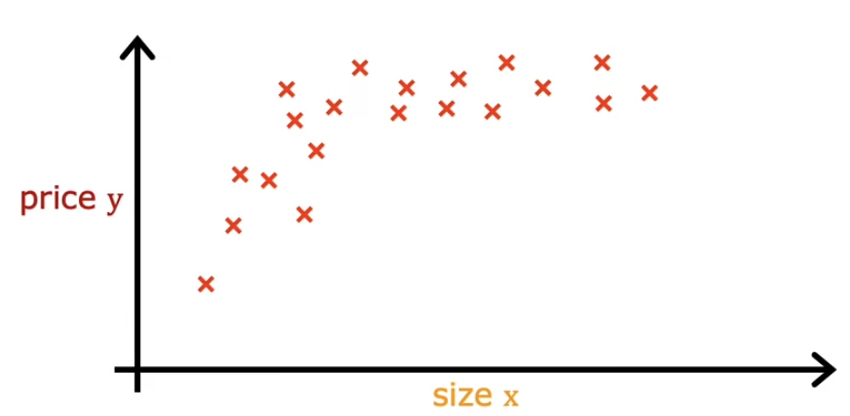

For this dataset, a straight line wouldn't fit this very well, we want a curve that better fits the data.

Maybe we want to fit a curve to this, a quadratic curve. So we construct this regression equation:

$$
f_{\vec{w}, b} = w_1x + w_2x^2 + b
$$

But quadratic equations always comes back down, and we don't really expect the price of the house to decrease as the size increase. So maybe a better fit here would be a cubic curve:

$$
f_{\vec{w}, b} = w_1x + w_2x^2 + w_3x^3 + b
$$

This better fits the dataset as it does go up as the size increases.

Note that if we create features that are powers of the original feature (because polynomial), then feature scaling become increasingly important in this case. 

For example, if the size of the house ranges from 1-1000, then the size squared would be 1-1000000, and the size cubed would be 1-1000000000. These ranges are wildly different from the original range. It's important to apply feature scaling to get these features into comparable ranges.

Another choice for the algorithm might also work well is this root function:

$$
f_{\vec{w}, b} = w_1x + w_2\sqrt{x} + b
$$

This also fits a curve quite well to our current dataset.

# Classification problems

Linear regression is not really good when it comes to classification problems. An example would be figuring out whether an email is spam or not. We'd want the model to output either "yes" or "no" for this problem. 

Usually, the classification problems where there's only 2 possible outputs are called *binary classification* (only 2 classes or categories). The 2 classes is usually 0 or 1 (false or true). The 0 class is the negative class and the 1 class is the positive class. Negative means the absence of what we're looking for, and positive means the presence of what we're looking for.

Example: Malignant tumor classification

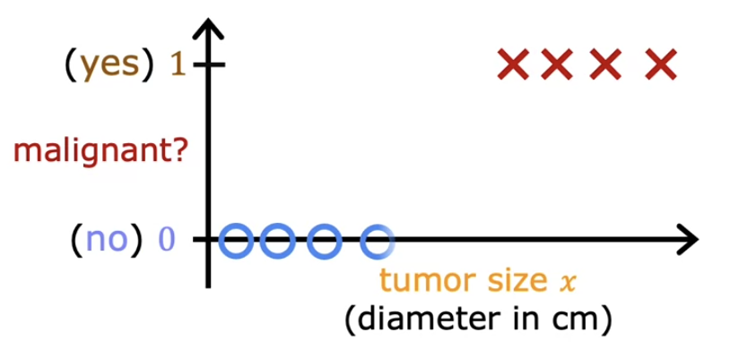

Linear regression would not work well here because it tries to predict not just 1s and 0s, but also values ranging from 1 and 0 along with values less than 0 and larger than 1.

We want to predict the classes. What we could do is pick a threshold, say 0.5, and if the linear regression model outputs a value below the threshold, the output would be set to 0. Else if it's larger or equal to the threshold, the output would be set to 1. However, this threshold for the linear regression model doesn't cover datasets of different sizes. For this example, if we were to add a "1" data point to the far right of the graph, it would modify the the linear regression line and change the threshold point. So if we try to use our old threshold value, we'd end up misclassifying some "1" data points.

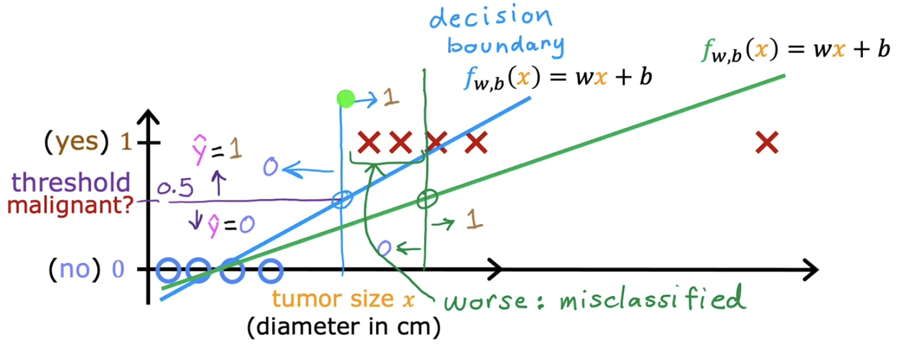

The line where the threshold and the linear regression line intersects is called the *decision boundary*.

# Logistic regression

Continuing with the malignant tumor classification example:


Logistic regression will fit a curve that will better represent data.

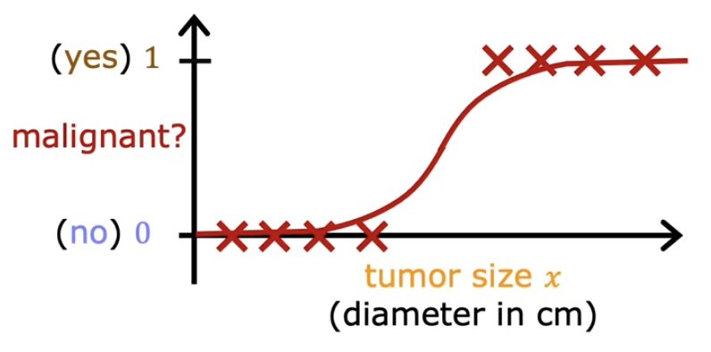

For this, when the input is compared to a threshold, it will output 1 or 0. Same thing as the linear regression before, except this time, the model fits better with the dataset, allowing for correct classification.

## Sigmoid function

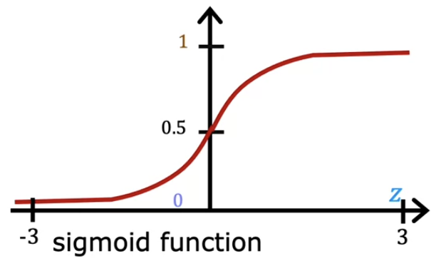

The sigmoid function outputs a value between 0 and 1. It can be described like this:

$$
g(z) = \frac{1}{1 + e^{-z}} \rightarrow 0 \lt g(z) \lt 1
$$

## Sigmoid in logistic regression

We can use the sigmoid function to build up a logistic regression algorithm:

$$
\begin{aligned}
&z = \vec{w} \cdot \vec{x} + b
\\
&g(z) = \frac{1}{1 + e^{-z}}
\\
&f_{\vec{w}, b}(\vec{x}) = g(\vec{w} \cdot \vec{x} + b) = \frac{1}{1 + e^{-(\vec{w} \cdot \vec{x} + b)}}
\end{aligned}
$$

This is the logistic regression algorithm. This basically applies the sigmoid function to a linear regression. Intuitively, it transforming the linear regression line into a line that better fits the dataset, which is a binary dataset.

## Logistic regression output

The output can be interpreted as the probability that the class is a positive class. For example, we have an $x$ value, which indicates the size of the tumor, and we put it into our logistics regression model and it spits out a value of $0.7$.

$$
f_{\vec{w}, b}(\vec{x}) = 0.7
$$

This indicates that the model thinks there's a $70\%$ chance that the tumor of $x$ size is malignant and a $30\%$ chance that the tumor of $x$ size is benign. Below is the notation for the probability of the prediction $y$ turns out to be 1 given some parameters and input.

$$
f_{\vec{w}, b}(\vec{x}) = P(y=1 | \vec{x}; \vec{w}, b)
$$

# Decision boundary

To predict the whether the predicted probability should output a 1 or a 0, we can set a threshold, above which you predict $y=1$ and below which you predict $y=0$. 

A common threshold choice is $0.5$. This is because at 0.5, because of the way the sigmoid function works, the only way an output value could be greater than or equal to 0.5 is by being larger than or equal to 0 (positive). Any value less than 0 would result in a value that falls below the 0.5 threshold.

$$
\begin{aligned}
f_{\vec{w}, b}(\vec{x}) \ge 0.5 \text{ only if } z \ge 0
\\
f_{\vec{w}, b}(\vec{x}) \lt 0.5 \text{ only if } z \lt 0
\end{aligned}
$$

Example: Classification problem with 2 features ($x_1$ and $x_2$)

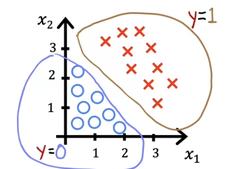

With 2 features, we can build a logistic regression model like this:

$$
f_{\vec{w}, b}(\vec{x}) = g(\vec{w} \cdot \vec{x} + b) = g(w_1x_1 + w_2x_2 + b)
$$

For now, let's put in some placeholder weights and biases:

$$
w_1 = 1 \;\;\;\; w_2 = 1 \;\;\;\; b = -3
$$

First, we need to find the decision boundary ($z = 0$). This $z$ value will always output $0.5$ since the 0 input for the sigmoid function is mapped to the output 0.5.

So let's calculate the decision boundary:

$$
\begin{aligned}
&w_1x_1 + w_2x_2 + b = 0 
\\
&x_1 + x_2 - 3 = 0
\\
&x_1 + x_2 = 3
\end{aligned}
$$

The decision boundary would be this line:

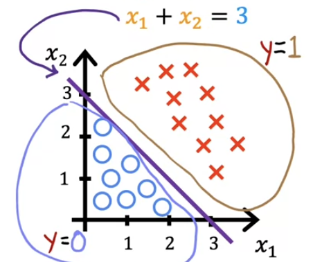

This is the decision boundary when the parameters are setup with those particular values. Different parameter choice would change this boundary. 

# Non-linear decision boundary

Example: 2 features, non-linear dataset

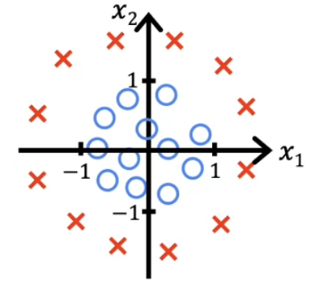

For non-linear datasets, we can use polynomials:

$$
z = w_1x_1^2 + w_2x_2^2 + b
$$

This now describes the $z$ value of the logistic regression model for this dataset. For now let's choose $w_1 = w_2 = 1$ and $b = -1$. So we get this decision boundary:

$$
\begin{aligned}
&z = w_1x_1^2 + w_2x_2^2 + b = 0
\\
&x_1^2 + x_2^2 - 1 = 0
\\
&x_1^2 + x_2^2 = 1
\end{aligned}
$$

So the decision boundary for this particular parameters setup could be drawn like this:

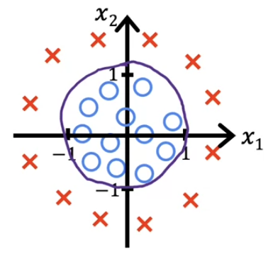

When $x_1^2 + x_2^2 \ge 1$, the predicted value will be the x's outside of the circle. When $x_1^2 + x_2^2 \lt 1$, the predicted value will be the x's outside of the circle.

By modifying the equation $x_n$, we can modify how the decision boundary will be like. We can create decision boundary of any shape, we just need to create the correct polynomials to represent those shapes. Without the use of polynomials, the decision boundary will always be linear.

# Cost function for logistic regression

The squared error cost function that we use for linear regression is not really ideal for the logistic regression algorithm. 

Example dataset:

| Tumor size (cm) | ... | Patient's age | Malignant |
| --------------- | --- | ------------- | --------- |
| 10              |     | 52            | 1         |
| 2               |     | 73            | 0         |
| 5               |     | 55            | 0         |
| 12              |     | 49            | 1         |
| ...             |     | ...           | ...       |

This dataset has $m$ training samples with $n$ features. Let's call the features $X_n$. The target label $Y$ takes on 1 of 2 values: 1 or 0. 

Our logistic regression model is defined by this equation:

$$
f_{\vec{w}, b}(\vec{x}) = \frac{1}{1 + e^{-(\vec{w} \cdot \vec{x} + b)}}
$$

How do we choose $\vec{w}$ and $b$ that would best fit the model to this particular dataset? The mean squared error cost function work pretty well for the linear regression algorithm since it is a convex function. But if we try to apply the same mean squared error cost function to the logistic regression algorithm, it becomes a non-convex function, it creates a lot of local minima, which gradient descent can get stuck in. 

Here's the loss function for logistic regression:

$$
\begin{aligned}
&L(f_{\vec{w}, b}(\vec{x}^{(i)}), y^{(i)}) = -\log(f_{\vec{w}, b}(\vec{x}^{(i)})) \text{ if } y^{(i)} = 1
\\
&L(f_{\vec{w}, b}(\vec{x}^{(i)}), y^{(i)}) = -\log(1 - f_{\vec{w}, b}(\vec{x}^{(i)})) \text{ if } y^{(i)} = 0
\end{aligned}
$$

Because the function would only output value ranging from 0 to 1, we can use logarithms to determine the error between the target value and output value. Negative logarithm has a graph like this:

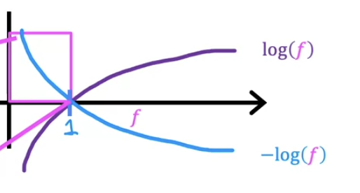

Since our function $f$ only outputs values ranging from 0 to 1, we'd only care about the part highlighted by the pink square. Negative logarithms indicate that if the input value approaches 1, the output would be 0, if it approaches 0, then the output would get really high (approaches infinity). So if we're trying to predict a data point with the label $y = 1$, then we'd want our function to output something close to 1. If our function outputs something close to 1, the negative logarithm will give an cost close to 0, which is what we want. For the label $y=0$, it's basically the opposite of the label $y=1$. We're basically just mirroring the negative logarithm line. This loss function would be a convex loss function for the logistic regression model.

So we have this cost function for our logistic regression model:

$$
J(\vec{w}, b) = \frac{1}{m} \sum^m_{i=1} L(f_{\vec{w}, b}(\vec{x}^{(i)})
$$

We can actually simplify the loss function to this:

$$
L(f_{\vec{w}, b}(\vec{x}^{(i)}), y^{(i)}) = - y^{(i)} \log(f_{\vec{w}, b}(\vec{x}^{(i)})) - (1 - y^{(i)}) \log(1 - f_{\vec{w}, b}(\vec{x}^{(i)}))
$$

$y^{(i)}$ can only take on the value of 1 or 0. This is simplification works because when $y^{(i)}$ is in 1 of its 2 state, 1 of the term would get removed because it would get multiplied by 0. So if $y^{(i)} = 1$ then the second term would be 0. If $y^{(i)} = 0$ then the first term would be 0. So we can rewrite the cost function of logistic regression to this:

$$
\begin{aligned}
J(\vec{w}, b) &= \frac{1}{m} \sum^m_{i=1} - y^{(i)} \log(f_{\vec{w}, b}(\vec{x}^{(i)})) - (1 - y^{(i)}) \log(1 - f_{\vec{w}, b}(\vec{x}^{(i)}))

\\ &= -\frac{1}{m} \sum^m_{i=1} y^{(i)} \log(f_{\vec{w}, b}(\vec{x}^{(i)})) + (1 - y^{(i)}) \log(1 - f_{\vec{w}, b}(\vec{x}^{(i)}))
\end{aligned}
$$

# Gradient descent for logistic regression

We can apply the usual gradient descent algorithm to update the weights and biases for our logistic regression model.

$$
\begin{aligned}
w_j = w_j - \alpha \frac{\partial}{\partial w_j}J(\vec{w}, b)
\\
b = b - \alpha \frac{\partial}{\partial b}J(\vec{w}, b)
\end{aligned}
$$

The partial derivative terms would evaluate to this (With $x_j$ being the current $j^{th}$ feature of sample $x$):

$$
\begin{aligned}
&\frac{\partial}{\partial w_j}J(\vec{w}, b) = \frac{1}{m} \sum^m_{i=1} (f_{\vec{w}, b}(\vec{x}^{(i)}) - y^{(i)}) x_j^{(i)}
\\
&\frac{\partial}{\partial b}J(\vec{w}, b) = \frac{1}{m} \sum^m_{i=1} (f_{\vec{w}, b}(\vec{x}^{(i)}) - y^{(i)})
\end{aligned}
$$

# Overfitting and underfitting

Bias in this context meaning the model not being able to fit the training dataset well. Variance in this context meaning the model fits the training dataset really well, but does poorly with new data.

Underfitting is when the model fit too poorly with the training dataset. We say underfitting model as having a high bias.

Overfitting is when the model fit too well with the training dataset but fits poorly with the testing dataset. We want the model to generalize well, meaning we want the model can make good predictions even on new data samples that it has never seen before. An overfitting model has high variance. 

We want our model to fit the data just at the right amount for it to perform well and generalize well.

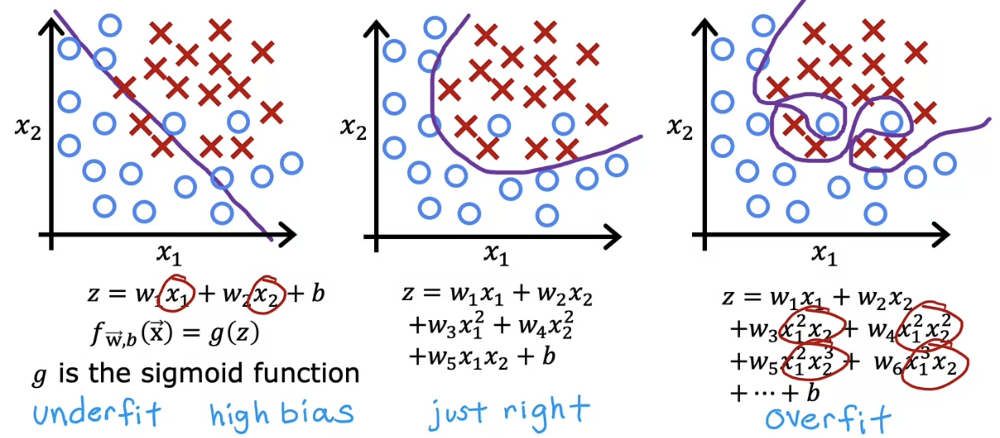

Solution to overfitting:
- Collect more training data.
- Select features to include/exclude. Too much features but not enough training data could lead to overfitting.
- Regularization. This is a way to reduce the impact of some of the features without eliminating it outright. In regularization, we just change the weights $w_j$ and not the bias $b$. 

# Regularization

Say we have a polynomial model that fits to a training dataset really well. This would be overfitting and a way to prevent this is to regularize the data. We want to put less significance on the higher degree variables in the polynomial.

One way we could do this is add the high degree terms to the cost function, effectively penalizing the model for choosing large weights for those high degree terms. The below example show a regularized cost function, regularizing the weights $w_3$ and $w_4$. These weights each have a degree of 3 and 4 respectively in this example polynomial linear regression model.

$$
\begin{aligned}
&w_1x + w_2x^2 + w_3x^3 + w_4x^4 + b
\\
&\min_{\vec{w},b} = \frac{1}{2m} \sum_{i=1}^{m} (f_{\vec{w}, b}(\vec{x}^{(i)}) - y^{(i)})^2 + 1000 w_3^2 + 1000 w_4^2
\end{aligned}
$$

Minimizing this cost function would give us a $w_3$ and $w_4$ close to 0, putting much less significance on the high degree terms.

With regularization, the idea is that if there are smaller values for the parameters, then it's a bit like having a simpler model. Maybe 1 with fewer features, therefore is less prone to overfitting.

Regularization is usually implemented for all the weights $w_j$. 

$$
J(\vec{w}, b) = \frac{1}{2m} \sum_{i=1}^{m} (f_{\vec{w}, b}(\vec{x}^{(i)}) - y^{(i)})^2 + \frac{\lambda}{2m} \sum^n_{j=1} w_j^2
$$

Where $\lambda$ is the regularization parameter. It's kinda similar to the learning rate. We also scale $\lambda$ the same way as the cost function because it makes it easier to choose a $\lambda$ value even if the dataset grows, the same $\lambda$ value would still work on that larger dataset.

Penalizing $b$ is not necessary, though some people do do it as it makes little difference on the outcome.

Different $\lambda$ values:
-  $\lambda = 0$: You're not using regularization. The model will overfit.
- $\lambda$ is a large number (eg. $10^{10}$): You're placing heavy weights on the regularization term. So the only way to counteract this large $\lambda$ value is to set all the weights to near 0. Making the model curve pretty flat since $b$ will have the most significance here. The model will underfit.

So we need to choose a value that's not too large and not too small.

# Regularized linear regression

The cost function for regularized linear regression is described like this:

$$
J(\vec{w}, b) = \frac{1}{2m} \sum_{i=1}^{m} (f_{\vec{w}, b}(\vec{x}^{(i)}) - y^{(i)})^2 + \frac{\lambda}{2m} \sum^n_{j=1} w_j^2
$$

Now we need to apply gradient descent to this new cost function.

$$
\begin{aligned}
&w_j = w_j - \alpha \frac{\partial}{\partial w_j}J(\vec{w}, b) = w_j - \alpha \biggr[ \frac{1}{m} \sum_{i=1}^{m} [(f_{\vec{w},b}(\vec{x}^{(i)}) - y^{(i)}) x_j^{(i)}] + \frac{\lambda}{m} w_j \biggl]
\\
&b = b - \alpha \frac{1}{m} \sum_{i=1}^{m} (f_{\vec{w},b}(\vec{x}^{(i)}) - y^{(i)})
\end{aligned}
$$

The $b$ term remains the same as we're not applying regularization to it. The $w_j$ term gets the derivative of the regularization added to it, with $\alpha$ multiplying with the entire regularized derivative term.

The regularization term has the effect of after being multiplied with $\alpha$, it would produce a number close to 1. This has the effect of reducing $w_j$ by a small a mount, effectively shrinking it for each iteration.

# Regularized logistic regression

The cost function for logistic regression is described like this:

$$
J(\vec{w}, b) = -\frac{1}{m} \sum^m_{i=1} y^{(i)} \log(f_{\vec{w}, b}(\vec{x}^{(i)})) + (1 - y^{(i)}) \log(1 - f_{\vec{w}, b}(\vec{x}^{(i)}))
$$

We can add the regularization term to this cost function to regularize it:

$$
J(\vec{w}, b) = -\frac{1}{m} \sum^m_{i=1} y^{(i)} \log(f_{\vec{w}, b}(\vec{x}^{(i)})) + (1 - y^{(i)}) \log(1 - f_{\vec{w}, b}(\vec{x}^{(i)})) + \frac{\lambda}{2m} \sum_{i=1}^n w_j^2
$$

And we can apply the regularization term to logistic regression's gradient descent:

$$
\begin{aligned}
&w_j = w_j - \alpha \frac{\partial}{\partial w_j}J(\vec{w}, b) = w_j - \alpha \biggr[ \frac{1}{m} \sum_{i=1}^{m} [(f_{\vec{w},b}(\vec{x}^{(i)}) - y^{(i)}) x_j^{(i)}] + \frac{\lambda}{m} w_j \biggl]
\\
&b = b - \alpha \frac{1}{m} \sum_{i=1}^{m} (f_{\vec{w},b}(\vec{x}^{(i)}) - y^{(i)})
\end{aligned}
$$