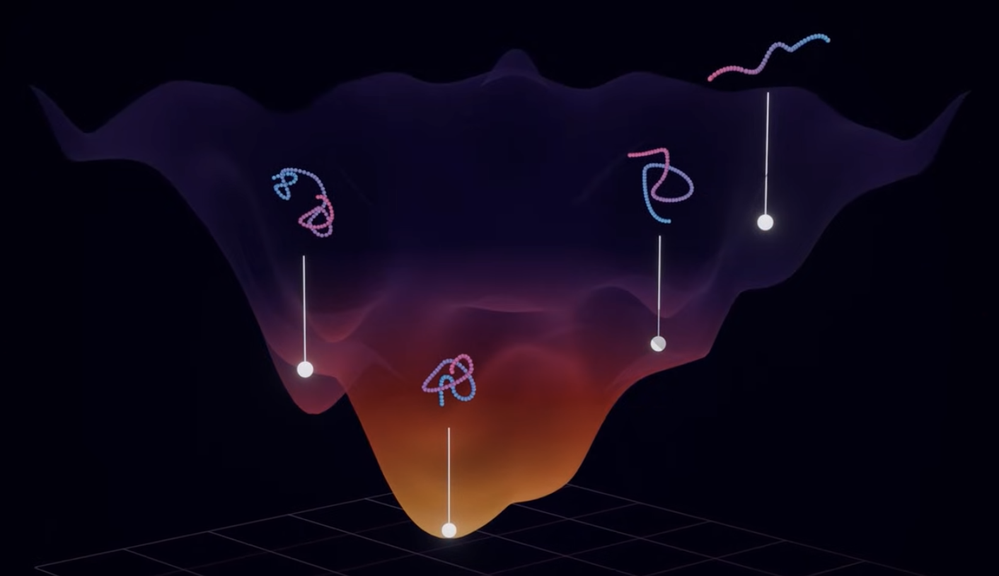
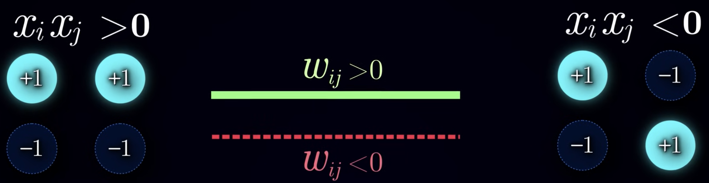

# Biological Memory

How do we find associations without checking all possible combinations? We can draw insights from protein folding. Proteins fold into 3D structures that determine their function. The number of possible combinations is enormous. Proteins fold into their native structures in milliseconds, how do they achieve this? Proteins doesn't really search, they just fold into the most stable and favorable configurations according to physical laws, kinda like how a ball being thrown doesn't search through every possible trajectories and just follow physical laws to determine its trajectory.

# Energy

Energy is a quantitative state of a system that describes a system's capacity to do work or cause change.

In the case of protein, we're interested in potential energy stored in the interactions between the atoms in the protein chain. Each possible configuration in the protein chain configuration space has a specific potential energy level to it determined by the sum of these atomic interactions. 

We can visualize the protein energy as a surface where each point on the surface represents a possible protein configuration and the height represents the potential energy of the configuration. The higher the point, the more potential energy it has. This is the *energy landscape*.

According to the 2nd law of thermodynamics, any system with potential energy would try to minimize its potential energy. So the protein will naturally seeks the configuration that has the lowest possible energy level, this corresponds to the native state. They don't search, they minimize the potential energy.

The core idea is to achieve something similar for associative memory.

We want to sculpt the energy landscape such that the memories corresponds to the local minima. We also need to drive the system to change the states in the direction of energy minimization, like the 2nd law of thermodynamics. Once it's done, we can encode the input pattern initially to be on the energy landscape and let it run to the equilibrium.

# Hopfield Network Architecture

We have a bunch a neurons with binary units: +1 and -1. Each neuron has connections to every other neurons. Each connection has a weight.

In the brain, neurons have asymmetric synapse connection. So the synapse from neuron A to neuron B is different from synapse from neuron B to neuron A, so pretty much a full duplex connection. While asymmetric connections are possible in a Hopfield network, it's complicated. So we use a symmetric connection scheme instead, so pretty much a half duplex connection. The weights between 2 neurons have the same weights in either direction.

Weights representation:
- $\gt 0$: Excitatory connection. Favors the alignment between the states of 2 neurons (favors both neurons being the same value).
- $\lt 0$: Inhibitory connection. Favors the misalignment between the states of 2 neurons (favors both neurons being different values).

Happiness of edge:

$$
\text{Happiness} = w_{ij} x_i x_j
$$

We can compute the happiness of the entire network with this:

$$
\text{Network Happiness} = \sum_{ij}^{\text{edges}} w_{ij}x_ix_j
$$

This network happiness determines the degree of agreement between states and connection weights. The goal is to maximize happiness, or minimize the unhappiness (degree of conflict between states and connection weights):

$$
\text{Network Unhappiness} = -\sum_{ij}^{\text{edges}} w_{ij}x_ix_j
$$

This unhappiness is going to be the energy of the system.

$$
E = -\sum_{ij}^{\text{edges}} w_{ij}x_ix_j
$$

To tune the network, we adjust the weight, which corresponds to sculpting the landscape, tweaking the memory locations. Once the weights are fixed, we adjust the states of the neurons to bring them to better agreement with the weights, which corresponds to descending to a local minima. This is *inference*.

# Inference

How do we set each neuron's value such that, given some pre-trained weights, the energy of the system would be minimized? We can't check all possible states, so we need to train this.

First, we start with some initial noisy state. Then, we iteratively lower energy by focusing on updating 1 neuron at a time. We calculate the total weighted input to a neuron $x_i$.

$$
h_i = w_{i1}x_1 + w_{i2}x_2 + ... + w_{iN}x_N = \sum_{j\ne i}w_{ij} x_j
$$

If $h_i \gt 0$, then $x_i = +1$ is favored to maximize agreement between $x_i$ and the other neurons. If $h_i \lt 0$, then $x_i = -1$ is favored to minimize conflict between $x_i$ and the other neurons. This is kinda like a voting process. We do this process for each neurons in the network. We repeat this inference process multiple times, which will gradually decrease the energy.

Eventually, we'll reach a state where flipping any neuron will lead to an increase in energy, that state is the energy minimum state.

# Learning Process

We denote the pattern we want to learn as $\xi$, which is a vector of all the neurons' values, containing the pattern we want to learn, with $\xi_i$ denoting the $ith$ neuron's state. We call $x$ as the vector of neurons' values in general.

To update the weights in the network to learn this pattern, we set the weight between 2 neuron to be the product of the reference values corresponding to the 2 neurons.

$$
w_{ij} = \xi_i \xi_j
$$

This is the *Hebbian learning rule*.

$$
E = -\sum_{(ij)}^{\text{edges}} w_{ij} \xi_i \xi_j
$$

For storing multiple patterns, we can sum the weights we would get for each pattern separately. 

$$
w_{ij} = w_{ij}^{(1)} + w_{ij}^{(2)} + w_{ij}^{(3)} = \xi_i^{(1)} \xi_j^{(1)} + \xi_i^{(2)} \xi_j^{(2)} + \xi_i^{(3)} \xi_j^{(3)}
$$

This summation turns each of the pattern into a local minimum.

# Limitation

We can't store a lot of patterns without them interfering with each other. The network will recall weird mixtures between patterns. The number of patterns we can store in the network is determined by the network size.

$$
n_{\text{patterns}} \approx 0.14 \times N
$$

So a network of 100 neurons can reliably store 14 different patterns. This makes vanilla Hopfield network not practical. What they do provide is an intuitive model of associative memory.