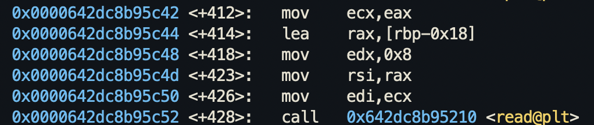

This tells us that the random value was read into the stack using the `read` syscall.

From this snippet from the disassembly (`disas` in gdb), we can tell that the `$rbp-0x18` element in the stack contains the value of the buffer that the read value will be put into. So we can inspect that value by using `x/gx $rbp-0x18`.