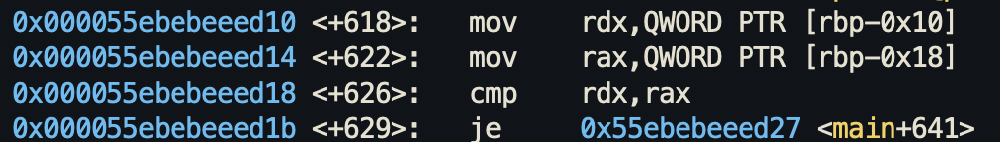
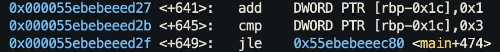

This is similar to level 3, but we have to set our own breakpoints and the code is a little different. Setting a breakpoint before the `scanf` function call (`b *main+560`) then use `x/gx $rbp-0x18` to get the read value. That value is the correct value.

Our input is stored in `$rbp-0x10`. This then gets compared with `$rbp-0x18` and if they are equal, the code jumps to the finisher part.

This indicates a loop. This tells us that the code will loop 4 times. And it will loop back to the get random value part. So it will get a new random value and make us guess that value for 4 times. At the end, it gives us the flag if we get all 4 random values.