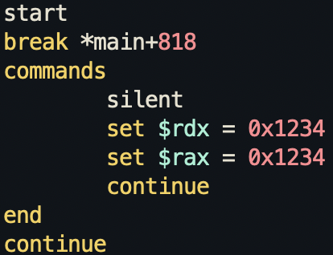

This requires us to make a script to automate the process. The code is similar to the level 4 code, except we need to do the same thing for 10 times. So we need to automate the process with GDB script.

Because the code determine the correctness of the input based on the `cmp rax, rdx` command, we can make a script that sets the `rax` and `rdx` values to be the same before the `cmp` instruction execution.

With this script, every time we hit the `main+818` instruction (which is the `cmp` instruction location), it will run the commands in the script, which just sets the `rdx` and `rax` registers. Run `/challenge/embryogdb_level5 -x level5.gdb` to load the script to the level's GDB.